> 来源链接：https://b23.tv/J2auUXY

# 1.2 APK文件结构与smali基础
## 学习目标
完成本章节学习后，你将掌握以下知识点：
1. 理解APK文件的本质与内部目录结构，掌握各部分的作用
2. 掌握`AndroidManifest.xml`的核心信息与逆向分析价值
3. 掌握smali基础语法、数据类型、方法签名、寄存器规则与常用指令
4. 建立Java代码与smali字节码的映射关系，能读懂基础smali逻辑
5. 掌握smali层的基础逆向修改技巧（如绕过密码校验）
6. Java代码与smali代码的映射对应规则，包含方法签名转换、静态/非静态方法差异、条件判断指令映射、`invoke-virtual`与`invoke-static`的核心区别
7. 安卓逆向中基于smali的两种密码校验破解思路
8. CrackMe注册码破解的完整实操流程与核心技能点
9. 巩固APK结构与smali基础的三类课后练习方案

---
## 一、APK文件本质与结构
APK本质是标准ZIP压缩包，直接修改后缀为`.zip`即可解压查看内部内容，是安卓应用的分发安装包。
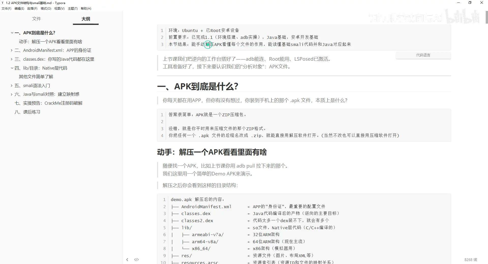*

### 解压后核心目录与文件
| 目录/文件 | 作用 | 逆向分析价值 |
| --- | --- | --- |
| `AndroidManifest.xml` | APP的核心配置文件，又称"APP身份证" | 最高：获取包名、权限、入口、组件、调试开关等核心信息 |
| `classes.dex` `classes2.dex` ... | Java/Kotlin代码编译后的Dalvik字节码文件 | 最高：Java层逆向的核心分析对象 |
| `lib/` | 存放Native层`.so`动态库文件，按CPU架构分子目录 | 高：核心加密、校验、防调试逻辑常放在Native层 |
| `res/` | 资源目录：布局、图片、字符串、动画等 | 中：可获取硬编码字符串、界面布局信息 |
| `resources.arsc` | 资源索引表，将资源ID与实际资源文件对应 | 中：解析资源的核心 |
| `assets/` | 原始资源目录，文件不会被编译 | 中：加密资源、加固壳文件常存放于此 |
| `META-INF/` | 存放APK签名信息 | 低：重打包后需要重新签名替换该目录 |
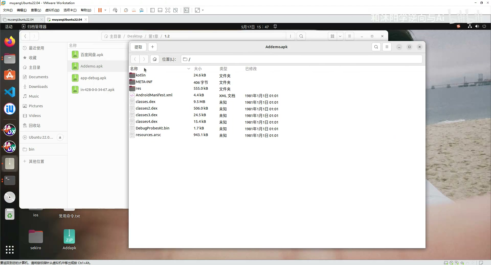*

#### 1. classes.dex 说明
单个dex文件有65536（64K）个方法数限制，大型APP会拆分为多个dex（`classes2.dex`、`classes3.dex`...），即MultiDex机制。
jadx等反编译工具会自动合并所有dex的代码，逆向时如果搜不到目标代码，注意是否在其他dex中。
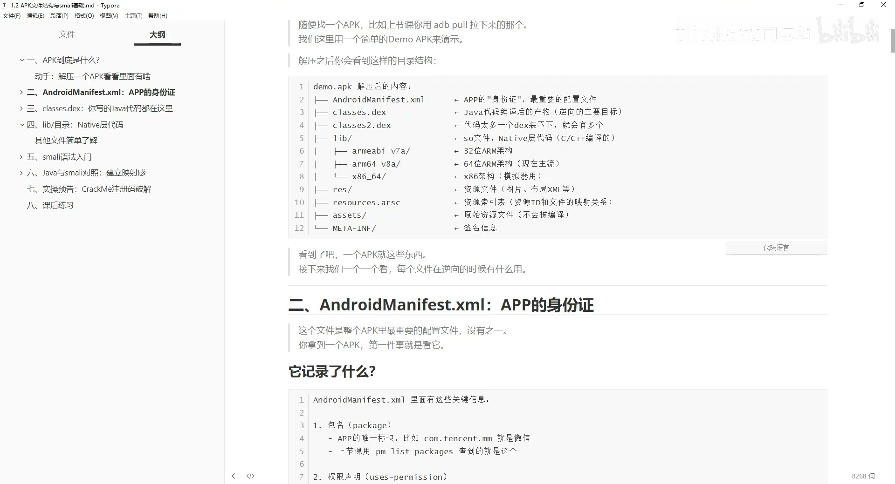*

#### 2. lib/ 目录说明
`.so`文件是C/C++代码编译后的机器码，属于Native层，需要用IDA Pro等工具分析，不能用jadx直接反编译。
按CPU架构分子目录：
* `armeabi-v7a`：32位ARM架构（旧设备）
* `arm64-v8a`：64位ARM架构（目前主流设备）
* `x86`/`x86_64`：模拟器/x86架构设备
逆向中绝大多数核心逻辑（加密、签名校验、ROOT检测、防调试）都会放在Native层。
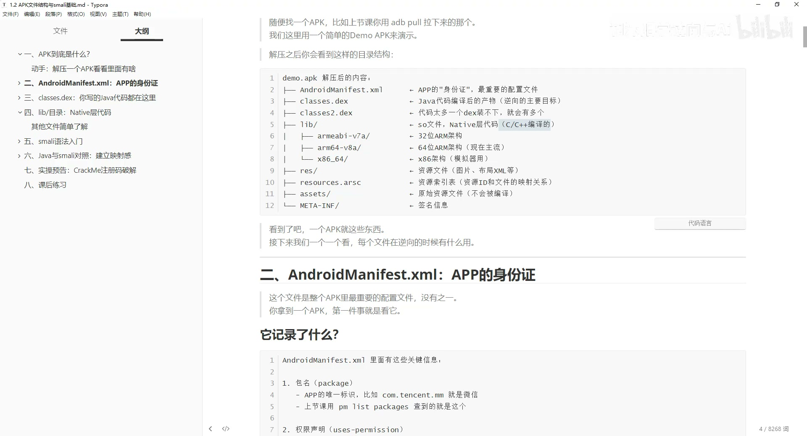*

---
## 二、AndroidManifest.xml 核心分析
`AndroidManifest.xml`是APP最重要的配置文件，直接打开是二进制乱码，需要用jadx、MT管理器等工具反编译后查看。
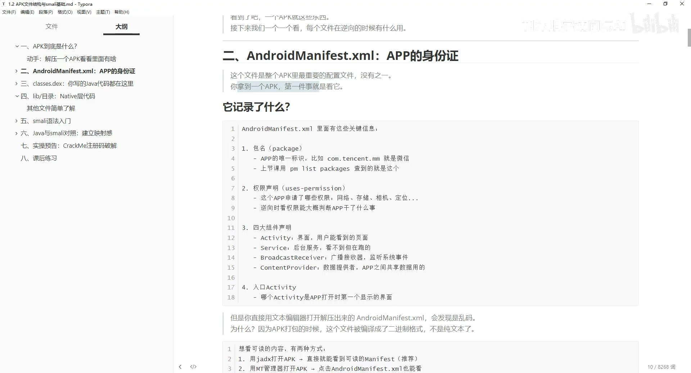*

### 核心信息与逆向价值
1. **基础身份信息**
   * 包名（`package`）：APP的唯一标识，adb操作、HOOK都需要用到
   * 版本号、最低/目标SDK版本
2. **权限声明**
   * 所有`<uses-permission>`标签对应APP申请的权限，可通过权限初步判断APP行为：
     * 开机自启、悬浮窗、拦截短信 → 可能是恶意/勒索软件
     * 联网、存储 → 常规应用权限
   * 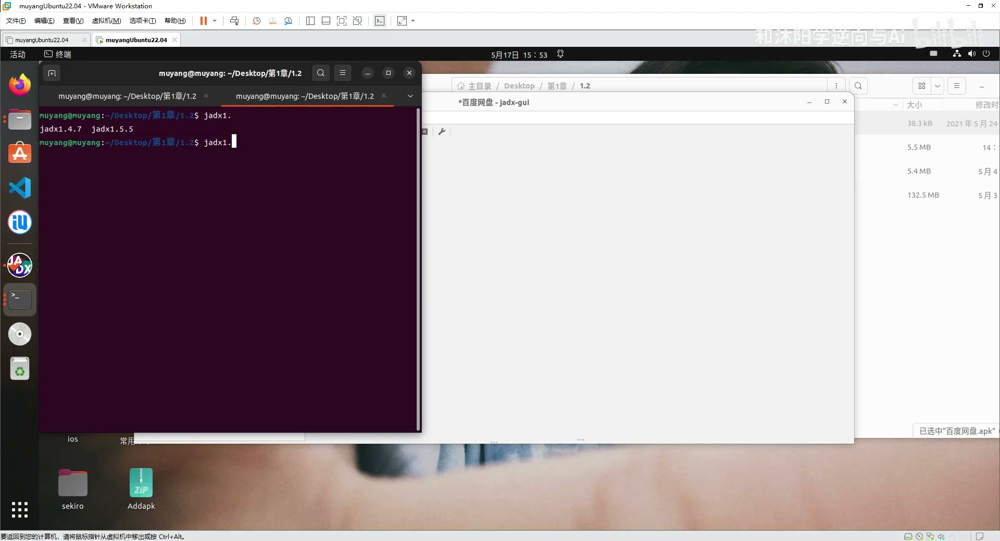*
3. **四大组件声明**
   * Activity：用户可见的页面
   * Service：后台运行的服务
   * BroadcastReceiver：广播接收器，监听系统/自定义事件
   * ContentProvider：数据共享提供者
4. **入口Activity**
   同时包含`android.intent.action.MAIN`和`android.intent.category.LAUNCHER`的Activity就是APP启动后打开的第一个页面，是逆向的常用入口。
5. **调试开关**
   `android:debuggable="true"`表示APP可被调试，逆向时可以直接附加调试器，非常便利。
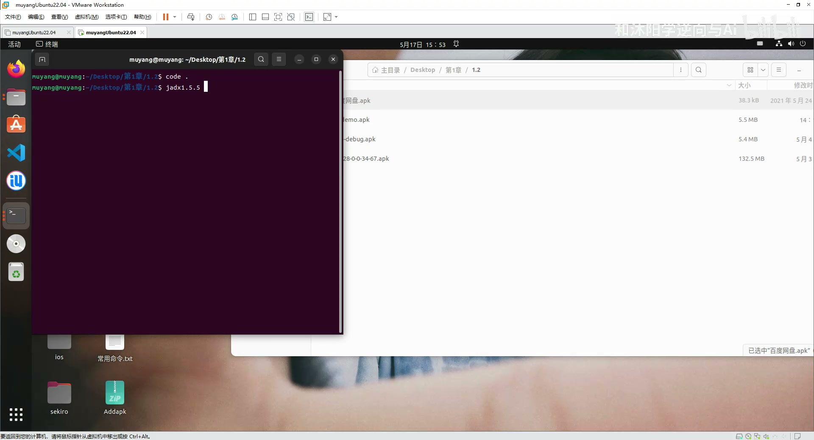*

---
## 三、smali语法入门
smali是Dalvik/ART虚拟机字节码的人类可读形式，是dex文件的真实内容表达。
> 注意：jadx反编译得到的Java代码是**伪代码**，是算法推导还原的结果，可能出错、缺失甚至反编译失败；smali才是dex的真实对应内容，修改APP（重打包）本质就是修改smali代码。

### 1. 数据类型描述符
smali不直接写Java类型名，而是用缩写描述符：
#### 基本类型
| smali描述符 | Java类型 | 说明 |
| --- | --- | --- |
| `V` | `void` | 无返回值，仅用于方法返回值 |
| `Z` | `boolean` | 布尔值，true=1/false=0 |
| `B` | `byte` | 字节 |
| `S` | `short` | 短整型 |
| `C` | `char` | 字符 |
| `I` | `int` | 整型（最常用） |
| `J` | `long` | 长整型，注意是J不是L |
| `F` | `float` | 单精度浮点 |
| `D` | `double` | 双精度浮点 |

#### 对象类型
格式：`L + 包名路径（.替换为/） + ;`
示例：
* String → `Ljava/lang/String;`
* Context → `Landroid/content/Context;`
* 自定义类`com.example.MainActivity` → `Lcom/example/MainActivity;`

#### 数组类型
在类型前加`[`表示一维数组，多个`[`表示多维数组：
* int数组 → `[I`
* String数组 → `[Ljava/lang/String;`
* int二维数组 → `[[I`
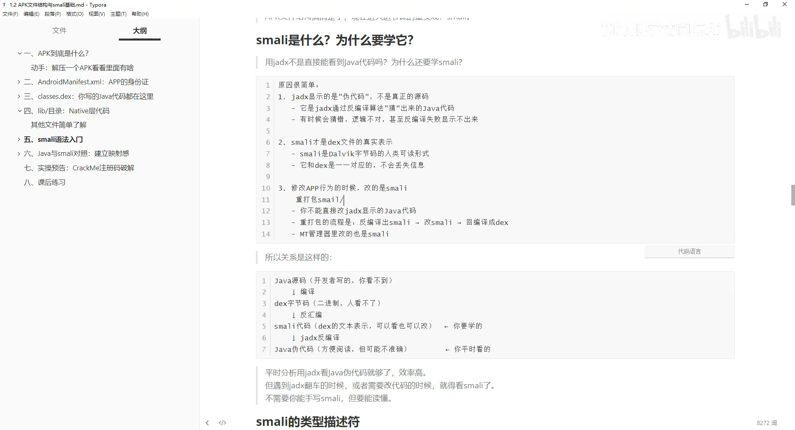*

---
### 2. 方法签名
smali中方法的表示格式：
```
方法名(参数类型1参数类型2...)返回值类型
```
示例：
| Java方法 | smali方法签名 | 说明 |
| --- | --- | --- |
| `public int add(int a, int b)` | `add(II)I` | 两个int参数，返回int |
| `public String greet(String name)` | `greet(Ljava/lang/String;)Ljava/lang/String;` | 1个String参数，返回String |
| `private void init()` | `init()V` | 无参数，无返回值 |

smali方法的完整定义以`.method`开头，`.end method`结尾：
```smali
.method public add(II)I
    .registers 4  # 方法总共使用4个寄存器
    .param p1, "a"    # I  第一个参数a
    .param p2, "b"    # I  第二个参数b

    .line 90  # 对应Java源代码行号
    add-int v0, p1, p2  # v0 = p1 + p2

    return v0  # 返回v0
.end method
```
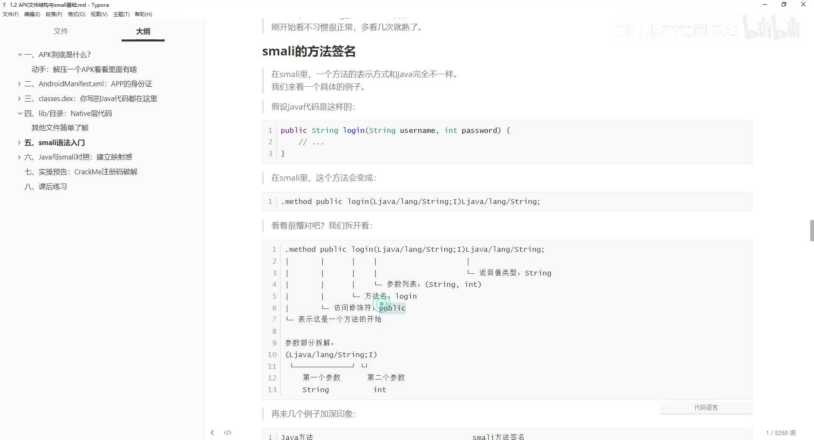*

---
### 3. 寄存器规则
smali用寄存器存储数据，分为两类：
#### 局部寄存器（`v`开头）
`v0`、`v1`、`v2`... 用于存储方法内部的临时变量，仅在方法内部有效。

#### 参数寄存器（`p`开头）
`p0`、`p1`、`p2`... 用于存储方法的参数，规则：
* **非静态方法**：`p0`固定为`this`（当前对象本身），`p1`是第一个业务参数，`p2`是第二个...
* **静态方法**：没有`this`，`p0`就是第一个业务参数，`p1`是第二个...

#### 寄存器声明
* `.registers N`：声明该方法总共使用N个寄存器（局部寄存器+参数寄存器的总数）
* `.locals N`：声明该方法使用N个局部寄存器（v开头的数量）
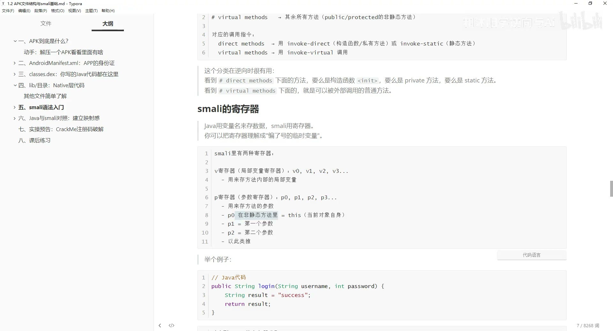*

---
### 4. 常用smali指令速查
#### 常量/赋值指令
| 指令 | 含义 |
| --- | --- |
| `const/4 v0, 0x0` | v0 = 0（小数值用const/4） |
| `const/16 v0, 0x64` | v0 = 100 |
| `const-string v0, "hello"` | v0 = 字符串"hello" |

#### 字段操作指令（读写类的成员变量）
| 指令 | 含义 |
| --- | --- |
| `iget-object v0, p0, Lcom/xxx/Test;->key:Ljava/lang/String;` | 读取p0（this）的key字段，存到v0 |
| `iput-object v0, p0, Lcom/xxx/Test;->key:Ljava/lang/String;` | 把v0的值写入p0的key字段 |

#### 方法调用指令
| 指令 | 适用场景 |
| --- | --- |
| `invoke-virtual {参数列表}, 方法签名` | 调用普通实例方法（非private、非static） |
| `invoke-static {参数列表}, 方法签名` | 调用静态方法 |
| `invoke-direct {参数列表}, 方法签名` | 调用构造方法、private方法 |
| `invoke-super {参数列表}, 方法签名` | 调用父类的方法 |
| `invoke-interface {参数列表}, 方法签名` | 调用接口方法 |

#### 返回值接收
| 指令 | 含义 |
| --- | --- |
| `move-result v0` | 接收上一个方法调用返回的基本类型值，存到v0 |
| `move-result-object v0` | 接收上一个方法调用返回的对象类型值，存到v0 |

#### 返回指令
| 指令 | 含义 |
| --- | --- |
| `return-void` | 方法无返回值 |
| `return v0` | 返回基本类型值v0 |
| `return-object v0` | 返回对象类型值v0 |

#### 条件判断指令（逆向最常用）
| 指令 | 含义 |
| --- | --- |
| `if-eqz v0, :label` | 如果v0 == 0（false），跳转到标签label |
| `if-nez v0, :label` | 如果v0 != 0（true），跳转到标签label |
| `if-eq v0, v1, :label` | v0 == v1 跳转 |
| `if-ne v0, v1, :label` | v0 != v1 跳转 |
| `if-lt v0, v1, :label` | v0 < v1 跳转 |
| `if-ge v0, v1, :label` | v0 >= v1 跳转 |
| `if-gt v0, v1, :label` | v0 > v1 跳转 |
| `if-le v0, v1, :label` | v0 <= v1 跳转 |

> 注意：编译器会对Java的判断逻辑做反转优化，比如Java的`if(score>=90)`在smali中会变成`if-lt p1, v0, :label`（如果score<90就跳转到下一个分支），逆向时要注意逻辑反转。

#### 其他指令
* 无条件跳转：`goto :label`
* 算术运算：`add-int v0, p1, p2`（v0 = p1+p2）、`mul-int v0, p1, p2`（乘法）等
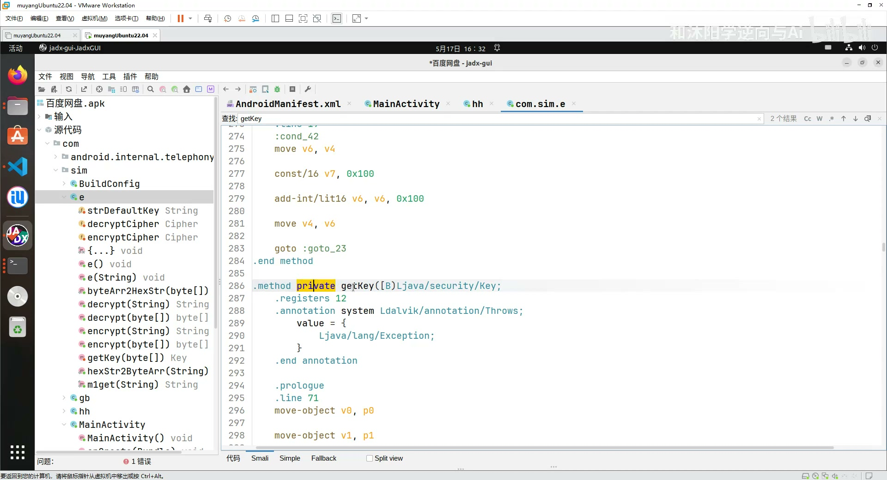*

---
## 四、Java与smali映射实例
通过6个典型场景建立Java到smali的映射感：
### Lab1：基本加法 - 方法签名与寄存器
```java
// Java代码
public int add(int a, int b) {
    return a + b;
}
```
```smali
// 对应smali
.method public add(II)I
    .registers 4
    .param p1, "a"    # I
    .param p2, "b"    # I

    .line 90
    add-int v0, p1, p2  # 非静态方法p0=this，p1=a、p2=b

    return v0
.end method
```
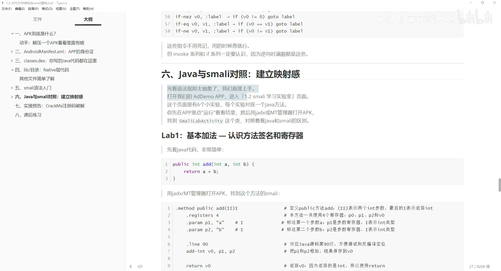*

---
### Lab2：字符串拼接 - 对象与invoke
Java的字符串拼接会被编译为`StringBuilder`的多次`append`调用：
```java
// Java代码
public String greet(String name) {
    return "你好，" + name + "！欢迎来到逆向课堂";
}
```
smali核心逻辑：
1. new-instance创建StringBuilder对象
2. invoke-direct调用构造方法初始化
3. 多次invoke-virtual调用append拼接字符串
4. 最后调用toString得到最终结果
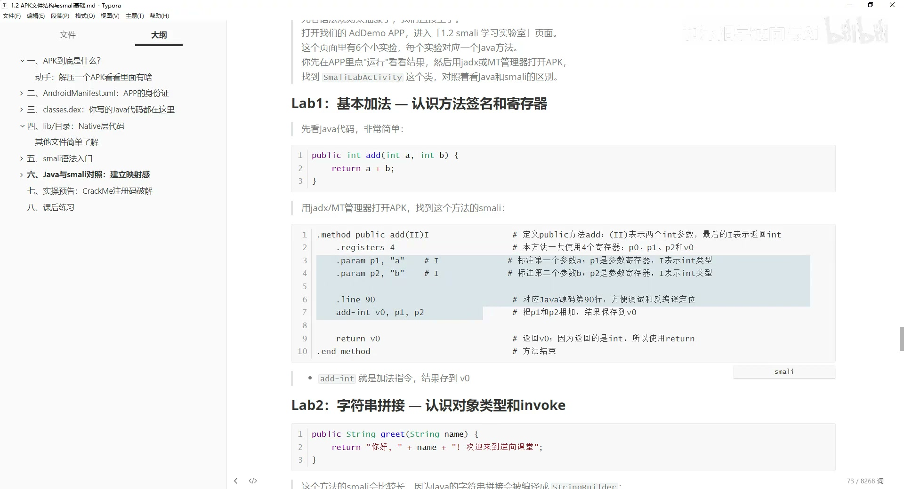*

---
### Lab3：密码校验 - 字段访问+条件判断
```java
// Java代码
private String secretKey = "muyang666";
public boolean checkPassword(String input) {
    if (input.equals(this.secretKey)) {
        return true;
    }
    return false;
}
```
smali核心逻辑：
```smali
# 1. 读取secretKey字段
iget-object v0, p0, Lcom/xxx/Test;->secretKey:Ljava/lang/String;
# 2. 调用equals方法
invoke-virtual {p1, v0}, Ljava/lang/String;->equals(Ljava/lang/Object;)Z
move-result v0  # 接收equals返回值
# 3. 条件判断
if-eqz v0, :cond_false  # 相等返回1，不相等返回0，等于0就跳转到返回false
const/4 v0, 0x1
return v0  # 返回true
:cond_false
const/4 v0, 0x0
return v0  # 返回false
```
**逆向技巧**：把`if-eqz`改成`if-nez`即可反转校验逻辑，或者直接在方法开头写`const/4 v0, 0x1` `return v0`直接绕过校验。
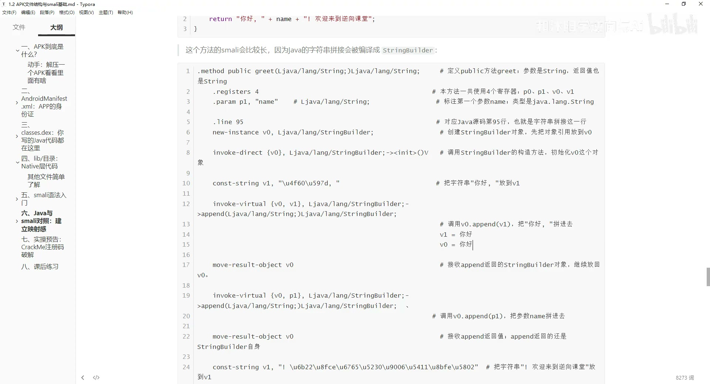*

---
### Lab4：多分支条件 - if系列指令
```java
// Java代码
public String getLevel(int score) {
    if (score >= 90) return "优秀";
    else if (score >= 60) return "及格";
    else return "不及格";
}
```
smali核心逻辑：
```smali
const/16 v0, 0x5a  # 0x5a=90
if-lt p1, v0, :cond_7  # 如果score<90，跳转到下一个60分的判断
# score>=90的逻辑，返回"优秀"
:cond_7
const/16 v0, 0x3c  # 0x3c=60
if-lt p1, v0, :cond_e  # 如果score<60跳转到不及格分支
# 返回及格的逻辑
:cond_e
# 返回不及格的逻辑
```
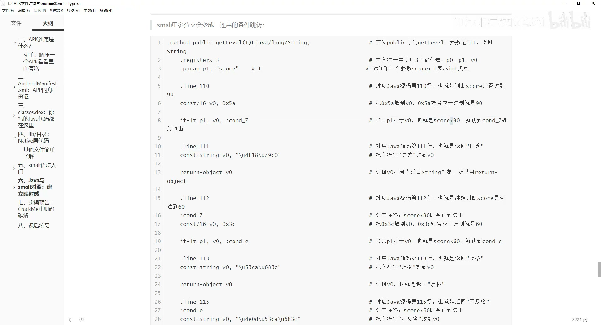*

---
### Lab5：静态方法 - p0不再是this
静态方法没有`this`，p0就是第一个业务参数：
```java
// Java代码
public static int multiply(int a, int b) {
    return a * b;
}
```
```smali
// 对应smali
.method public static multiply(II)I
    .registers 3
    .param p0, "a"    # I  p0就是第一个参数a
    .param p1, "b"    # I  p1就是第二个参数b

    mul-int v0, p0, p1
    return v0
.end method
```
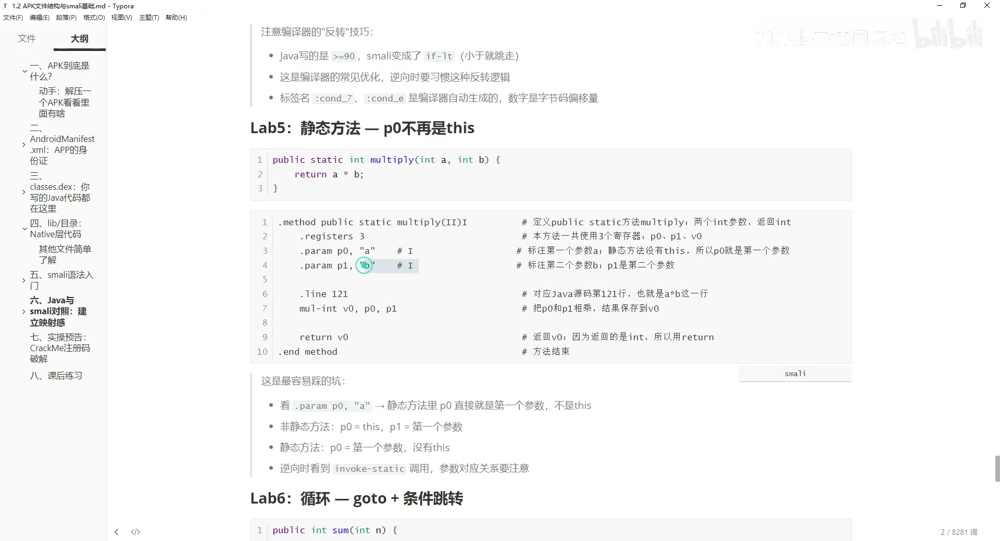*

---
### Lab6：循环 - goto + 条件跳转
Java的for循环会被编译为`goto`+`if`判断的组合：
```java
// Java代码
public int sum(int n) {
    int result = 0;
    for (int i = 1; i <= n; i++) {
        result = result + i;
    }
    return result;
}
```
smali核心逻辑：
1. 初始化result=0、i=1
2. 循环入口：判断i>n就跳转到循环结束
3. 循环体：result +=i
4. i自增