> 来源链接：https://www.bilibili.com/video/BV1WyLM6uECQ?p=5

# 学习目标
1. 掌握安卓逆向入口定位的4种常用方法
2. 掌握CrackMe注册码破解的两种核心思路：算法分析计算正确注册码、修改smail绕过校验
3. 掌握MT/NP管理器修改smail的实操流程，掌握直接返回true、修改条件跳转两种核心技巧
4. 掌握APK重打包、签名、安装的完整流程
5. 理解重打包的局限性以及动态Hook技术的优势
6. 建立修改后先验证稳定性、再测试功能的逆向分析习惯
---
## 一、CrackMe案例介绍
本次破解的目标为自定义demo应用，界面包含用户名输入框、注册码输入框、验证按钮，输入错误注册码会提示“注册码错误，请重试”
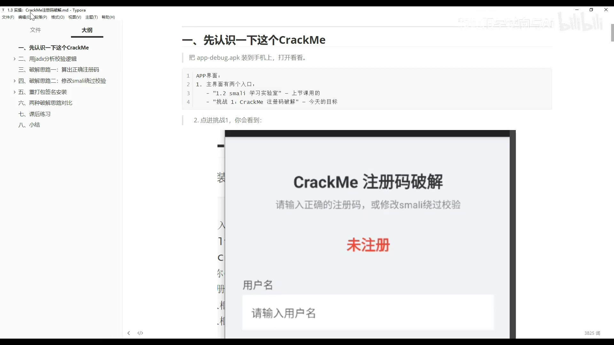
本次破解共两种核心思路：
1. 算法分析：逆向注册码生成逻辑，计算出正确注册码
2. 修改smail：修改校验逻辑，绕过验证
补充说明：后续学习Frida框架可以实现不修改APK、不重打包的动态Hook校验
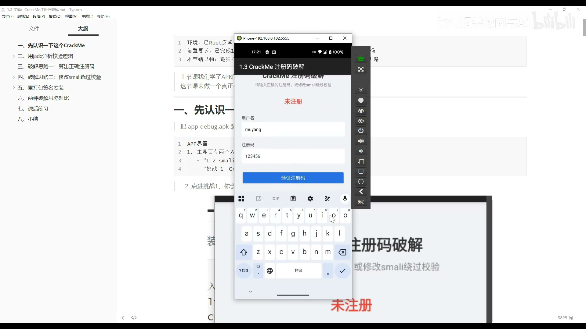
---
## 二、逆向分析第一步：定位入口
### 2.1 入口定位的4种常用方法
#### 方法1：查看AndroidManifest.xml
- 适用场景：APK未混淆、界面数量少的简单应用
- 操作流程：在jadx中打开APK的`AndroidManifest.xml`，找到对应“注册码破解”页面对应的Activity类名`CrackMeActivity`
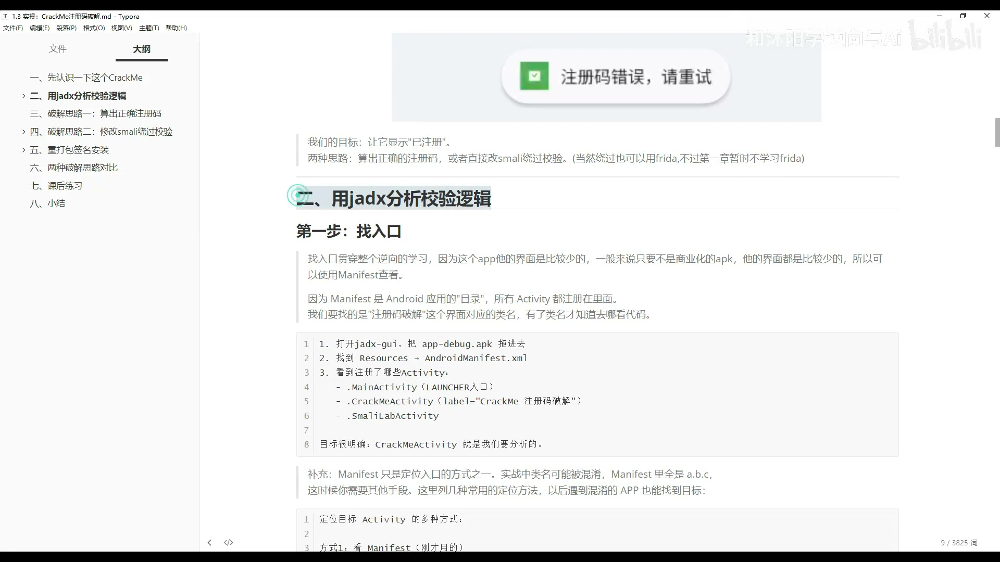
#### 方法2：开发者助手/Activity记录工具
- 适用场景：任意场景，快速直接
- 操作流程：打开开发者助手悬浮窗，进入目标APK页面，工具会直接显示当前Activity的完整类名
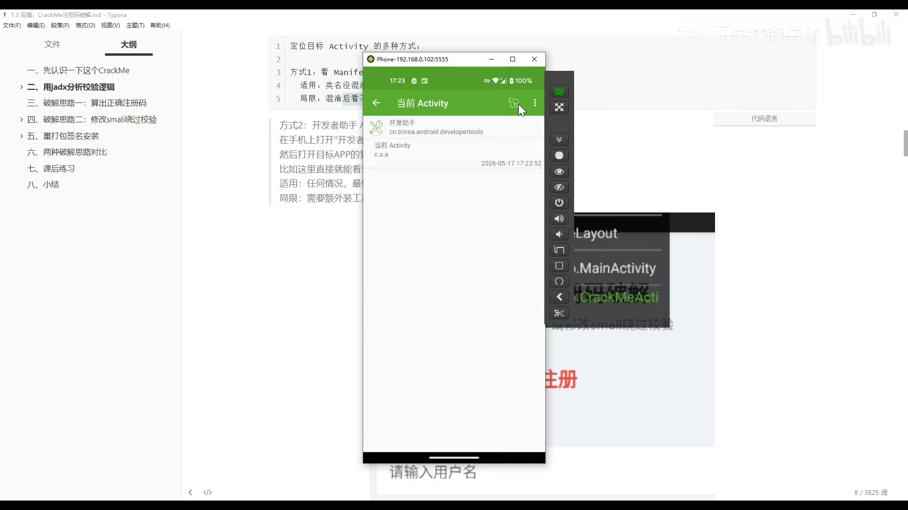
#### 方法3：搜索界面字符串
- 适用场景：逆向分析最常用的定位方法，可快速定位校验逻辑所在类
- 操作流程：在jadx中搜索界面显示的字符串，比如“注册码错误”，即可直接定位到目标类
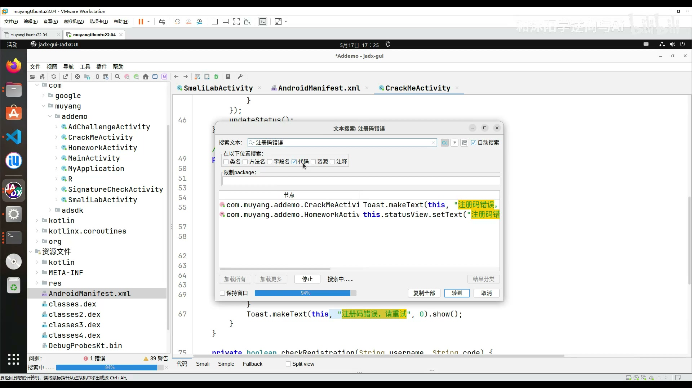
#### 方法4：搜索按钮点击事件
- 操作流程：先在资源文件中找到按钮的资源ID，再在代码中搜索该ID的点击事件，定位到校验逻辑所在位置
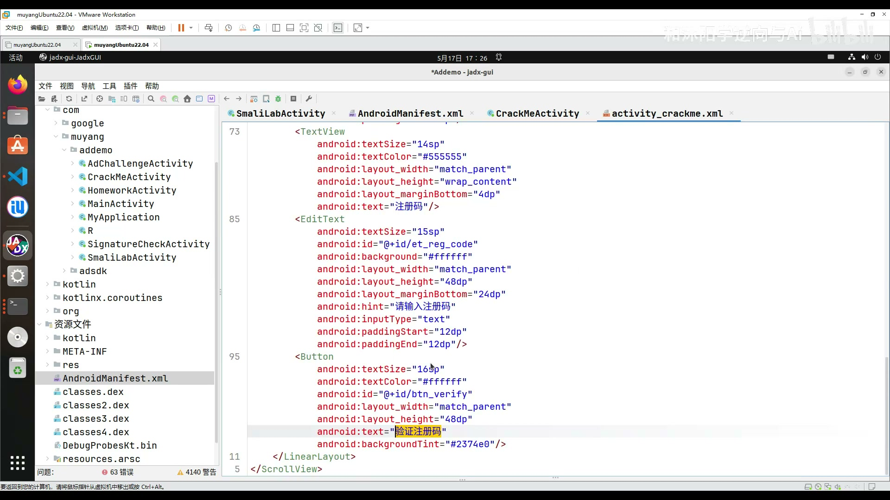
### 2.2 分析目标Activity逻辑
定位到`CrackMeActivity`后，从生命周期`onCreate`开始分析：
1. 找到按钮初始化与点击事件绑定
2. 点击事件触发校验方法`doVerify`
3. 核心校验逻辑在`checkRegistration`方法，该方法会调用`generateKey`生成正确注册码，和用户输入的注册码做对比
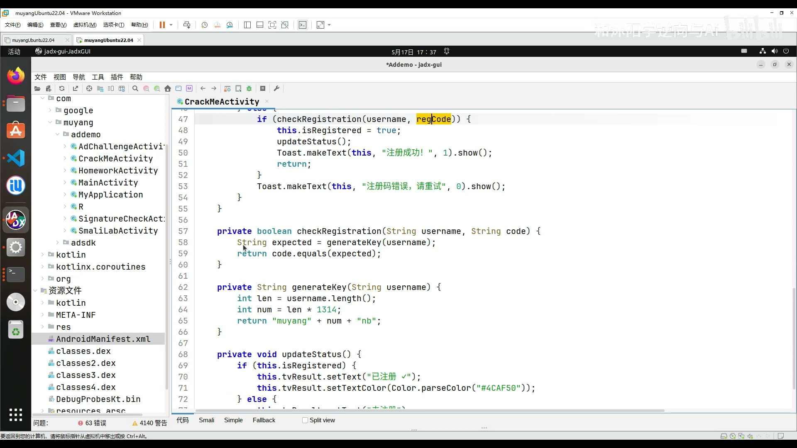
---
## 三、破解思路1：算法分析计算正确注册码
### 3.1 注册码生成逻辑
`generateKey`方法的算法逻辑：
1. 获取输入用户名的长度
2. 将长度乘以1314
3. 拼接为固定格式字符串
对应公式：
$$正确注册码 = 牧羊 + (用户名长度 \times 1314) + 牛逼$$
### 3.2 效果验证
输入任意用户名，按照上述公式计算出注册码，输入后即可验证成功，提示“注册成功”
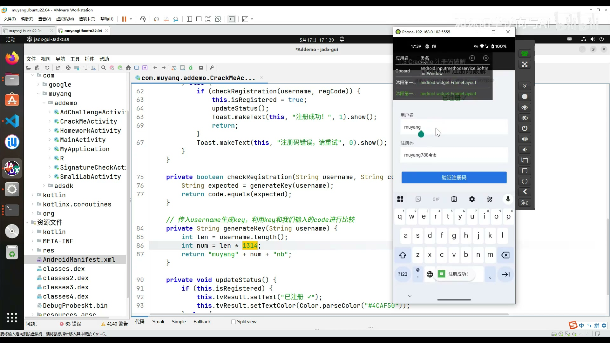
### 3.3 该方法的局限性
1. 算法复杂、应用加壳混淆时，逆向分析难度极高
2. 存在服务端校验时，本地计算的注册码无效
3. 适用场景：仅适用于算法简单、纯本地校验的小型应用
---
## 四、破解思路2：修改smail绕过校验
### 4.1 工具介绍：MT/NP管理器
优势：可以直接在手机端编辑dex文件的smail代码，无需电脑端apktool解包、修改、重打包的复杂流程，操作可视化，效率远高于电脑端手动操作
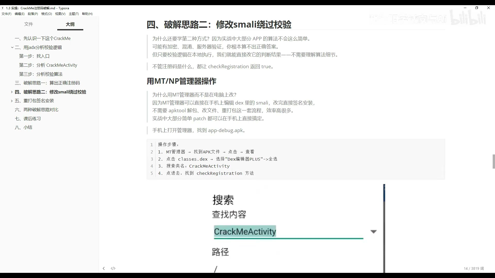
### 4.2 修改方法A：方法直接返回true
#### 操作步骤
1. 用MT管理器打开目标APK，点击查看dex文件
2. 搜索定位到`checkRegistration`方法
3. 删除方法内原有逻辑，添加两行smail代码，实现无论输入什么，都返回校验成功：
   ```smail
   const/4 v0, 0x1
   return v0
   ```
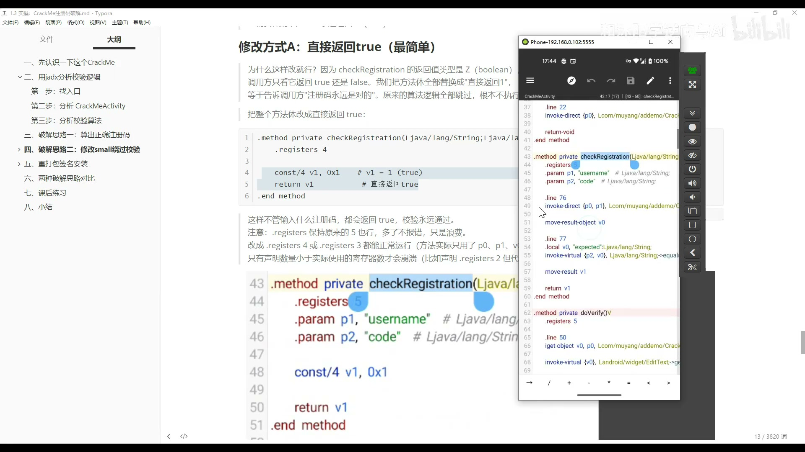
4. 保存修改，MT管理器自动完成重打包与签名
5. 卸载原应用，安装修改后的APK
6. 测试验证：输入任意用户名和任意注册码，均可提示注册成功
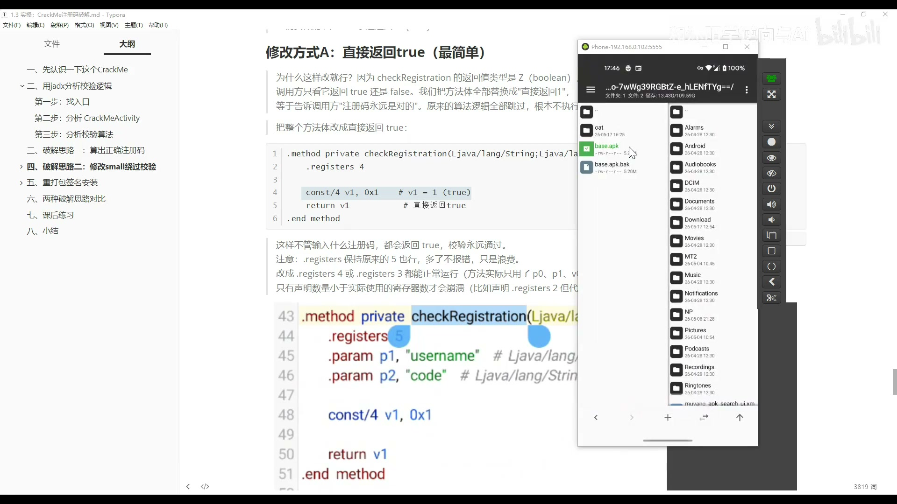
### 4.3 修改方法B：修改条件跳转（通用性更强）
#### 适用场景
实战中多数校验逻辑不会单独封装为返回布尔值的方法，而是在大方法内部通过if判断走成功/失败分支，该方法可以在不修改校验方法的前提下，直接反转判断逻辑
#### smail条件跳转指令说明
- `if-eqz vX, :label`：如果vX寄存器的值等于0（代表false/空），跳转到指定标签
- `if-nez vX, :label`：如果vX寄存器的值不等于0（代表true），跳转到指定标签
#### 操作步骤
1. 定位到`doVerify`方法中，找到调用`checkRegistration`后的判断分支
2. 将原来的`if-eqz`（校验失败跳转错误分支）修改为`if-nez`，反转判断逻辑，或者直接删除跳转指令
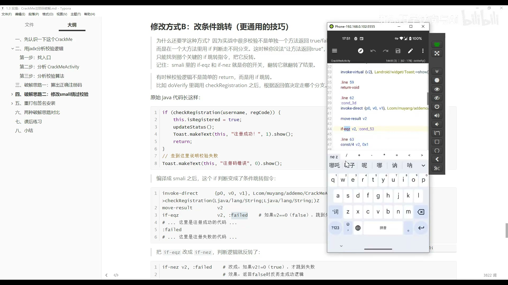
3. 保存、签名、安装测试，任意输入均可注册成功
---
## 五、重打包签名安装
### 操作流程
修改smail代码后，完整流程为：保存修改 → 重打包APK → 签名APK → 卸载原应用安装修改版
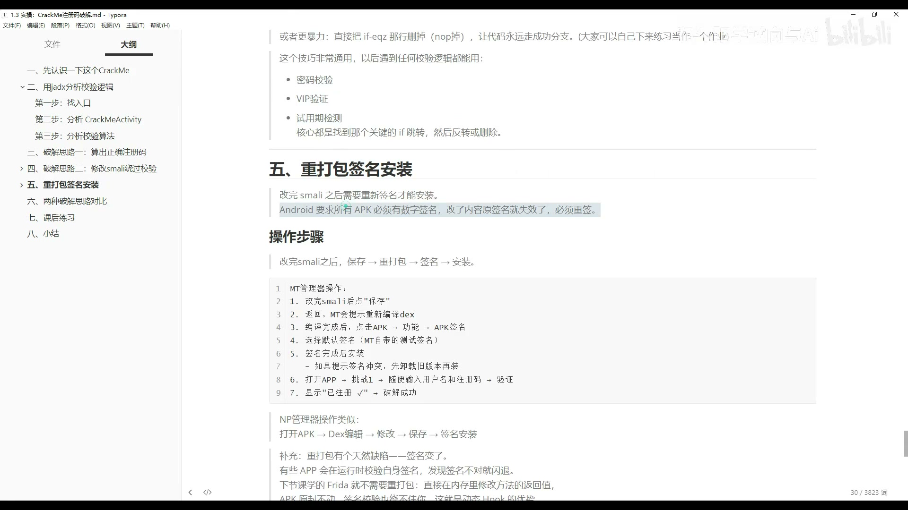
### 重打包的局限性
1. Android系统要求所有APK必须有数字签名，修改APK内容后原有签名失效，必须重新签名
2. 部分商用APK会在运行时校验自身签名，签名不一致会直接闪退
3. 后续课程将学习的Frida动态Hook技术，无需重打包，直接在运行时内存中修改方法返回值，APK原文件不做任何修改，签名校验逻辑无法检测，这是动态Hook的核心优势
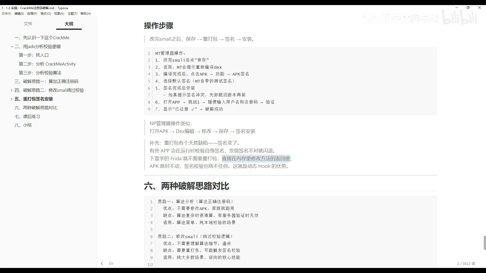
---
## 六、两种破解思路对比
| 破解思路 | 优势 | 缺点 | 适用场景 |
| --- | --- | --- | --- |
| 算法分析计算注册码 | 不需要修改APK，原安装包即可使用 | 算法复杂、加壳混淆时逆向难度极高，有服务端校验时完全无效 | 算法简单、纯本地校验的小型demo |
| 修改smail绕过校验 | 不需要理解算法细节，通用性强 | 需要重打包，可能触发应用的签名校验逻辑 | 绝大多数逆向场景，是逆向分析的核心通用技能 |
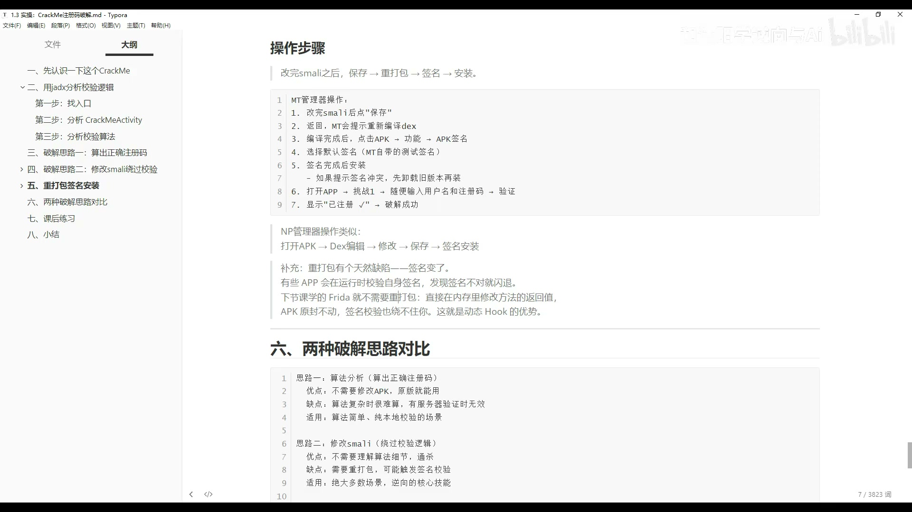
实战中通常两种方法结合使用：先用jadx理清大致逻辑，再决定是计算注册码还是修改smail绕过
---
## 七、课后练习
1. **练习1 smail修改 - 直接返回true 必须完成**
   使用MT/NP管理器打开目标APK，找到`checkRegistration`方法，修改为直接返回true，重打包签名安装，验证任意注册码都能通过校验
2. **练习2 smail修改 - 反转条件跳转 必须完成**
   还原APK到原始状态，不修改`checkRegistration`方法，找到`doVerify`方法中调用`checkRegistration`后的`if-eqz`跳转指令，修改为`if-nez`，重打包测试验证
   思考题：两种修改方法有什么区别？哪种修改方式更隐蔽？
3. **练习3 思考题**
   如果开发者把校验逻辑放到native层so文件中实现，还能用修改smail的方式绕过校验吗？
4. **练习4 课后作业：CrackMe2**
   独立完成进阶CrackMe2的破解，其算法逻辑和本课不同，锻炼独立分析能力
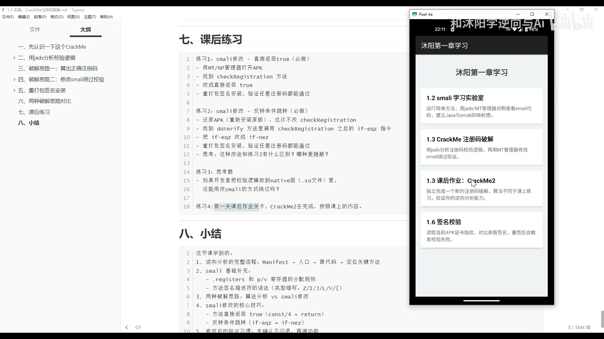
---
## 八、课程小结
1. 逆向分析完整流程：`分析AndroidManifest → 定位入口Activity → 分析源码逻辑 → 定位核心校验方法`
2. smail基础补充：`.registers`关键字含义、`p/v`寄存器分配规则、混淆后方法名的阅读方法
3. 两种破解核心思路：算法逆向分析 vs smail修改绕过
4. smail修改核心技巧
   - 方法直接返回true：`const/4 vX, 0x1` + `return vX`
   - 反转条件跳转：`if-eqz`和`if-nez`指令互换
5. 逆向验证习惯：修改后先确认应用不闪退，再测试对应功能是否生效
6. MT/NP管理器完整操作流程：编辑smail → 保存修改 → 重打包 → 签名 → 安装测试
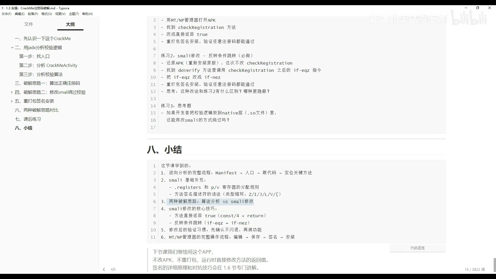
下节课预告：不修改APK、不重打包，运行时直接修改方法返回值，也就是Frida动态调试技术，签名的详细原理和对抗技巧会在1.6节专门讲解
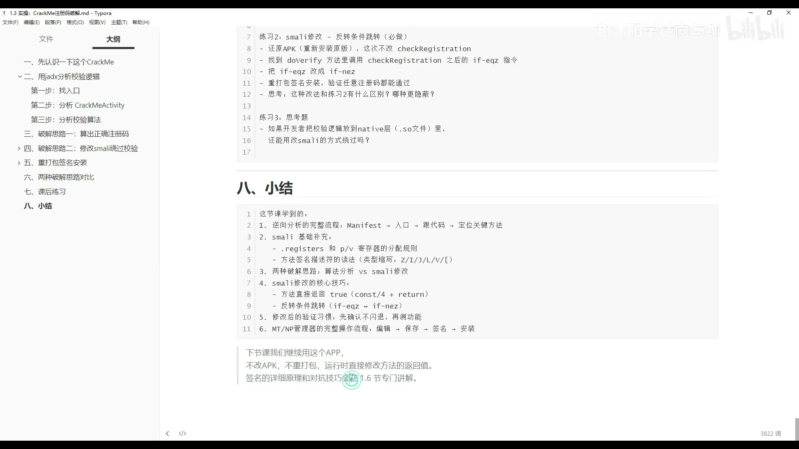
---
# 参考资料
1. 沐阳安卓逆向系列课程 1.2 APK文件结构与Smali基础
2. jadx官方项目地址：https://github.com/skylot/jadx
3. Smali语法官方参考文档
4. MT管理器官方使用教程