> 来源链接：https://www.bilibili.com/video/BV1WyLM6uECQ?p=6

# JEB动态调试入门学习笔记
## 学习目标
1. 掌握使用JEB对安卓APP下断点、单步执行、观察寄存器的操作方法
2. 完整掌握JEB动态调试的基础流程
3. 理解动态调试与静态分析的差异与适用场景
4. 能够通过动态调试直接获取运行时关键数据（如注册码、加密密钥）
5. 掌握JEB动态调试过程中寄存器变量的查看与追踪方法
6. 掌握动态调试触发断点、验证注册码校验逻辑的实操流程
7. 理解静态分析与动态调试结合的安卓逆向方法论
8. 熟练使用JEB调试的常用快捷键
9. 了解JEB动态调试修改寄存器值的操作方法
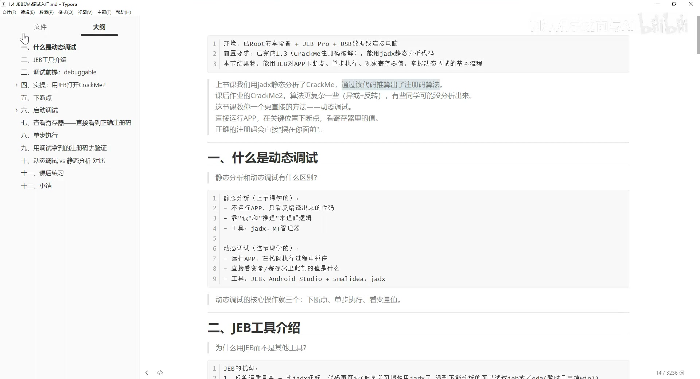

---
## 一、动态调试的基本概念
安卓逆向的分析方法分为静态分析与动态调试两类：
- **静态分析**：不运行APP，仅通过阅读反编译后的代码推理逻辑，常用工具为JADX、MT管理器
- **动态调试**：运行APP，在代码执行过程中暂停程序，直接查看变量、寄存器的真实运行时值，常用工具为JEB、Android Studio + smali插件

动态调试的核心优势：无需理解复杂算法逻辑，关键数据直接可见，适合分析混淆代码、加密算法、静态分析难以还原的逻辑。
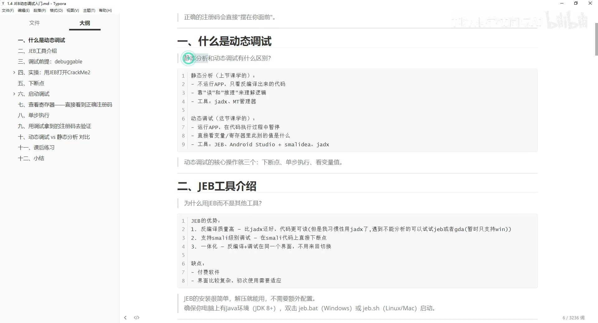

---
## 二、JEB工具介绍
JEB是安卓逆向行业常用的专业反编译与调试工具，核心特性如下：
### 2.1 优势
1. 反编译质量优于JADX，复杂逻辑、混淆代码的还原度更高
2. 原生支持smali级别调试，无需额外插件
3. 一体化设计，反编译、调试在同一界面完成，无需切换工具
### 2.2 不足
1. 付费商业软件，可通过安全行业常用资源渠道获取学习版本
2. 界面布局复杂，初次使用需要适应操作逻辑
### 2.3 安装与启动
1. 解压即可使用，无需额外安装配置
2. 依赖Java环境（要求JDK 8+）
3. 启动方式：Windows下双击`jeb.bat`，Linux/Mac下执行`./jeb.sh`
> 注意：JEB对硬件性能有一定要求，建议在Windows物理机下运行，低配置虚拟机中使用容易出现卡顿、无响应问题。
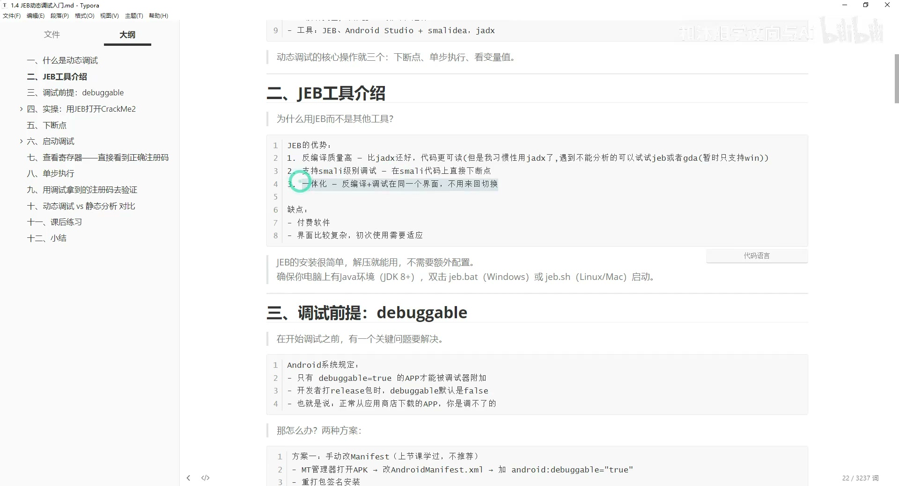

---
## 三、调试核心前提：debuggable权限
安卓系统规定：只有`AndroidManifest.xml`中`android:debuggable="true"`的APP才能被调试器附加。普通发布版APP该属性默认值为`false`，无法直接调试，需要通过以下方案解决：
### 3.1 方案一：手动修改Manifest（不推荐）
- 操作流程：反编译APK → 修改`AndroidManifest.xml`添加`android:debuggable="true"` → 重打包签名后安装
- 缺点：每个APK都需要重打包，操作繁琐，若APP有签名校验则直接失效
### 3.2 方案二：修改系统级属性（Root后推荐，一劳永逸）
- 操作流程：
  1. 执行`adb shell`进入设备shell环境
  2. 执行`su`切换到root权限
  3. 执行`setprop ro.debuggable 1`设置调试属性
  4. 软重启系统后属性生效，所有APP都可被调试
- 持久化方案：编写Magisk/APatch开机执行模块，重启自动设置属性
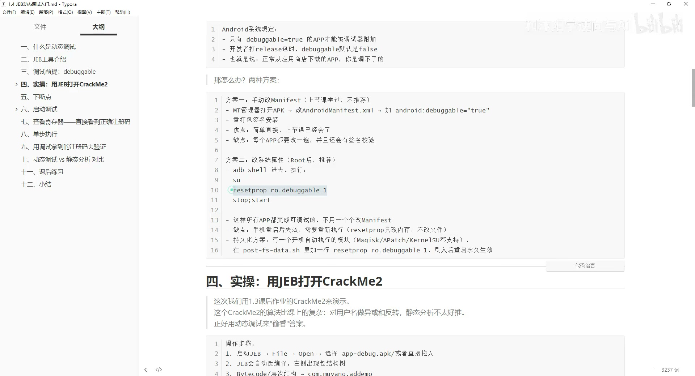
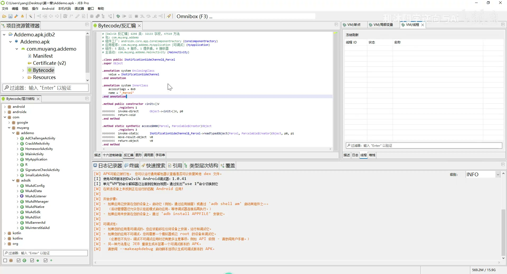

---
## 四、实操流程：调试CrackMe2（课后作业APK）
### 4.1 准备工作：JEB加载APK
1. 启动JEB，将目标APK拖入JEB主界面
2. 等待JEB自动完成反编译，左侧项目资源管理器将展示APK的完整结构
3. 找到目标类：`com.muyang.addemo.HomeworkActivity`（CrackMe2的主逻辑类），按`Tab`键可在smali视图与反编译Java视图之间切换
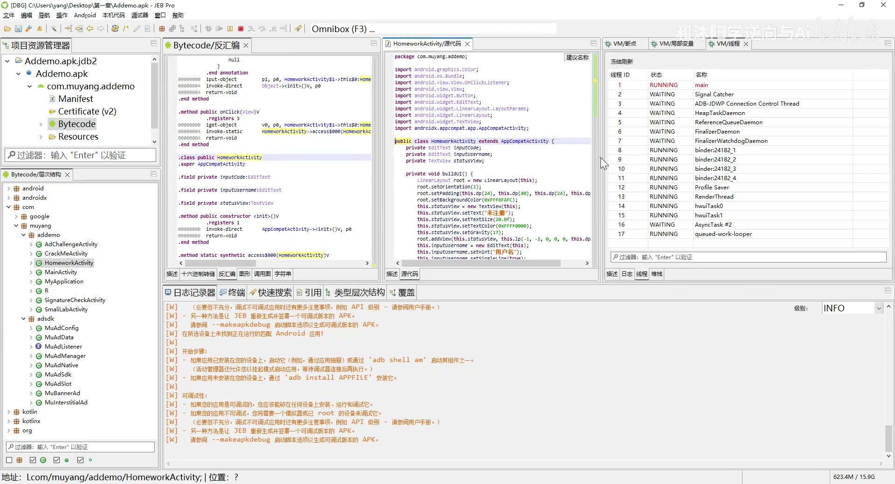
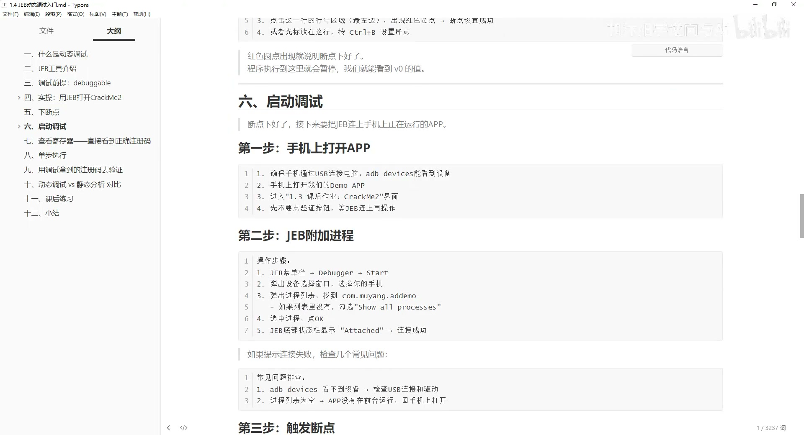

### 4.2 下断点：定位关键代码位置
CrackMe2的注册校验逻辑位于`checkRegistration`方法：调用`generateKey`生成正确注册码，再与用户输入的注册码做对比。
- 断点位置选择：`invoke-virtual`调用`generateKey`方法的下一行，此时寄存器中已经存储了生成的正确注册码
- 操作方法：光标定位到目标代码行 → 按`Ctrl+B`下断点，行前出现红色标记即为断点设置成功
> 本案例中`generateKey`算法包含字符异或、字符串反转，静态分析需要逐行梳理逻辑，动态调试仅需1次断点即可跳过算法分析直接拿结果
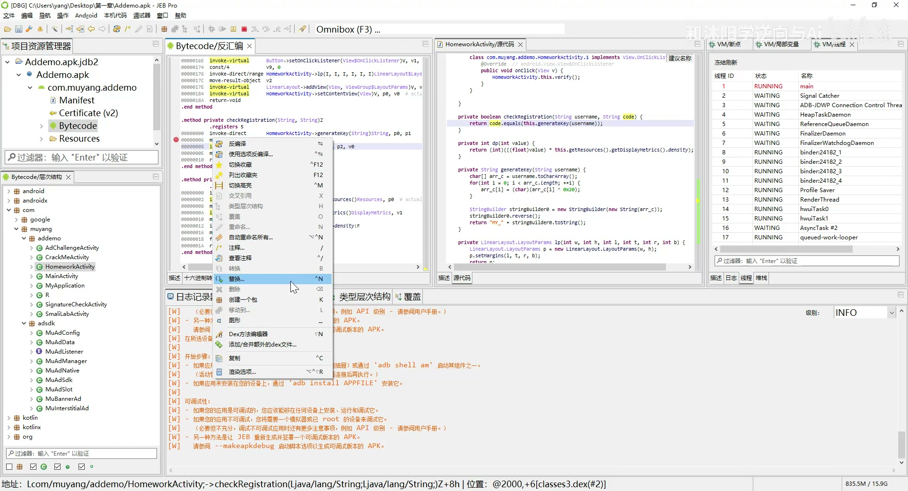

### 4.3 附加调试进程
1. 手机端打开目标CrackMe2 APP，停留在注册输入界面
2. JEB操作：点击顶部调试按钮（小蜘蛛图标）→ 选择已连接的测试设备 → 找到目标APP进程 → 点击「附加（Attach）」
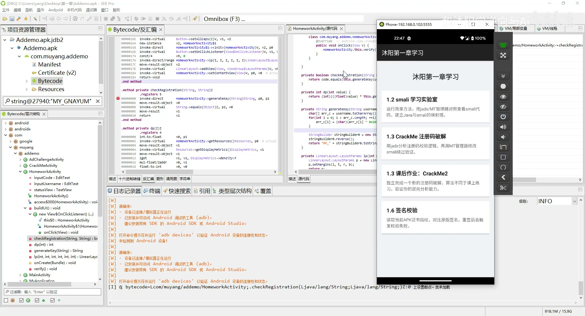

### 4.4 触发断点
手机端操作：输入任意用户名（如`muyang`）、输入任意测试注册码 → 点击「验证」按钮
此时APP执行到断点位置会暂停，JEB调试面板激活，展示当前线程状态与寄存器信息。
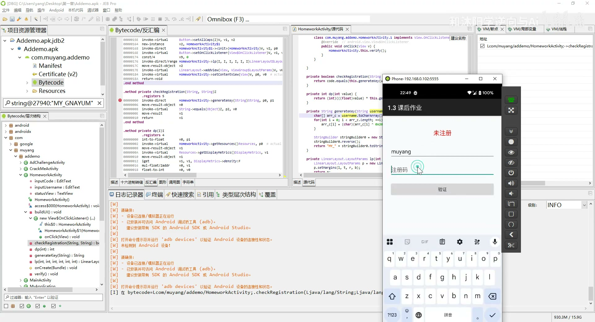

### 4.5 查看寄存器：直接获取正确注册码
断点触发后，查看JEB右侧的「VM寄存器」面板：
| 寄存器 | 存储内容 |
| --- | --- |
| p1 | 用户输入的用户名 |
| p2 | 用户输入的测试注册码 |
| v0 | `generateKey`方法生成的**正确注册码** |

直接读取v0的值即可得到正确答案，无需分析复杂算法逻辑。
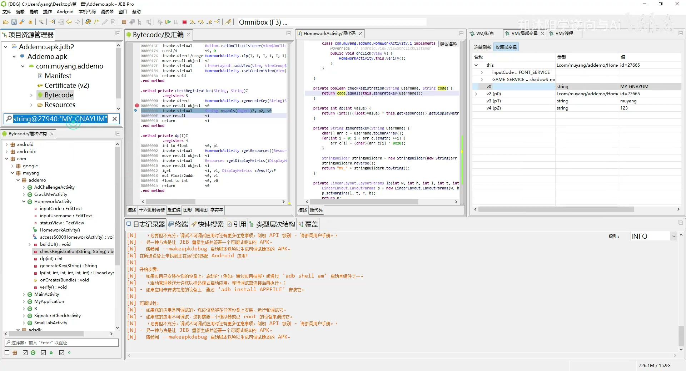
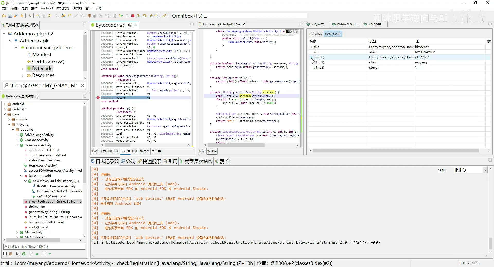

---
## 五、调试进阶操作：单步执行
JEB调试常用快捷键如下，可实现逐行跟踪代码执行：
| 快捷键 | 功能 | 说明 |
| --- | --- | --- |
| F7 | 单步进入（Step Into） | 遇到方法调用时，进入方法内部跟踪执行 |
| F8 | 单步跳过（Step Over） | 遇到方法调用时，不进入方法内部，直接执行到下一行代码 |
| F9 | 继续运行（Resume） | 从断点位置继续执行APP，直到下一个断点触发 |
| Ctrl+F2 | 停止调试 | 断开调试器与APP进程的连接 |
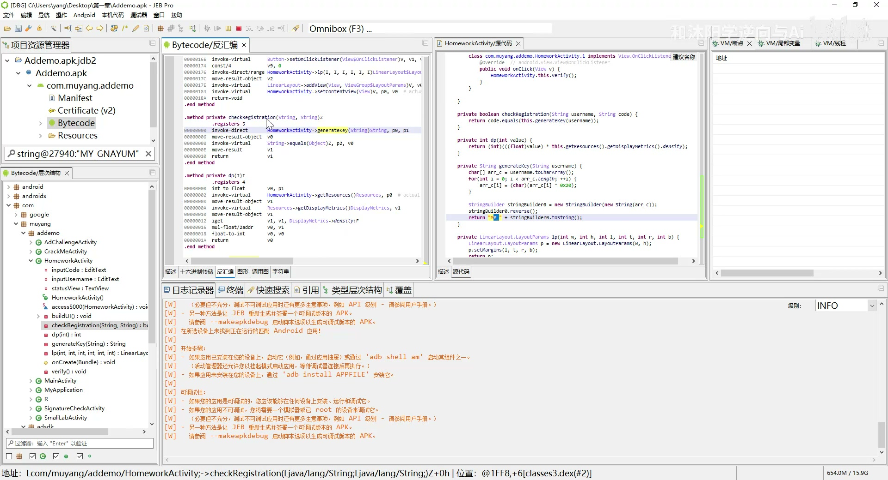
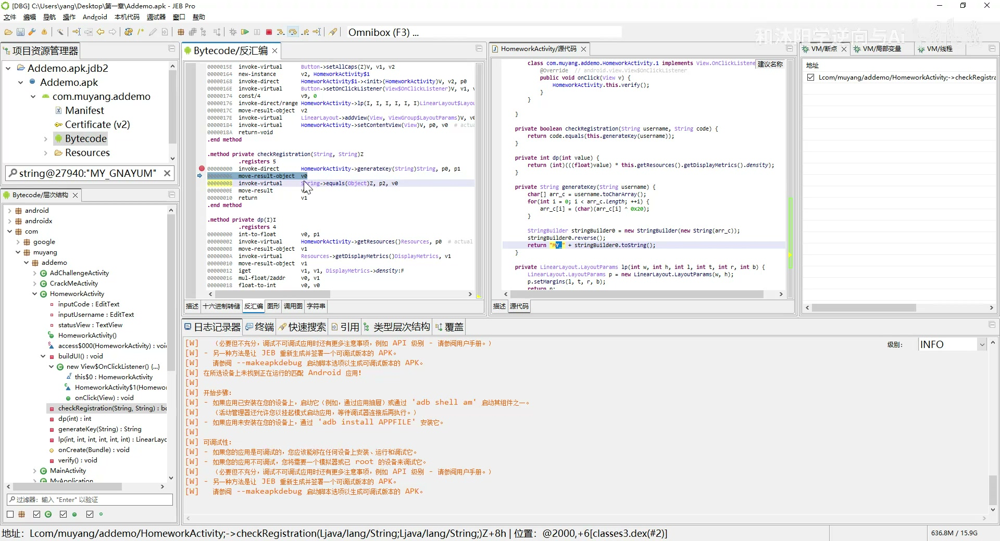

---
## JEB动态调试寄存器追踪实操
本部分为`Addemo.apk`注册校验逻辑的动态调试实操，演示如何从寄存器提取正确注册码。
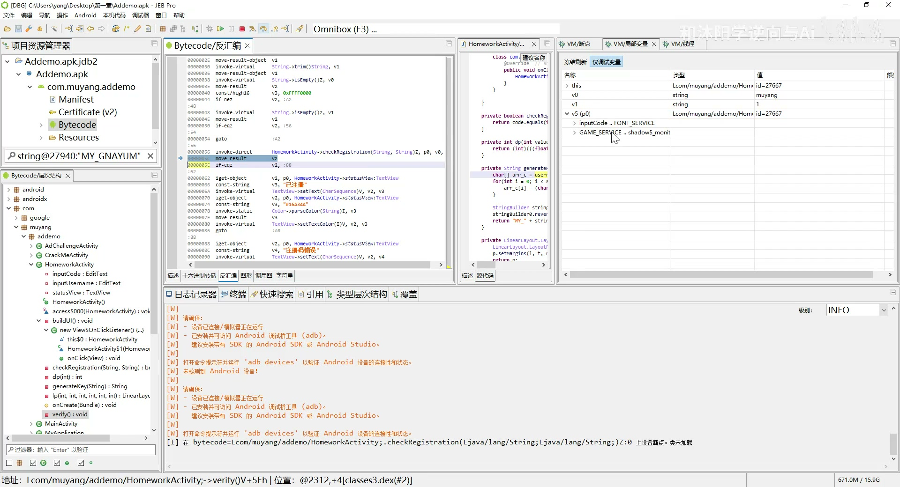
JEB命中断点后，右侧**VM寄存器**面板会实时展示当前栈帧的所有寄存器信息：
-  寄存器`p0`：对应当前`HomeworkActivity`类的实例对象
-  寄存器`p1`：存储用户输入的用户名字符串
-  寄存器`p2`：存储用户输入的注册码字符串

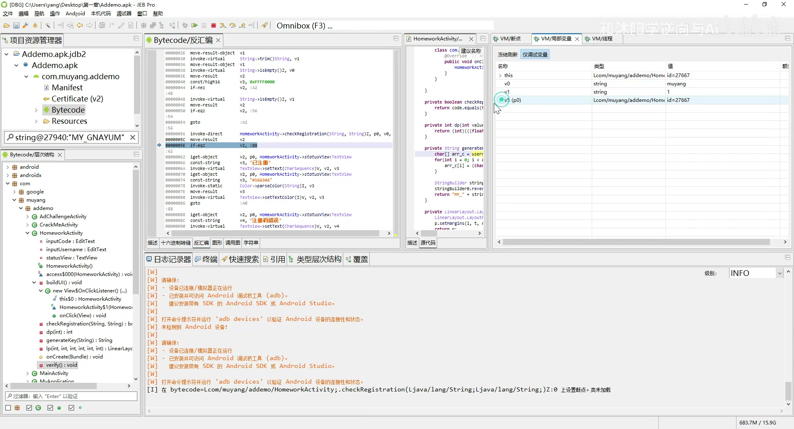
选中指定寄存器后，面板会高亮显示该寄存器的类型、内存地址和存储内容，可用于核对变量信息。

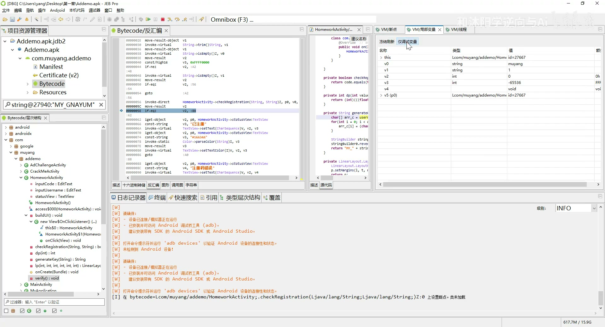
单步执行后，`this`指针会出现在寄存器列表中，和`p0`指向同一个类实例。

程序执行到字符串赋值逻辑后，寄存器`v0`出现，存储了硬编码的正确注册码常量`MY_GNAYUM`，动态调试可直接提取该关键数据。

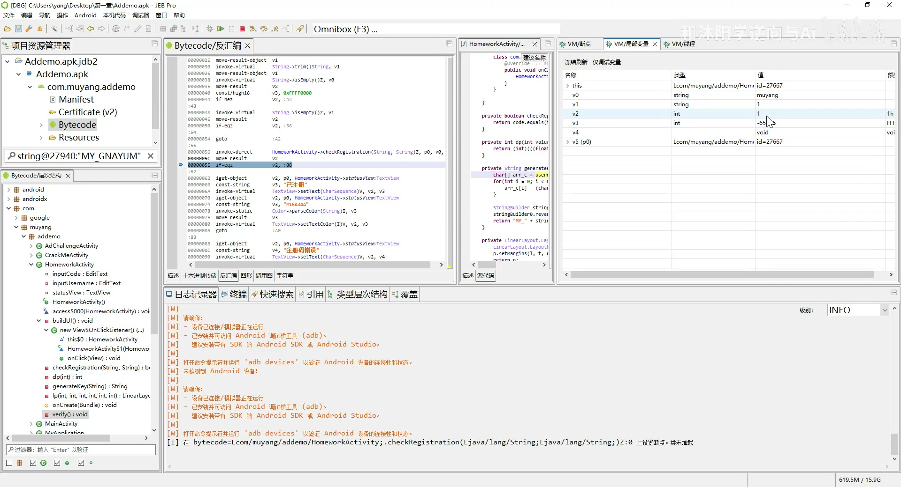
此时寄存器中同时保存了用户输入的注册码和正确注册码，后续将进入字符串对比校验逻辑。

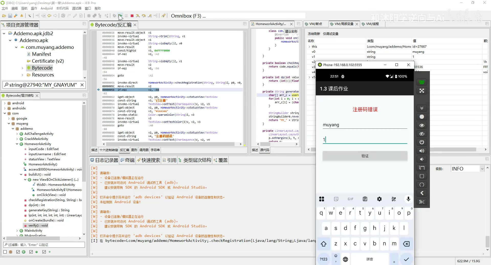
切换至安卓模拟器，输入用户名`muyang`和错误注册码点击验证，应用弹出「注册码错误」提示，触发注册校验逻辑。

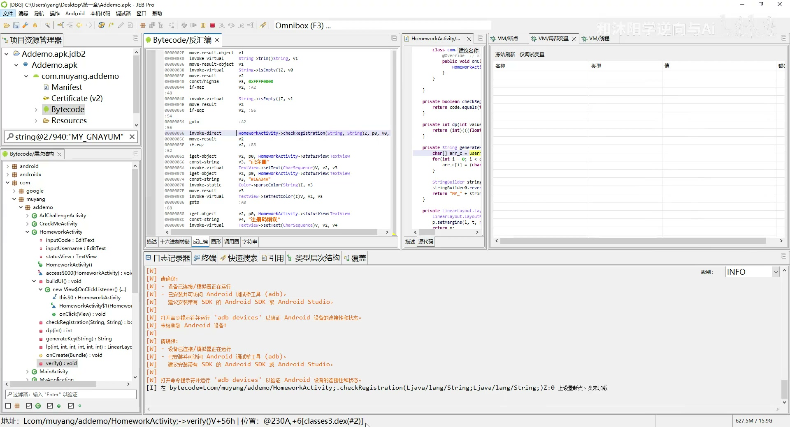
程序执行到`checkRegistration`方法的返回逻辑，寄存器`v2`存储校验返回结果：`0`代表验证失败，`1`代表验证成功。

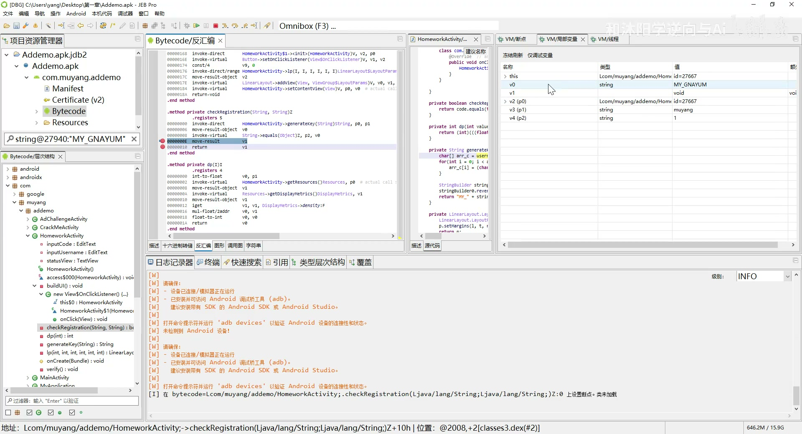
调试器定位到`checkRegistration`方法的返回指令处，可查看本次校验的入参、中间变量、返回值的完整信息。

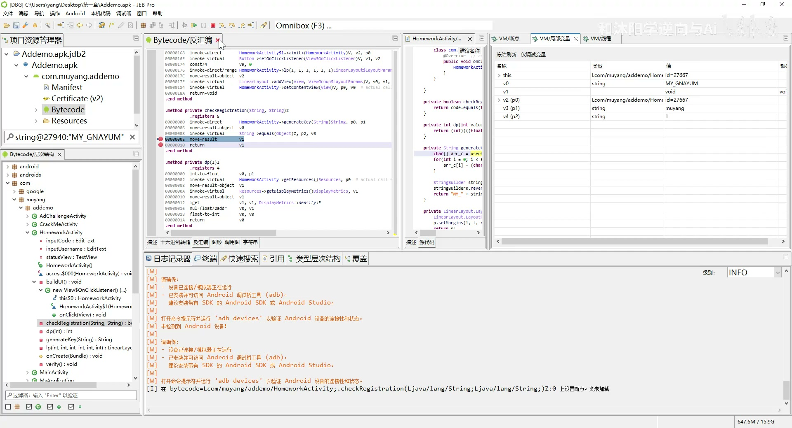
寄存器面板完整展示本次校验的所有变量：用户名、用户输入注册码、正确注册码、校验返回值。

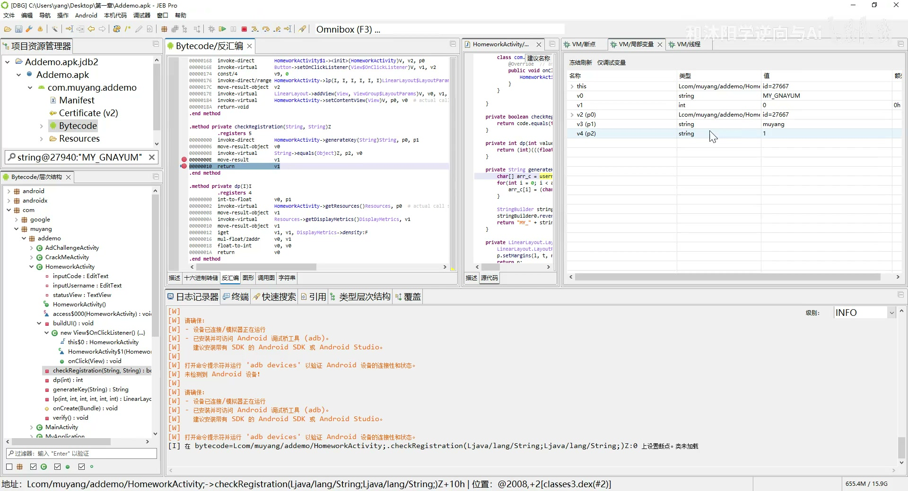
选中`p2`寄存器，可查看用户输入注册码的具体内容和内存地址。

选中`v0`寄存器，可查看正确注册码`MY_GNAYUM`的详细信息。

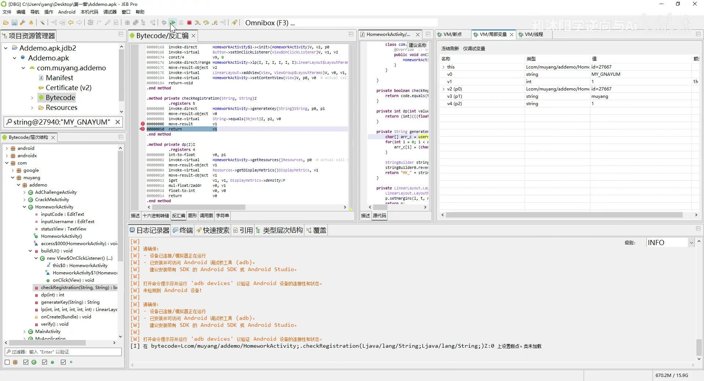
选中`p1`寄存器，可查看用户输入用户名的详细信息。

---
## 六、结果验证与扩展技巧
### 6.1 验证调试结果
将从寄存器中获取的正确注册码输入APP的注册码输入框，点击验证，APP提示「已注册」，说明调试获取的结果正确。
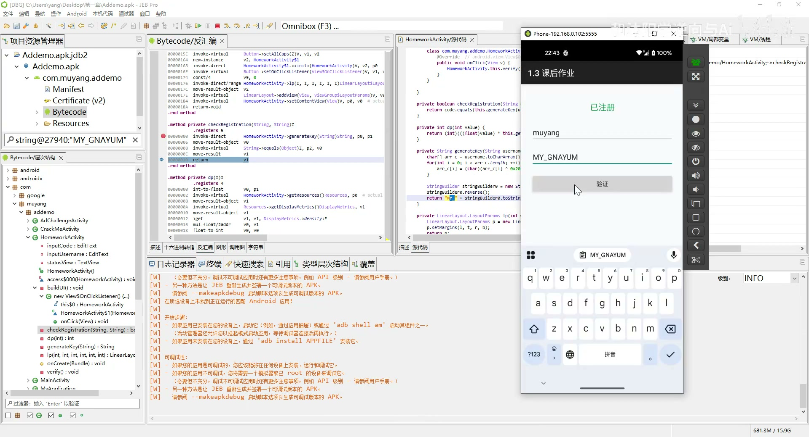

### 6.2 进阶技巧：直接修改寄存器跳过验证
JEB支持直接修改寄存器的值，无需获取正确注册码即可绕过验证：
- 场景：在`equals`方法执行完成后，返回值存储在寄存器中
- 操作：双击目标寄存器的值 → 将返回值从`0`（false）修改为`1`（true）→ 按F9继续运行，即可直接通过验证
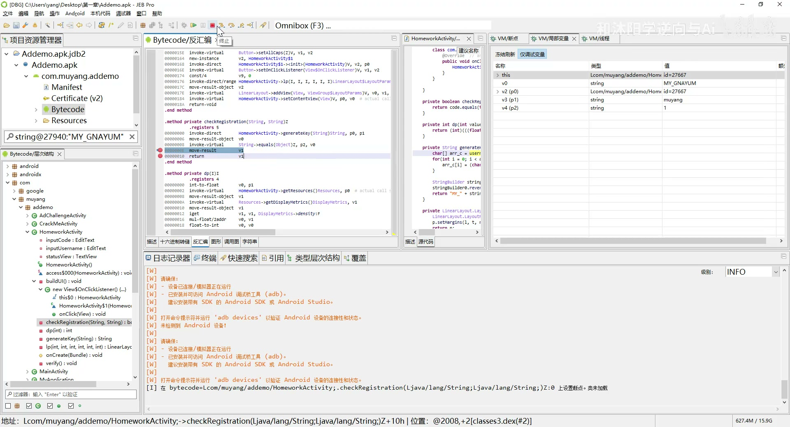

---
## 七、特殊场景：启动阶段调试（启动前Hook）
如果需要调试`Application.onCreate`、Activity启动阶段的逻辑，常规附加进程的方式来不及捕获执行流程，需要使用启动调试模式：
1. 执行命令：`adb shell am start -D -n 包名/Activity全路径`
   示例：`adb shell am start -D -n com.muyang.addemo/.HomeworkActivity`
2. 执行命令后APP会停留在「等待调试器」界面
3. JEB选择调试进程附加，成功后APP继续执行，即可捕获启动阶段的逻辑
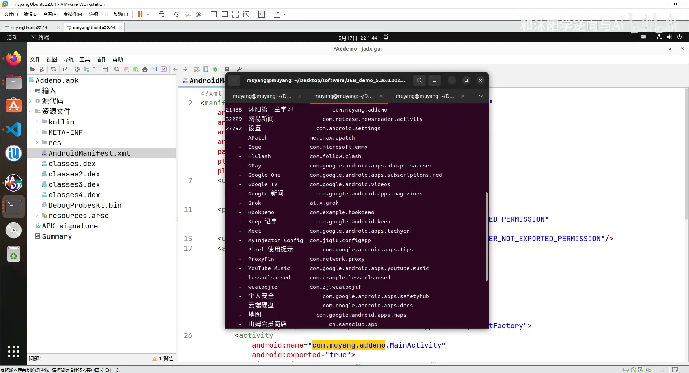
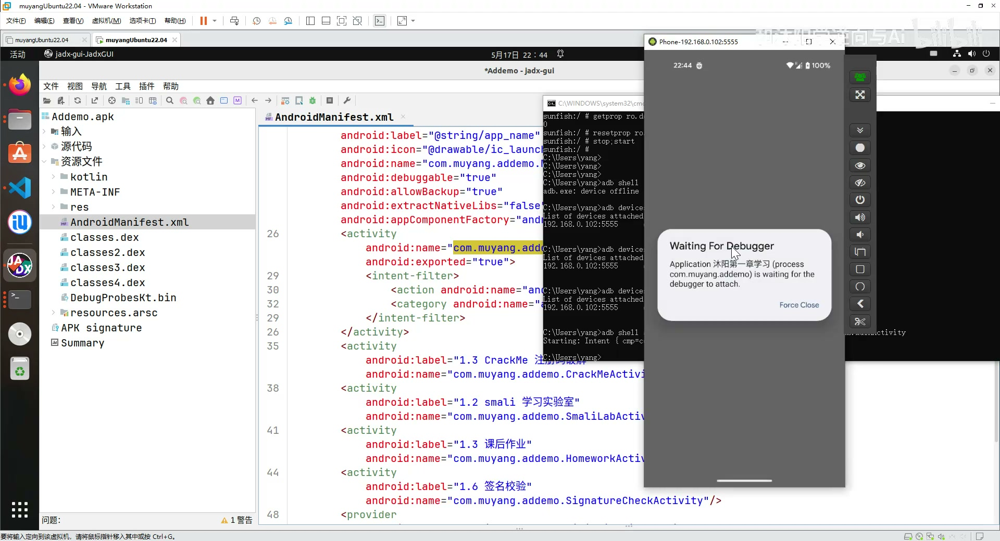

---
## 八、常见问题排查
### 8.1 报错：`Unexpected JDWP handshake`
- 原因：Android Studio、DDMS、ADB相关进程抢占了JDWP调试端口，导致JEB无法连接
- 解决方法：
  1. 完全关闭Android Studio、所有ADB相关调试工具
  2. 执行`adb forward --remove-all`清除所有端口转发
  3. 重新执行启动调试命令，再用JEB附加进程
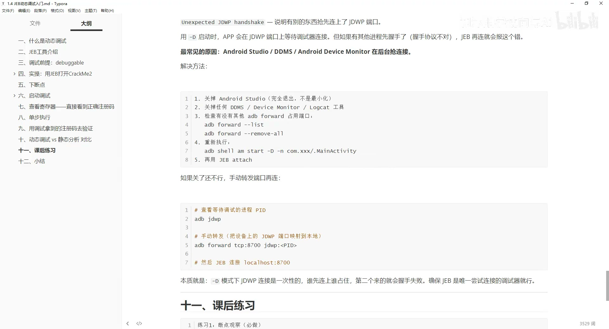

### 8.2 附加进程失败的其他常见原因
1. 设备未成功连接ADB，执行`adb devices`确认设备在线
2. 目标APP未启动，进程不存在
3. 测试设备未开启Root权限，`ro.debuggable`属性未设置成功

---
## 九、动态调试 vs 静态分析对比
| 对比维度 | 静态分析 | 动态调试 |
| --- | --- | --- |
| 是否需要运行APP | 否 | 是 |
| 核心能力 | 推理代码逻辑 | 直接获取运行时真实数据 |
| 适用场景 | 简单逻辑、无加固无混淆的APP | 复杂算法、混淆代码、加密逻辑、静态分析无法还原的场景 |
| 优势 | 无环境依赖，离线即可分析 | 无需理解算法细节，结果直接可见，效率更高 |
| 劣势 | 复杂算法分析耗时久，容易出现推理错误 | 需要调试环境，部分反调试APP会检测调试行为 |
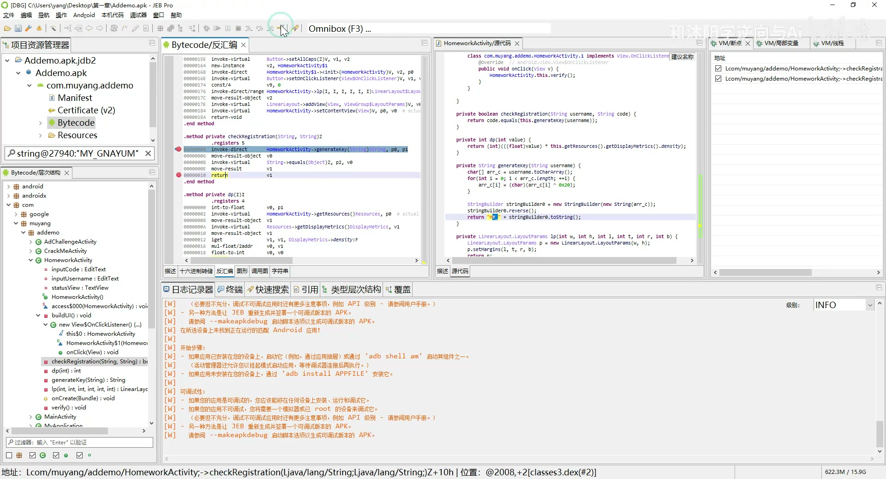

---
## 十、课后练习
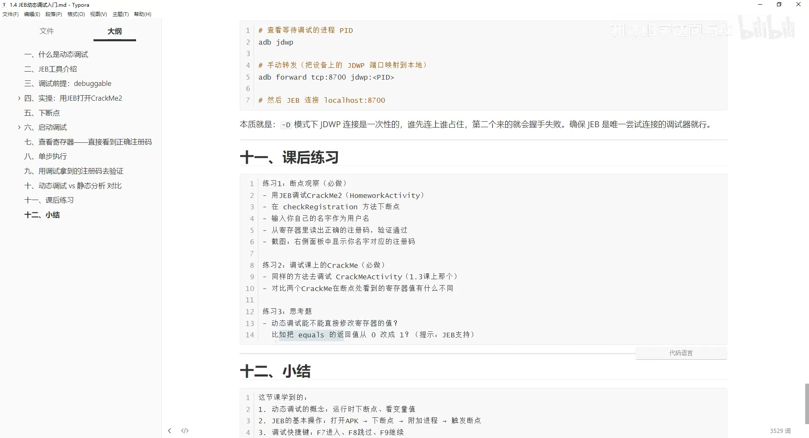
> 调试前置说明：JDWP模式下调试连接是一次性的，率先完成连接的调试器会占用通道，后续连接会握手失败，必须保证JEB是唯一连接目标进程的调试器。

1. **练习1（必做：断点观察）**
   - 用JEB调试CrackMe2（`HomeworkActivity`）
   - 在`checkRegistration`方法下断点
   - 输入自定义字符串作为用户名
   - 从寄存器中获取正确注册码完成验证
   - 截取包含用户名对应注册码的调试界面作为作业提交

2. **练习2（必做：跨版本对比调试）**
   - 用同样方法调试1.3节课的旧版CrackMe（`CrackMeActivity`）
   - 对比两个CrackMe断点处寄存器值的差异

3. **练习3（思考题：修改寄存器绕过验证）**
   - 思考JEB动态调试是否支持直接修改寄存器的值
   - 不获取正确注册码，直接修改`equals`方法的返回值，将返回值从`0`修改为`1`，让注册验证直接通过（提示：JEB原生支持该操作）

---
## 十一、课程小结
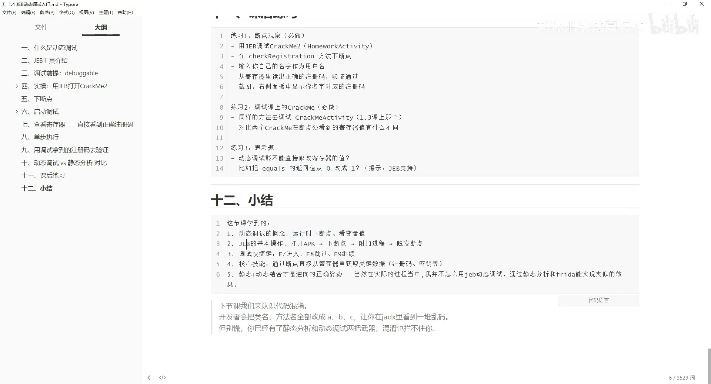
1. 动态调试的核心逻辑：在程序运行时断下，直接查看/修改运行时数据
2. JEB调试完整流程：加载APK → 定位关键代码 → 下断点 → 附加进程 → 触发断点 → 查看/修改寄存器 → 验证结果
3. 动态调试核心优势：不需要逆向分析复杂算法，直接获取运行时真实结果，大幅提升逆向效率
4. 注意事项：提前配置好debuggable权限，避免其他工具抢占调试端口
5. JEB调试常用快捷键：`F7`步入函数、`F8`单步步过、`F9`继续执行
6. 核心逆向技能：通过断点直接从寄存器提取密码、注册码等关键敏感数据
7. 逆向方法论：静态分析+动态调试结合是安卓逆向的标准思路；实际工程中可结合静态分析和Frida实现同类调试效果，无需完全依赖JEB动态调试。

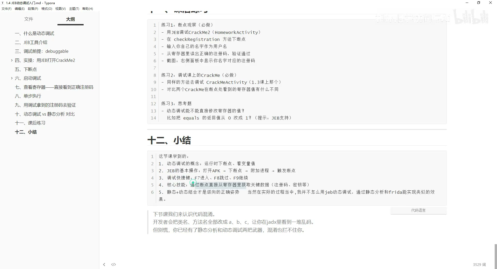
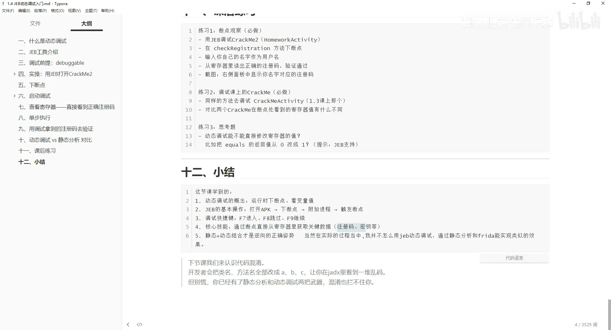
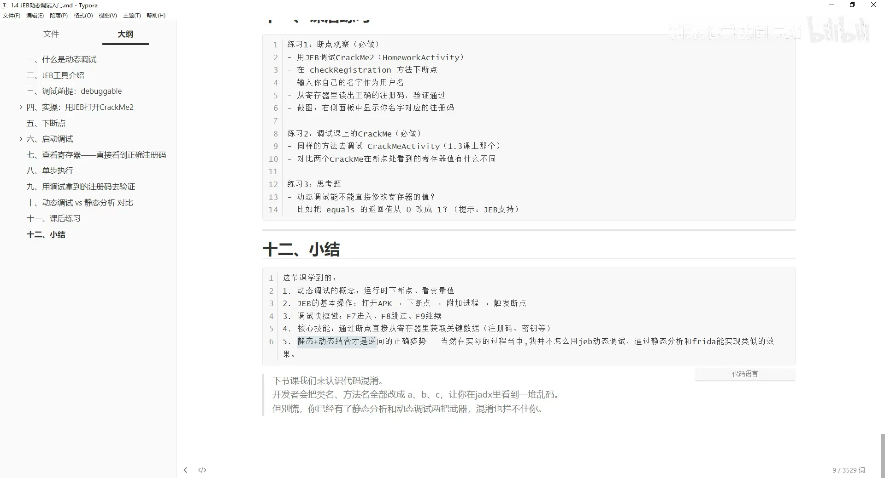
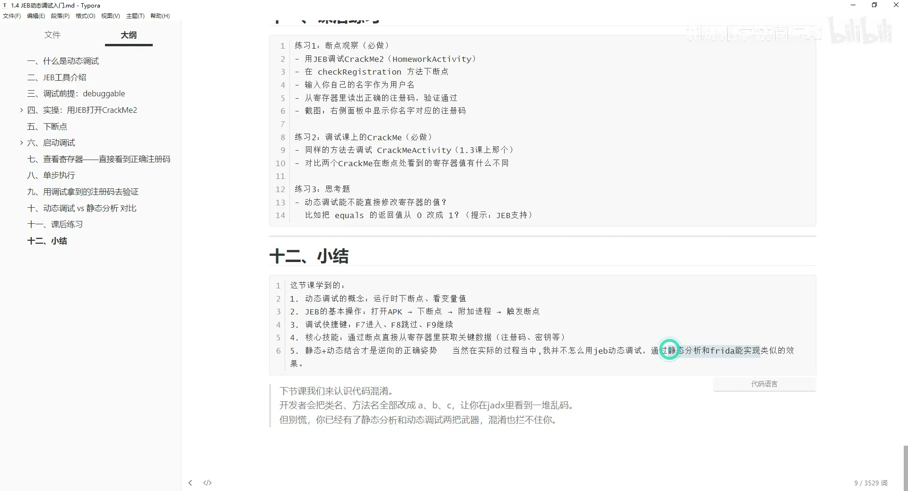

### 下节课预告
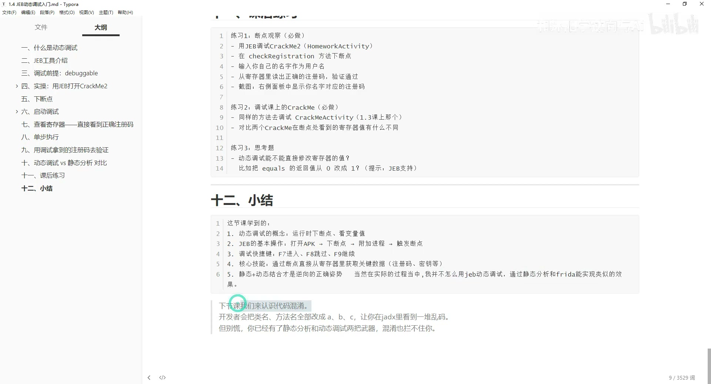
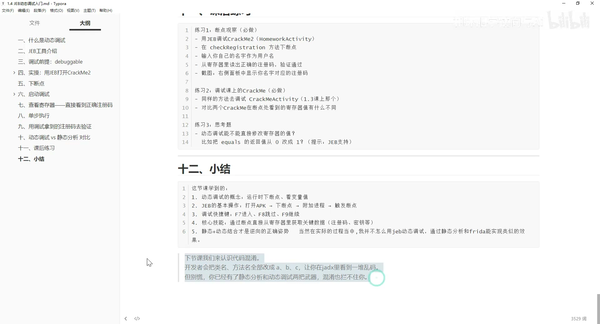
下节课将介绍代码混淆技术：开发者会将类名、方法名替换为`a`、`b`、`c`等无意义名称，造成静态阅读障碍；但掌握静态分析和动态调试后，即可高效应对代码混淆。

---
## 参考资源
1. JEB官方文档：https://www.pnfsoftware.com/jeb/manual
2. Android 官方调试文档：https://developer.android.com/studio/debug
3. 安卓ADB官方文档：https://developer.android.com/studio/command-line/adb
4. 课程配套资料：CrackMe2 APK、JEB学习版可在课程群内获取
5. 沐阳安卓逆向系列课程配套练习素材