> 来源链接：https://www.bilibili.com/video/BV1ZhMx6xEKR/?spm_id_from=333.337.search-card.all.click&vd_source=e73a152dada4626bad49c30d848902f7

## 1. 学习目标
通过本教程你将掌握以下知识点：
1. 理解OpenAI Codex的核心定位，明确其与普通对话类AI的本质差异
2. 掌握Codex桌面端的安装、登录、权限配置全流程，适配国内使用场景
3. 熟练操作Codex核心功能：项目/对话管理、插件与技能调用、多任务调度、工作树模式、自动化任务、内置终端等
4. 能够用Codex完成日常办公（Word/Excel/PPT生成）、编程开发、网站部署、自动化信息搜集等场景的全流程工作
5. 掌握Codex使用最佳实践，能够解决使用过程中的常见问题

## 2. Codex核心认知
*
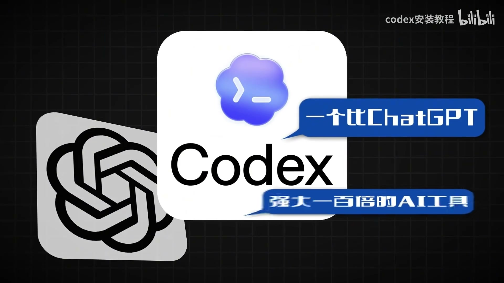*
### 2.1 产品定位
Codex是OpenAI推出的**AI智能体（Agent）工具**，并非单纯的编程工具：它从编程能力出发，已经进化为可以实际操作文件、软件、浏览器的全能助手，能够自主完成从方案到执行的全流程工作，而非仅输出建议。
*

### 2.2 与普通ChatGPT的本质区别
可以用家庭装修的类比理解两者差异：
- **ChatGPT**：你提供厨房照片后，它会给出灶台移动、配色调整的详细方案，但不会实际执行，所有操作都需要你自己完成，仅承担“顾问”角色。
- **Codex**：你只需要提出“重装厨房”的需求，它会自主完成量尺寸、画设计图、施工、多任务并行（同时装修厨房/浴室/客厅），最后交付完工结果供你验收。
*
*

落到实际工作场景中，ChatGPT仅能告诉你操作方法，而Codex可以直接操作你电脑的文件夹、创建文件、运行程序、联网搜资料、修改代码、部署上线，是能实际动手干活的AI，而非仅输出内容的问答机器人。

## 3. Codex安装与前期准备
### 3.1 版本选择
Codex共有4种使用形态：CLI版、VS Code插件版、桌面客户端、网页版。
*
综合功能完整性、新手友好度，**优先选择桌面客户端**，本教程也以桌面客户端为讲解主体。

### 3.2 账号与额度准备
1. 基础要求：需要ChatGPT账号，推荐开通Plus/Pro订阅
   - 免费账号额度极低，几乎无法正常使用
   - Plus用户每5小时可发送30-150条消息，足够日常使用
   - Pro用户额度更高，适合重度使用/企业场景
2. 低成本账号方案：如果觉得官方订阅成本高，可以通过第三方渠道（如闲鱼）获取订阅账号，目前可选方案较多。
3. 对比优势：Codex比同类AI工具额度更高，会不定期重置额度，账号限制、封号风险远低于同类产品。
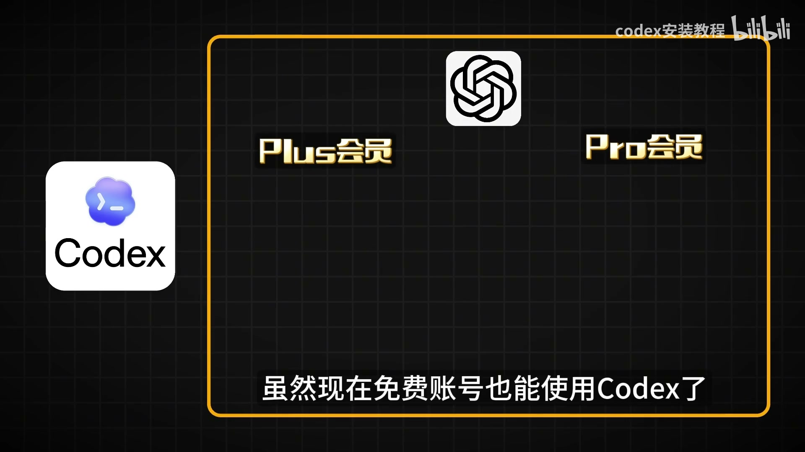*
*

### 3.3 安装与登录流程
1. 下载安装：访问官方地址`chat.openai.com/codex`，根据你的操作系统下载对应安装包，和普通软件安装流程完全一致。
2. 登录方式选择：
   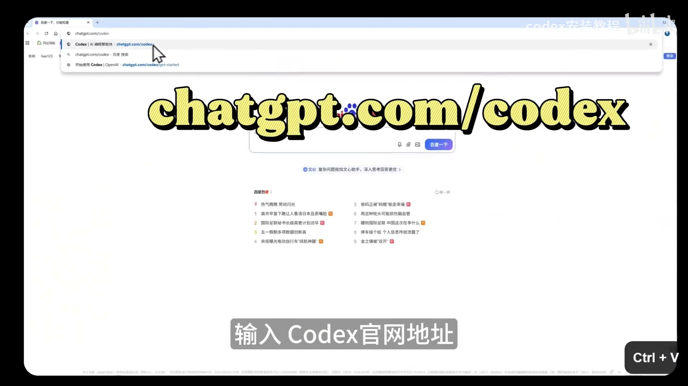*
   - **方式1：ChatGPT账号登录（推荐）**：点击登录按钮后浏览器自动跳转OpenAI授权页，同意后自动跳回Codex即可完成登录；优势是额度和ChatGPT订阅共享，第一时间获得最新模型，解锁云端任务等高级功能。
   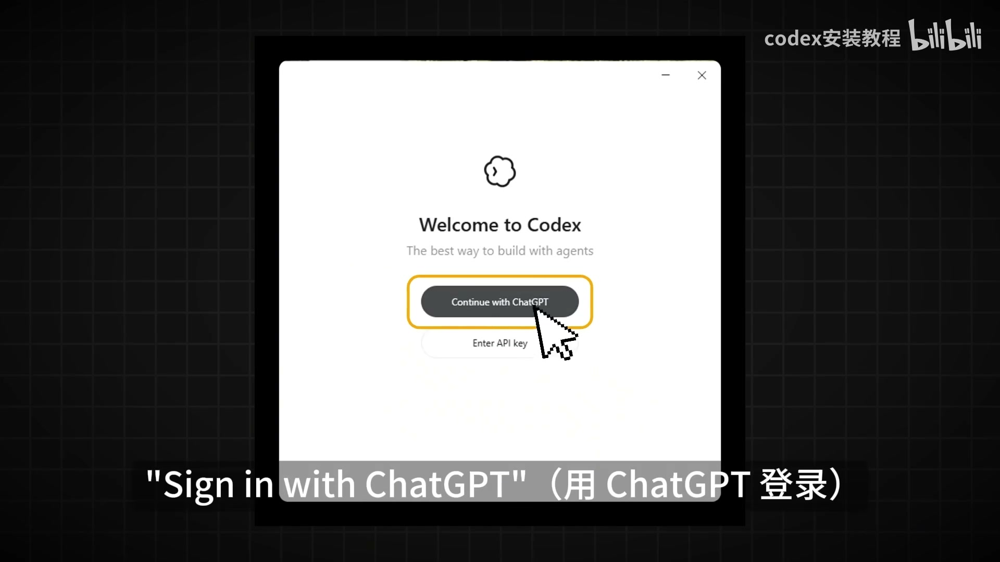*
   - **方式2：API Key登录**：适合不想订阅的用户，但模型更新慢、无云端任务，按用量计费成本不稳定，不推荐。
3. 首次登录可以选择你的工作场景，Codex会自动安装对应常用插件，也可以直接跳过。

## 4. Codex界面与核心功能详解
### 4.1 左侧栏核心模块
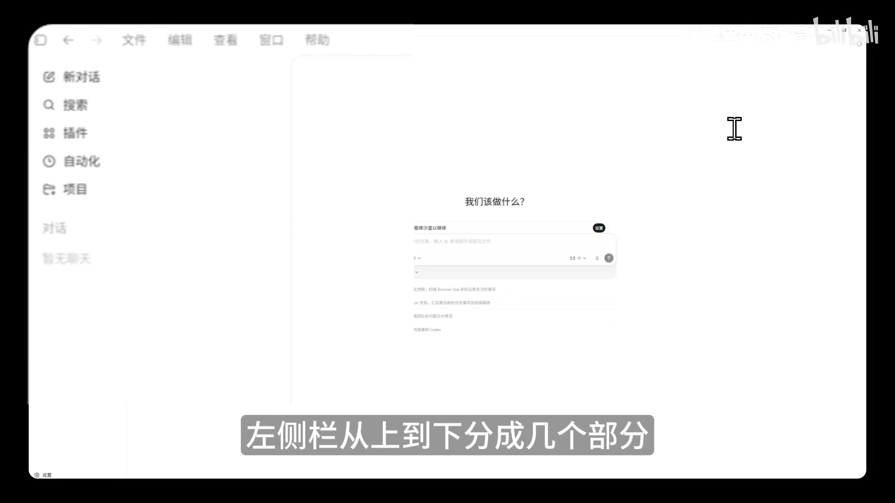*
左侧栏从上到下分为4个功能按钮、2个核心列表、设置入口：
1. 功能按钮：新对话、搜索（可以搜索所有历史对话内容）、插件、自动化
2. 核心列表：
   - **对话**：和普通ChatGPT对话逻辑一致，适合琐碎的、不涉及文件生成的需求，比如问答、翻译、文案撰写。
   - **项目**：每个项目对应你电脑上的一个实体文件夹，项目内所有生成的文件、代码、资源都会保存在这个文件夹中，方便统一管理；**所有涉及文件生成的工作，都必须在项目中完成**。
   每个项目下可以创建多个对话，不同对话共享项目内的文件，但对话上下文互相独立。
   *
3. 最下方为设置入口。

### 4.2 输入区核心配置
输入区是你和Codex交互的核心区域，包含多个关键配置项：
1. **特殊触发规则**：输入`@`可以调用插件、指定参考文件；输入`$`可以调用指定技能（Skill）。
2. 左下角+号功能：
   - 上传本地文件（PPT、Excel、图片、代码等）作为参考
   - 开启**计划模式**：开启后Codex只会输出执行方案，不会实际修改任何文件，你确认方案无误后再让它执行，适合复杂、高风险任务。

#### 4.2.1 权限模式配置
Codex有3种权限模式，对应不同的操作自由度与安全性：
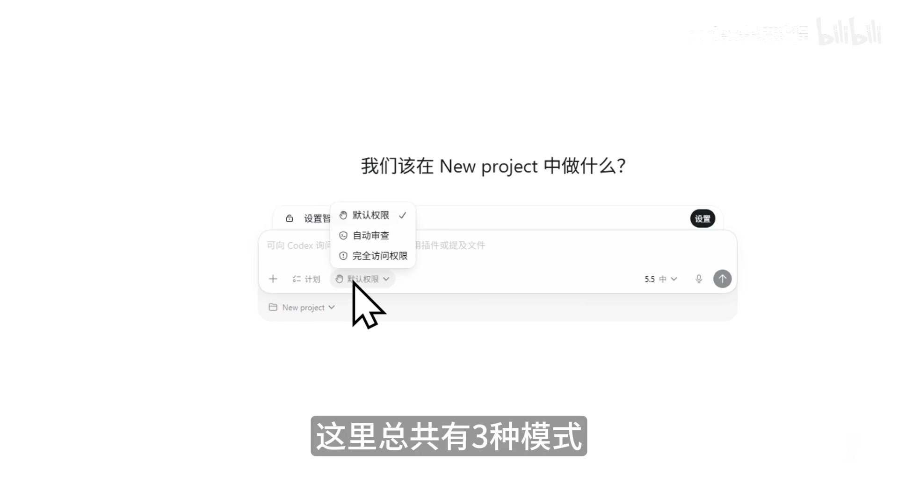*
| 权限模式 | 特点 | 适用人群 |
|---------|------|---------|
| 默认权限 | 仅能修改当前项目文件夹内的内容，所有联网、运行命令、删除文件操作都需要用户确认 | 新手、所有不确定风险的场景 |
| 自动审查 | Codex自行评估操作风险，低风险操作（如新建文件）自动执行，高风险操作（如删除文件）询问用户 | 已经熟悉Codex操作的用户，减少频繁确认的打断 |
| 完全访问权限 | 最高权限，可以操作项目文件夹外的电脑内容，所有操作无需确认，效率最高但存在误操作风险 | 对Codex非常熟悉、项目有Git备份的资深用户 |

> 新手使用建议：第一周只用默认权限，第二周尝试自动审查，完全熟练且做好备份后再开启完全访问权限。

#### 4.2.2 模型与思考强度配置
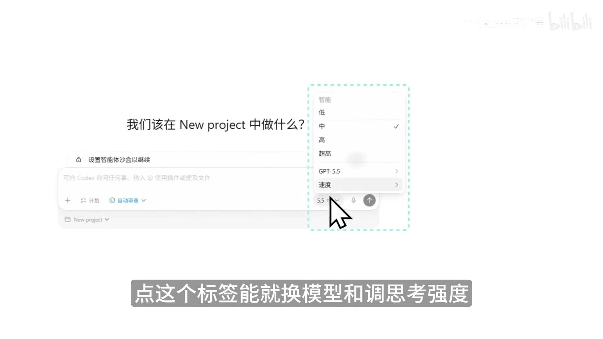*
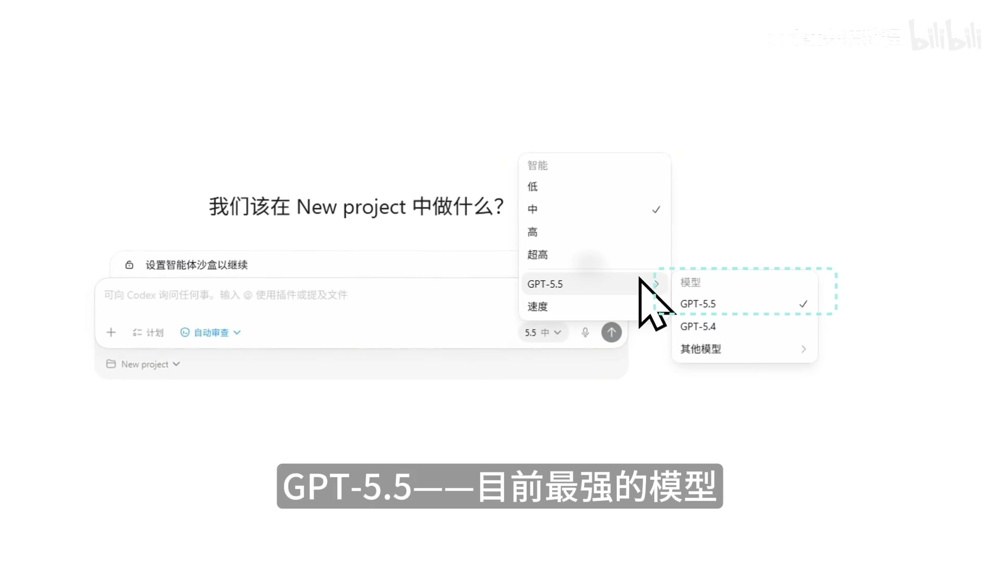*
1. **可选模型**：
   - GPT-5.5：目前最强模型，复杂代码编写、重构、调试场景首选
   - GPT-5.4：5.5上线前的主力模型，能力全面，覆盖绝大多数场景
   - GPT-5.4 mini：轻量快速模型，省额度，适合简单问答、快速浏览代码等低复杂度任务
   - GPT-5.3-Codex：专门为编程优化的老牌模型，部分复杂工程任务表现优异
2. **思考强度档位**：决定Codex回答前的思考深度，从低到高分为4档：
   - 低：速度最快，容易出错，适合修改拼写、简单语法问题
   - 中：默认档位，平衡速度与质量，日常任务首选
   - 高：思考更深入，适合有一定复杂度的任务，比如跨文件功能开发
   - 超高：思考最深最慢，适合普通模式下解决不了的疑难Bug、大规模重构
3. **速度选项**：标准模式为默认，快速模式速度提升约1.5倍，但消耗更多额度，适合赶时间的场景。

### 4.3 核心操作功能
1. **任务确认机制**：Codex要执行修改文件、运行命令等操作前会弹出确认窗口，有3个选项：仅批准本次、本次对话同类操作自动批准、拒绝；新手建议每次确认操作内容后再批准。
2. **预览与批注**：Codex生成网页、Word、PPT、Excel后可以直接在界面内预览，对不满意的部分可以直接加批注，Codex会精准修改对应内容，不需要重新描述需求。
3. **版本与审查功能**：修改完成后可以查看新旧内容的差异，绿色为新增内容，红色为删除内容；如果不满意可以直接撤销修改；支持图形化Git操作，无需输入命令就能完成提交、推送到远程仓库。
*
4. **额度机制**：Codex的上下文额度按5小时滚动重置，5小时前的消息会自动过期释放额度，无需手动清理。
*

### 4.4 多任务管理：排队、插队、并行
Codex是目前多任务调度最灵活的AI工具，支持3种任务调度模式：
*
1. **任务排队**：Codex执行当前任务时，你可以直接输入新需求，新任务会自动排在当前任务之后，按顺序依次执行，不需要等当前任务完成。
2. **任务插队**：如果需要调整当前正在执行的任务，不需要等排队，点击消息旁的「引导」按钮，新需求会直接注入当前执行的任务，Codex会边做边调整需求。
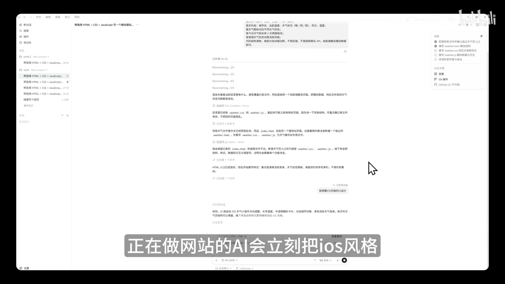*
3. **多任务并行**：新建对话就可以同时执行多个任务，不同对话的上下文不共享，但都可以访问当前项目的文件；也可以跨项目同时执行多个任务，互不干扰。

### 4.5 插件与技能系统
很多用户容易混淆插件与技能，两者核心区别如下：
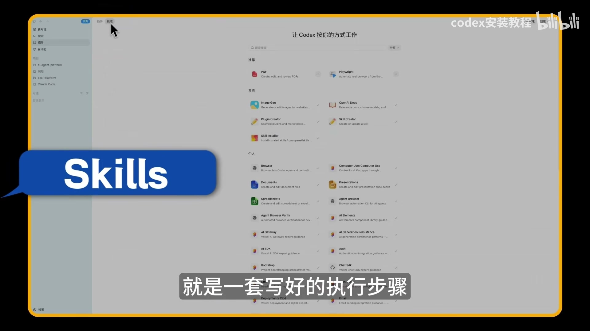*
- **技能（Skill）**：是一套预设的执行步骤说明，相当于给Codex的操作手册，调用技能就是让Codex按照固定流程完成任务，比如内置的`Image Gen`就是生图的技能，调用后Codex会按照确定的流程生成符合要求的图片。
- **插件（Plugin）**：比技能层级更高，一个插件包含多个技能，同时具备外部应用的连接能力，安装后就能让Codex操作对应的软件/服务；比如`Browser Use`插件包含多个浏览器操作技能，安装后Codex就能操作浏览器。
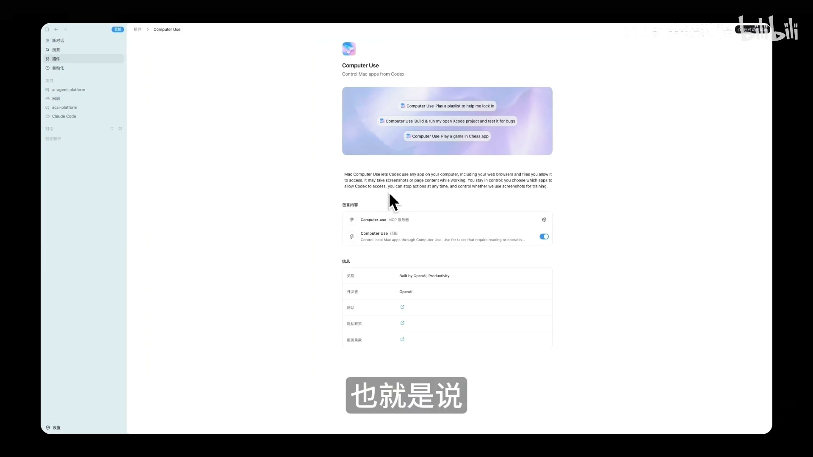*

#### 调用方式与常用插件
- 调用方式：输入`@`可以选择插件，输入`$`可以选择技能，也可以不手动指定，让Codex根据需求自动判断调用。
- 常用办公类插件：`Documents`（生成Word）、`Spreadsheets`（生成Excel）、`Presentations`（生成PPT）、`Browser Use`（操作浏览器）、`Vercel`（网站部署）
- 注意：操作本地电脑的`Computer Use`插件目前仅支持Mac系统，Windows暂不支持。

## 5. Codex实战场景教程
### 5.1 日常办公场景
Codex已经可以覆盖绝大多数日常办公需求：
1. **生成Word分析报告**：安装`Documents`插件，输入需求即可，比如：`帮我写一份AI行业2026年趋势分析报告，要有目录、大模型对比表格、结论，用@Document生成`，Codex会自动联网搜集资料，整理成格式规范的Word文档保存在项目文件夹。
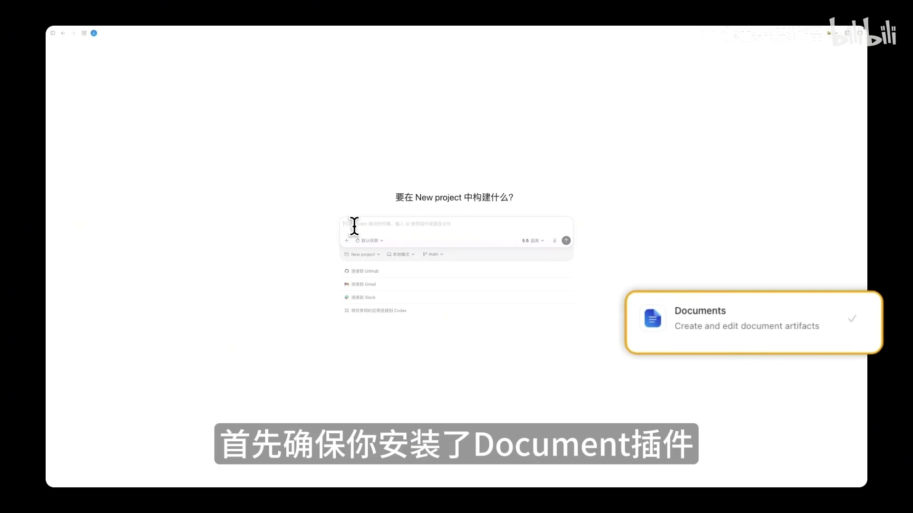*
2. **生成Excel数据表格**：安装`Spreadsheets`插件，输入需求：`帮我做一份AI相关股票对比表，包含股票名、今日涨跌幅、市值、一句话总结，用不同颜色标注涨跌`，自动生成对应Excel文件。
3. **生成演示PPT**：安装`Presentations`插件，输入需求：`帮我做一份10页的PPT，主题是AI如何改变工作方式，风格简洁商务，每页要有要点和配图说明，用@Presentation生成`，自动生成PPT文件。
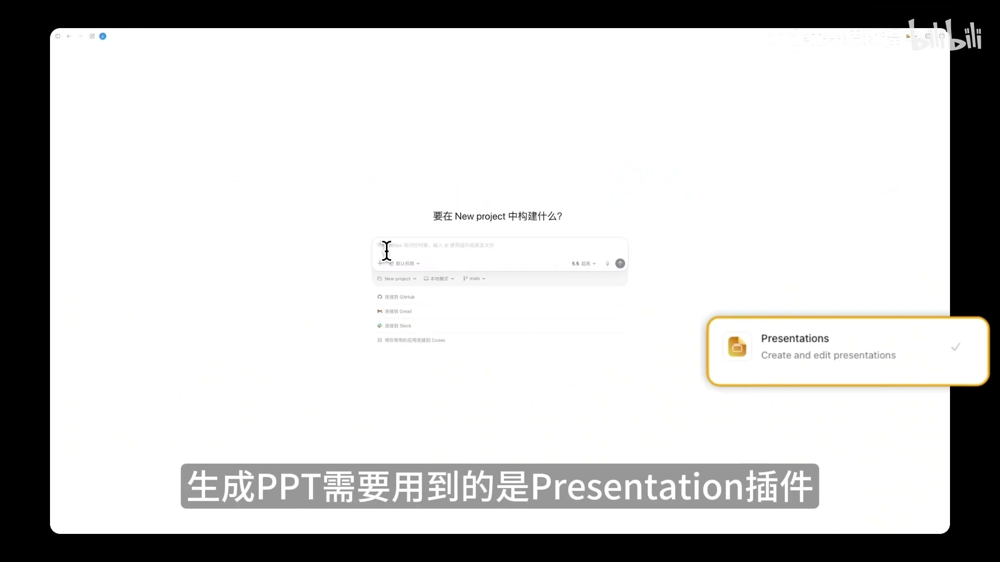*
4. **多任务同时执行**：可以在一条需求里同时要求完成多项工作，比如`帮我搜集今日AI行业动态，用@Document写分析报告、用@Spreadsheets做数据汇总表、用@Presentation做简报、用$Image Gen生成封面图`，Codex会自动完成所有工作并保存在项目文件夹。

### 5.2 自动化定时任务
对于每天重复的固定工作，可以设置为自动化定时任务：
1. **设置方式**：直接用自然语言输入需求即可，比如：`设置一个每日定时任务，每天早上8点自动搜索AI行业相关股票信息，生成分析报告、数据汇总表、简报PPT，所有文件保存在当前项目文件夹`。
2. **任务管理**：点击左侧「自动化」按钮，可以查看所有定时任务，修改运行时间、任务描述，手动触发运行，也可以暂停或删除不需要的任务。
*
*
> 使用建议：首次设置自动化前，先在普通对话测试你的需求，确认输出符合预期后再设置为定时任务，避免浪费额度。

### 5.3 三种工作环境详解
Codex有3种工作环境，适配不同风险等级的任务：
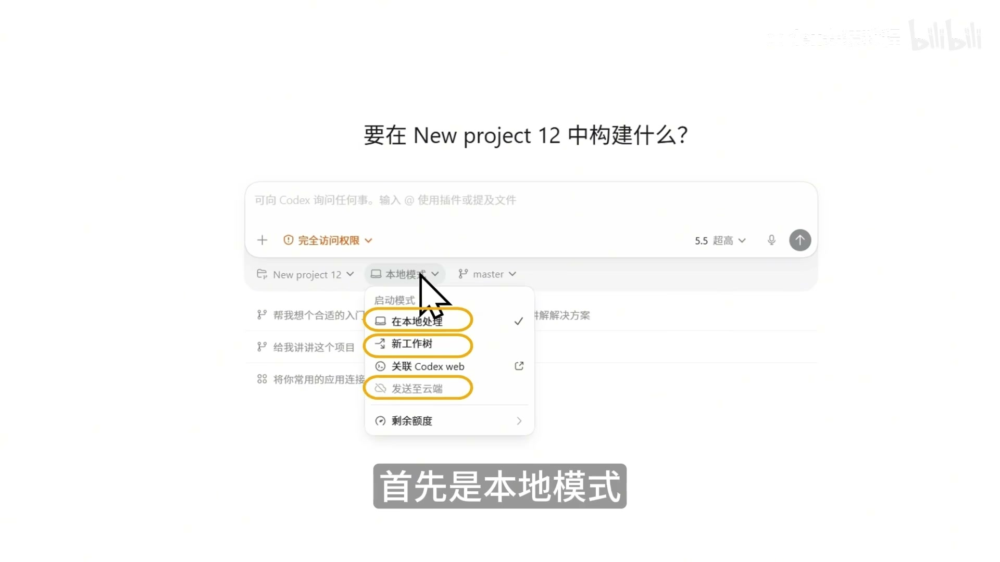*
1. **本地模式**：默认模式，Codex直接修改你本地的项目文件，修改实时生效，适合简单的、低风险的小修改；缺点是改坏了需要手动撤回，建议修改前先提交Git版本。
2. **工作树模式**：Codex为你的项目创建一个独立的平行副本（工作树），所有修改都在副本上完成，完全不会影响原文件；修改完成后你可以审查所有改动，再选择合并到本地、创建新分支、或者直接丢弃改动；完美解决多对话同时修改同一个文件的冲突问题，适合复杂、高风险的修改任务。
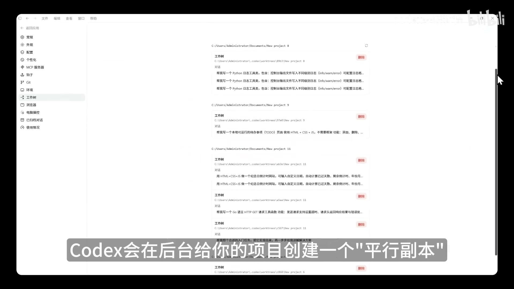*
3. **云端模式**：任务发送到OpenAI服务器执行，你的电脑不需要开机，适合耗时很长的大任务；需要关联Codex Web和GitHub仓库，配置稍复杂，新手可以暂时不用。

### 5.4 浏览器与本地电脑操作
这是Codex相比同类工具最突出的能力：
1. **浏览器操作**：安装`Browser Use`插件后，Codex可以自主打开浏览器、访问网站、点击按钮、填写表单、截图、抓取信息，只有遇到需要登录账号的场景才需要你操作，其余全程自动；比如可以让它：`帮我在Canva找10个适合职场汇报的免费PPT模板，整理优缺点并截图，输出成报告`。
*
2. **本地电脑操作（仅Mac支持）**：安装`Computer Use`插件后，Codex可以操作你本地电脑的所有软件、文件，比如：`打开我电脑的Chrome，访问小红书，搜索Codex教程，把最新的10篇图文笔记下载整理，在桌面新建文件夹保存`，全程无需人工干预。
*

### 5.5 进阶功能
#### 5.5.1 AGENTS.md全局规则文件
在项目根目录创建名为`AGENTS.md`的文件，写入你对Codex的通用工作规则，比如：`没有我的要求不要做额外优化`、`所有回复用中文`、`修改前先确认文件结构`、`不要删除重要文件`等，Codex每次新建对话都会自动读取并遵守这些规则，避免你每次重复提要求。
*
> 使用建议：`AGENTS.md`建议控制在150行以内，避免占用过多上下文额度影响需求理解。

#### 5.5.2 内置终端与多AI协作
- 打开方式：按`Cmd+J`（Mac）/`Ctrl+J`（Windows），或者点击右上角终端图标打开；终端的工作目录会自动跟随当前对话/工作树，不需要手动切换路径。
- 高级用法：Codex可以自动读取终端的输出、日志、报错信息；你也可以在终端里同时运行其他AI工具（比如Claude Code），实现多AI协作，用Codex做它擅长的操作浏览器、生成文件、任务管理，用Claude Code做它擅长的代码优化等工作。
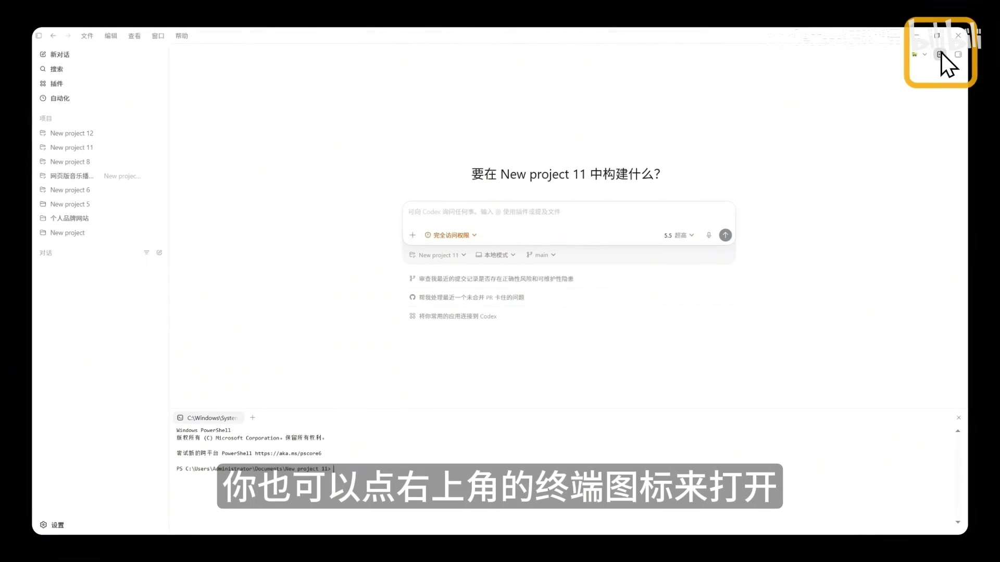*

### 5.6 完整实战：用Codex做个人网站并上线
我们用一个完整流程演示Codex的工作流：
1. 新建空白项目，命名为「个人品牌网站」
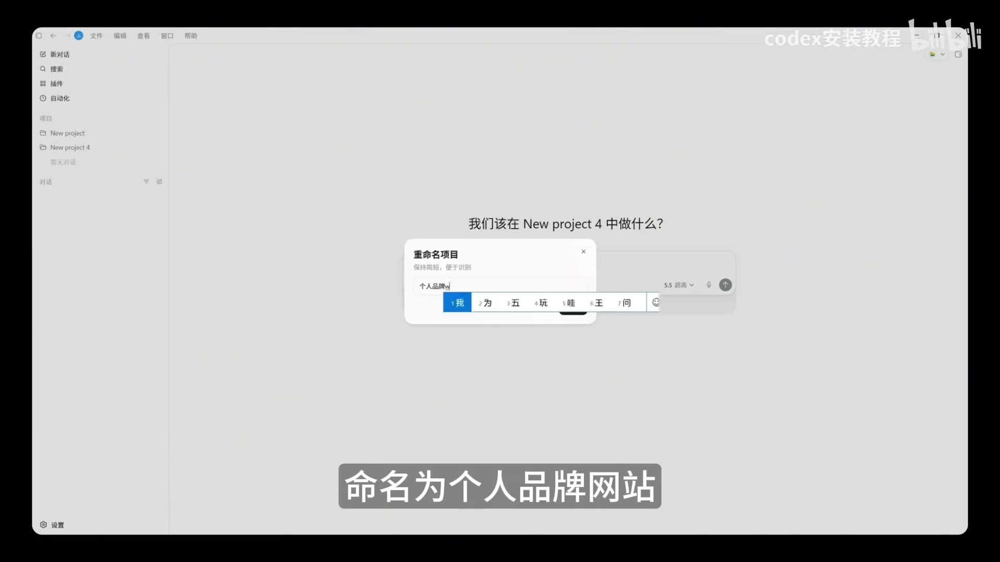*
2. 输入需求：`帮我做一个个人品牌官网，简约科技风格，适配移动端，要有首页介绍、作品展示、联系方式三个板块`，Codex会自动编写代码，启动本地开发服务，给你本地预览地址。
3. 你可以在预览中查看效果，直接提修改需求，比如“把主色调改成蓝色，增加移动端菜单”，Codex会实时调整。
4. 调整满意后，安装`Vercel`插件，输入`帮我把这个网站部署上线`，Codex会自动完成部署，生成公开的访问链接，全世界都可以访问你的网站。
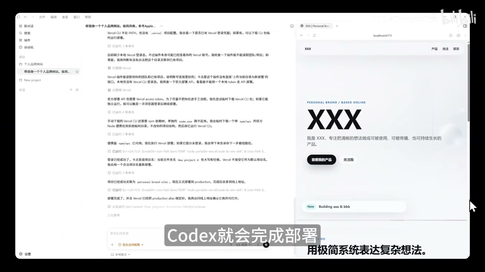*

## 6. Codex使用最佳实践
遵循以下规则可以大幅提升Codex的使用效率，减少出错概率：
1. **涉及文件一律用项目，不要用对话**：所有需要生成文件的工作都放在项目里，统一管理不会混乱。
*
2. **一个任务一个对话**：不要在单个对话里塞多个无关任务，对话越纯粹，Codex的输出质量越高。
3. **复杂任务先出计划再执行**：开启计划模式，或直接要求“先给我执行方案，不要动手修改”，确认方案没问题后再让Codex实施，避免走弯路。
4. **明确任务完成标准**：不要只说“帮我修bug”，要说“帮我修这个bug，完成标准是