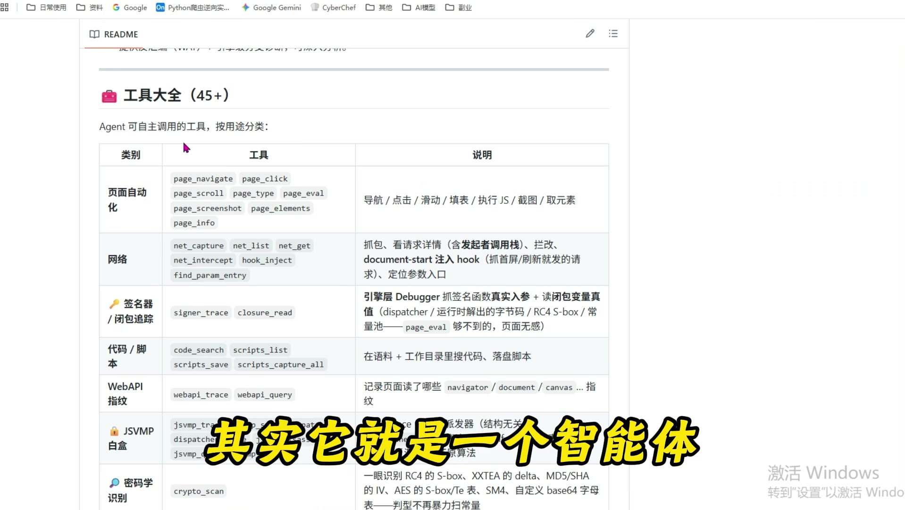
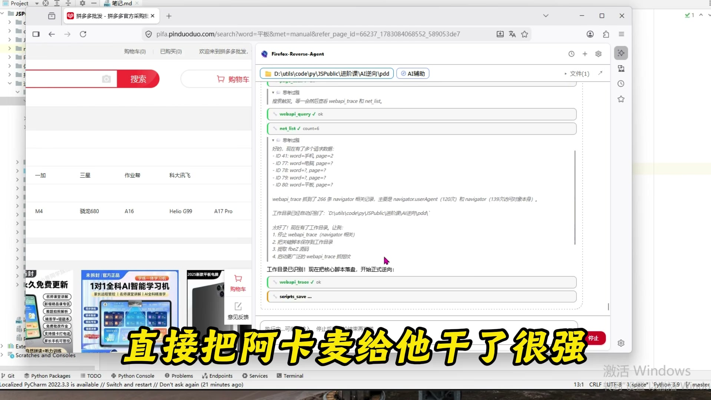
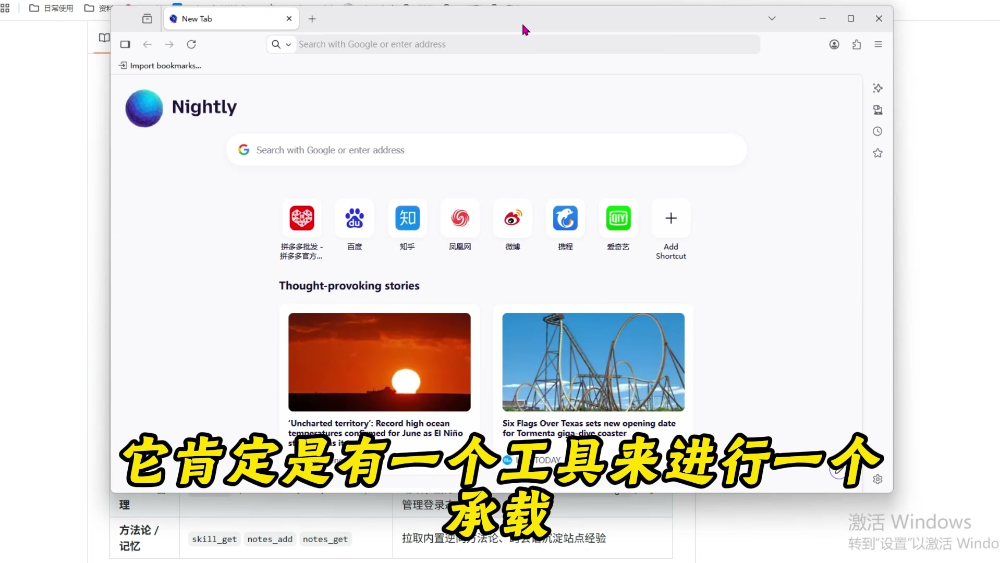
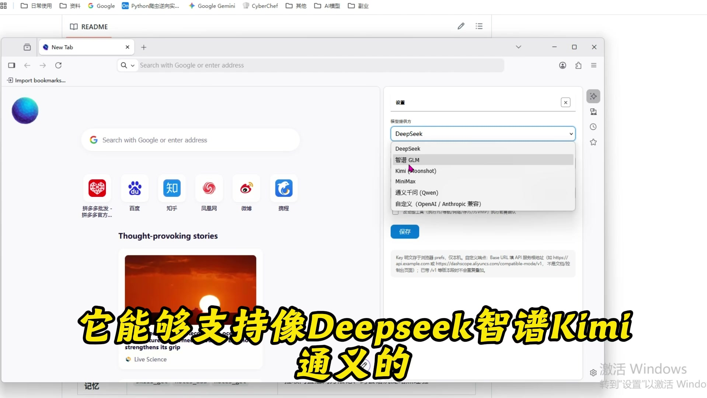
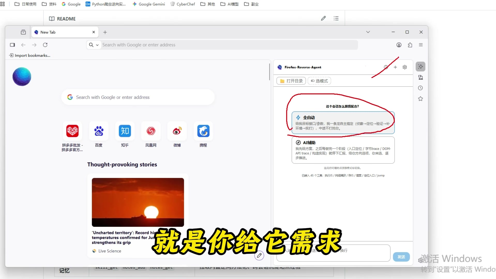
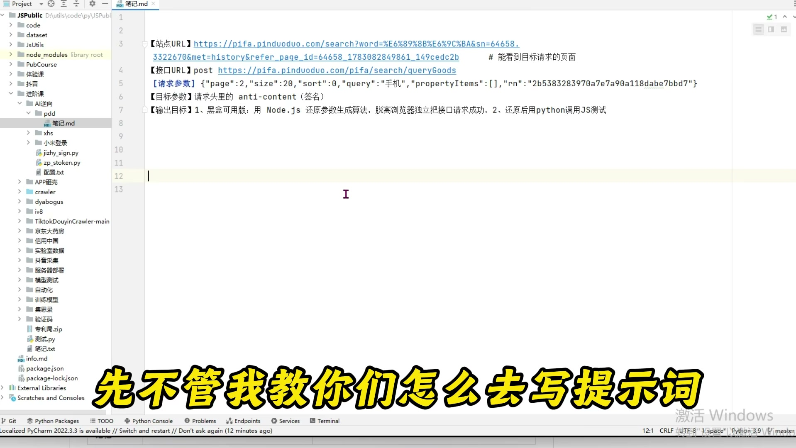
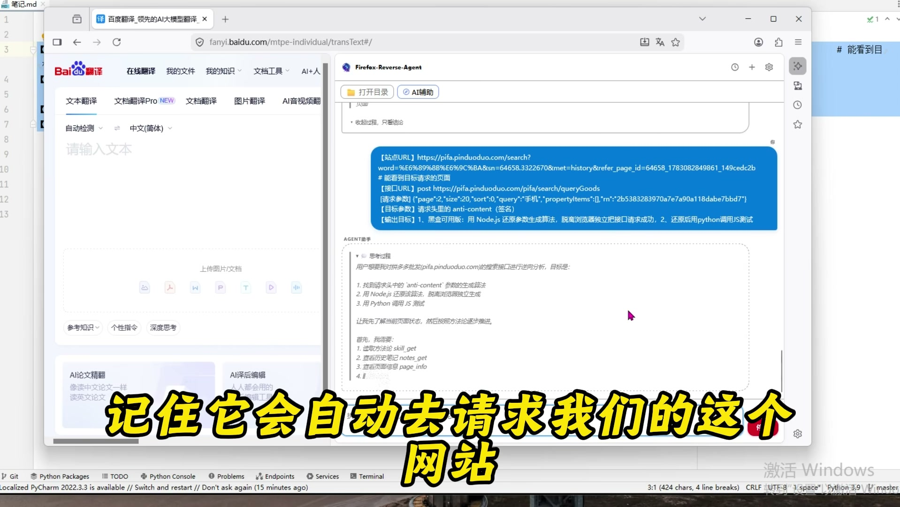
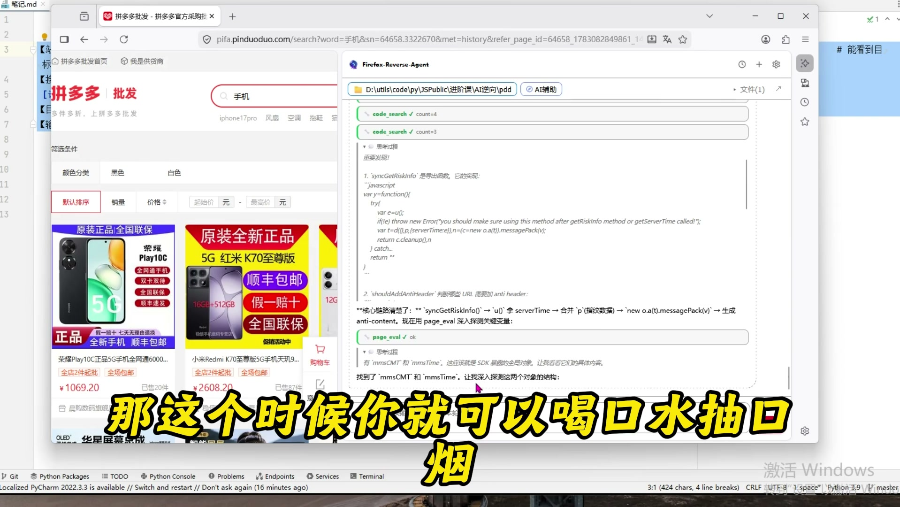
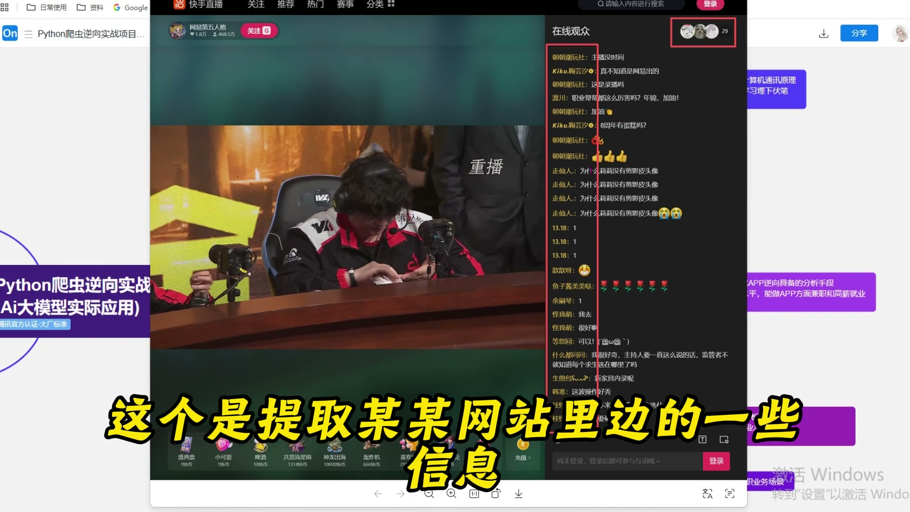

> 来源链接：https://www.bilibili.com/video/BV166TD6YECi/?spm_id_from=333.1387.favlist.content.click&vd_source=e73a152dada4626bad49c30d848902f7

## 学习目标
完成本内容学习后，将掌握以下核心知识点：
1. 爬虫智能体的核心能力边界与适用场景
2. 爬虫智能体的完整配置流程（大模型对接、工作模式选型）
3. 爬虫逆向任务的标准化Prompt编写方法
4. AI工具对爬虫从业者职业发展的影响与应对逻辑
5. 电商平台反爬签名参数的自动化逆向全流程

## 1. 爬虫智能体概述
爬虫智能体是一款面向JS逆向、网站数据采集场景的自动化AI工具，可替代人工完成全流程逆向分析工作，核心能力包括：
- 自动化能力：自动访问目标网站、自动完成需求分析、自动执行抓包调试、自动生成可运行代码
- 技术覆盖：支持GSMMP协议分析、Web常见指纹识别、自动环境补全、代理集成、WSM分析、白盒调试、JS混淆还原
- 实战适配：已验证可完成抖音、拼多多、淘宝、京东等主流平台的爬虫逆向，可突破Akamai等高难度反爬体系

## 2. 爬虫智能体的部署与配置
### 2.1 运行环境
该智能体基于浏览器运行，内置所有逆向所需工具，无需额外搭建第三方抓包、调试工具环境，开箱即可使用。

### 2.2 大模型对接配置
智能体依赖大模型完成逻辑分析，兼容主流大模型服务，包括DeepSeek、智谱AI、通义千问等，仅需在配置面板填入对应大模型的API KEY即可完成对接，推荐使用DeepSeek，使用成本更低。

### 2.3 工作模式选型
智能体提供两种工作模式，适配不同使用场景：
1. **全自动模式**：输入完整需求后，智能体自动执行全流程分析，无需人工干预，适合无明确逆向思路的场景，缺点是分析耗时较长，Token消耗更高
2. **AI辅助模式**：智能体每完成一个分析阶段，输出中间结果供人工判断，人工可调整分析方向，适合具备逆向经验的从业者，分析效率更高，Token消耗更低

## 3. 电商平台逆向实战（拼多多`anti-content`签名参数为例）
### 3.1 逆向任务Prompt编写规范
为提升分析效率、降低Token消耗，需要给智能体提供明确的任务信息，标准化Prompt包含以下字段：
| 字段 | 说明 | 示例 |
|------|------|------|
| 站点URL | 目标网站页面地址 | `https://pifa.pinduoduo.com/search` |
| 接口URL | 需要分析的API接口地址 | `POST https://pifa.pinduoduo.com/pifa/search/queryGoods` |
| 请求参数 | 接口的传参内容 | `{"page":2,"size":20,"sort":0,"query":"手机"}` |
| 目标参数 | 需要逆向还原的字段 | 请求头中的`anti-content`签名参数 |
| 输出要求 | 代码的交付标准 | 1. 生成可脱离浏览器运行的Node.js参数还原算法；2. 提供Python调用JS的测试代码 |

### 3.2 智能体自动化执行流程
输入任务需求后，智能体将自动完成以下全流程工作：
1. 自动访问目标站点，触发接口请求，自动定位目标商品接口
2. 自动定位`anti-content`参数对应的生成JS文件
3. 自动注入Hook代码，抓取参数生成的完整逻辑
4. 自动还原混淆算法，提取核心签名生成逻辑
5. 自动将代码保存到指定的本地工作目录

### 3.3 使用成本说明
智能体运行过程中会持续消耗大模型Token，模型性能越高，逆向成功率越高，对应Token消耗成本也越高，高难度反爬场景建议使用高性能大模型。

## 4. AI工具对爬虫从业者的影响与职业建议
### 4.1 AI工具的核心局限性
AI仅为提效工具，无法完全替代技术人员：
1. 无技术基础的人员无法正确使用：无法编写符合要求的Prompt，无法排查生成代码的Bug和兼容性问题
2. 代码输出后仍需技术人员完成验证、调试、业务适配和后续维护工作

### 4.2 从业者的核心价值
1. **效率提升价值**：传统人工逆向单个中高难度网站需要数天到数月，借助AI工具仅需1-2天即可完成交付，大幅提升业务交付效率，提升个人产出
2. **不可替代性**：企业的核心需求是业务交付，AI仅为生产工具，掌握爬虫逆向核心技术、具备业务理解能力的人员不会被AI淘汰，反而可以借助AI工具提升个人竞争力和收入水平。

### 4.3 学习与发展建议
1. 优先掌握爬虫、JS逆向领域的核心技术，建立完整的技术视野，才能正确发挥AI工具的价值
2. 无核心技术基础的人员无法借助AI获得行业竞争力，反而会被行业淘汰
3. 可借助AI工具承接副业类爬虫需求，提升个人收入，例：直播平台用户信息提取类项目，市场报价可达6000元/单

## 参考与资源
1. 爬虫智能体工具：可联系视频主讲助理获取工具及使用教程
2. 系统学习资源：Python爬虫逆向实战体系课程，内容覆盖PC端逆向、APP逆向、AI大模型应用，对标年薪20-40W岗位要求
3. 实战项目参考：直播平台用户数据提取、电商平台商品数据采集等可落地副业项目