> 来源链接：https://www.bilibili.com/video/BV1YkNT6xEUK

# 学习目标
1. 掌握AI辅助视频剪辑的核心三步逻辑，建立AI剪辑的完整流程认知
2. 学会使用Codex搭配剪映、WhisperX、HyperFrames，完成口播视频的全自动剪辑包装
3. 掌握和AI协作的指令撰写方法，能够独立完成风格调整、效果校验全流程
4. 了解一键剪辑Skill的使用逻辑，大幅提升常规口播视频的剪辑效率

---

## 一、核心认知与工具准备
### 1.1 剪辑核心三步法
所有视频剪辑都可以拆解为三个标准化环节，AI剪辑完全沿用该逻辑，降低学习门槛：
1.  **粗剪**：剪掉口误、气口、重复表述，保留有效视频片段
2.  **字幕**：生成带时间戳的字幕文件，对齐视频内容
3.  **包装**：添加动画、视觉素材、风格化效果，完成视频整体包装
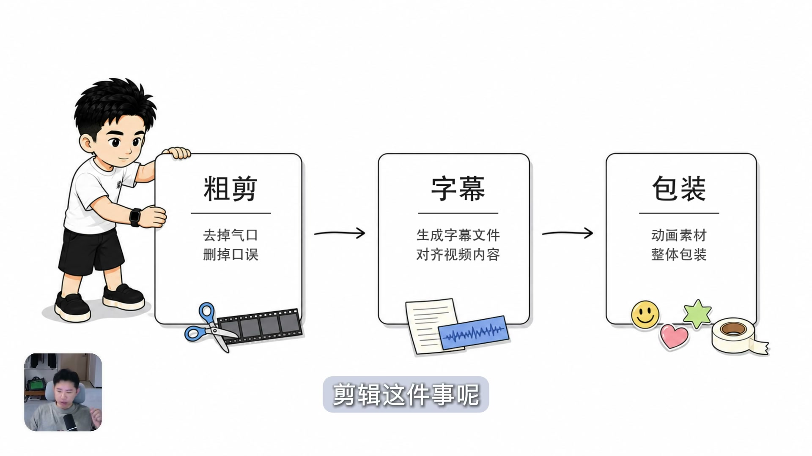

### 1.2 所需工具清单
本次流程共需要4款工具+待剪辑原视频，Codex作为核心智能体，负责串联调度所有工具的全流程：
| 工具名称 | 核心作用 |
|---------|---------|
| 剪映 | 完成视频初步粗剪，低成本去除无效片段 |
| WhisperX | 自动生成带精准时间戳的SRT字幕文件 |
| HyperFrames | 完成视频动画渲染、视觉包装、成片导出 |
| Codex | 核心调度工具，理解指令、调用工具、执行修改、输出结果 |
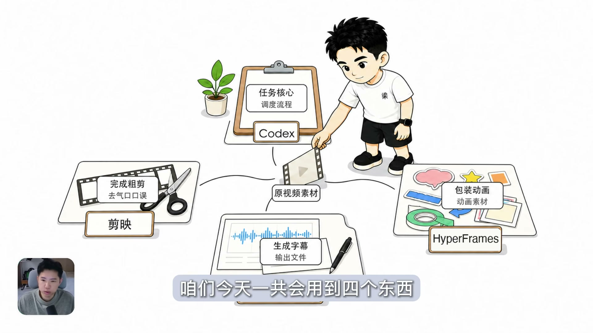

---

## 二、分步实操教程
### 2.1 第一步：剪映完成视频粗剪
Codex对口误、气口、重复表述的识别精度有限，因此先用剪映完成低成本的初步粗剪，降低后续AI处理的出错概率。
操作步骤：
1.  打开剪映，导入待剪辑的原视频到时间轴
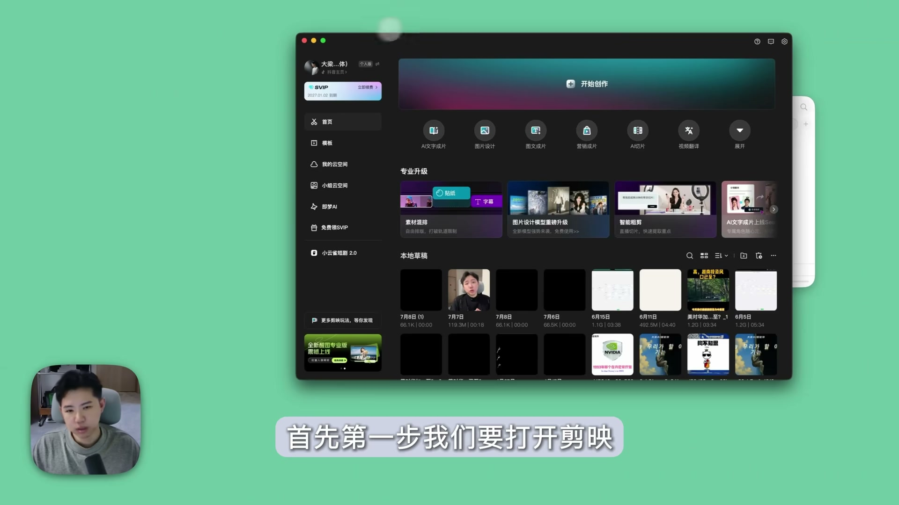
2.  点击剪映「智能剪口播」功能，AI自动识别视频中的无效片段
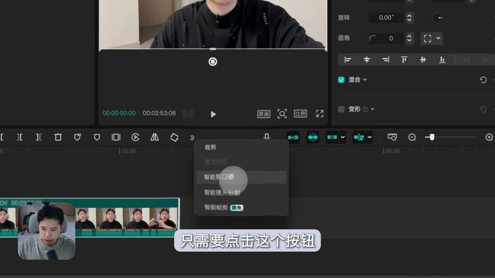
3.  手动校验剪辑结果：
    - 核对自动识别的语气词、停顿、重复表述是否准确
    - 对于漏识别的无效内容，选中对应字幕/片段直接删除即可
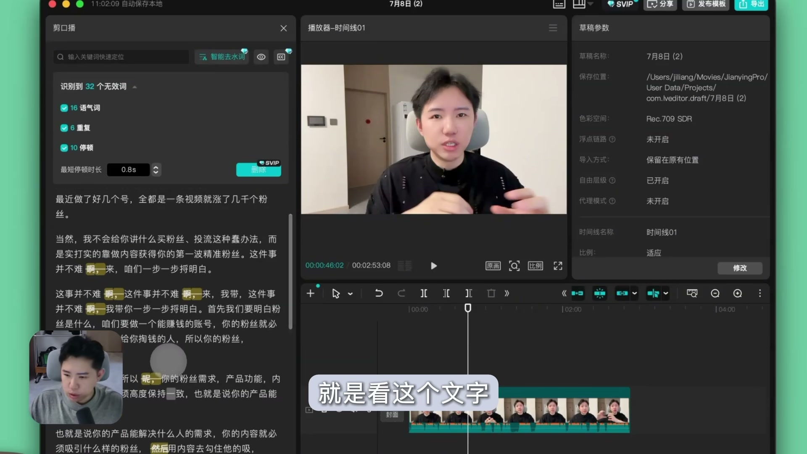
4.  确认粗剪无误后，将视频导出到指定的项目文件夹，关闭剪映
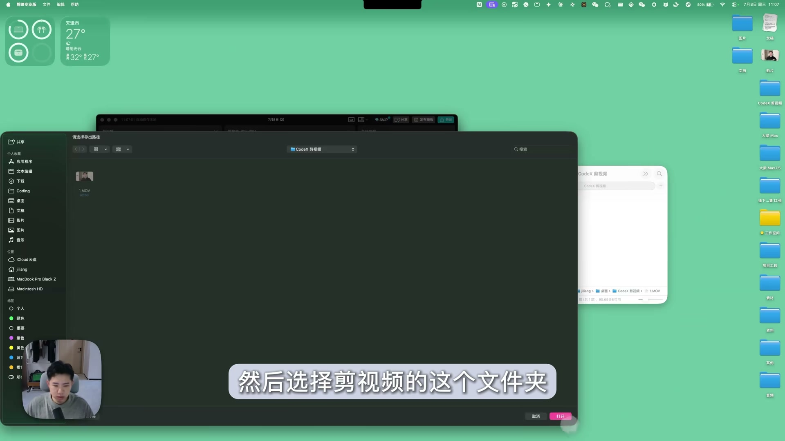

### 2.2 第二步：Codex调用WhisperX生成字幕
操作步骤：
1.  打开Codex，将工作目录设置为刚才的项目文件夹，导入粗剪完成的成片

2.  向Codex发送指令：
    ```
    这是我剪好的视频，请用WhisperX帮我生成带时间点的SRT字幕文件，保存到同一个文件夹
    ```
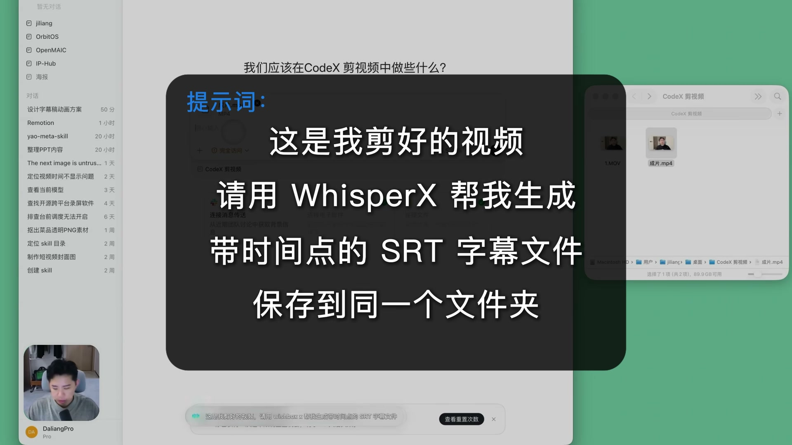
3.  工具依赖处理：如果本地未安装WhisperX，无需手动操作，直接告知Codex帮你完成安装配置即可

4.  等待执行完成，打开项目文件夹，确认已经生成对应SRT字幕文件
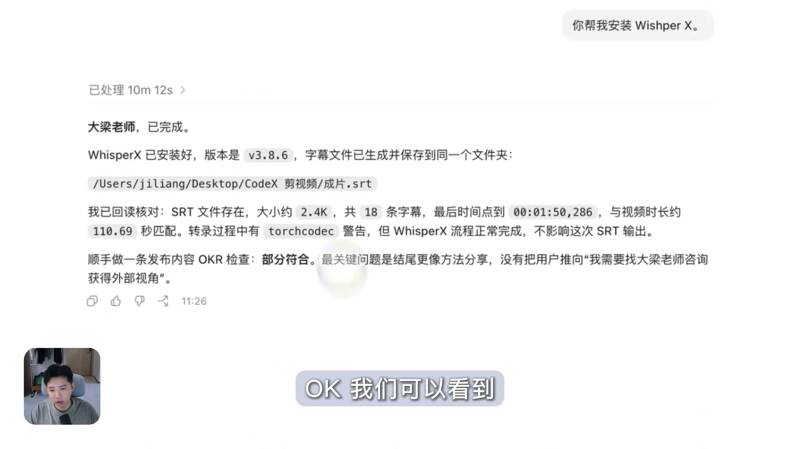

### 2.3 第三步：拆解视频内容，规划动画与字幕
这一步的目的是让AI识别内容逻辑，区分信息权重：核心观点、数据、流程适合做动画强化，过渡表述、口语化内容仅保留字幕即可。
操作步骤：
向Codex发送指令：
```
请根据这个视频和SRT字幕，帮我拆解内容的重点，告诉我哪些地方适合做动画，哪些地方只需要保留字幕
```
等待Codex输出内容拆解结果，确认重点标注、处理建议符合你的内容逻辑。
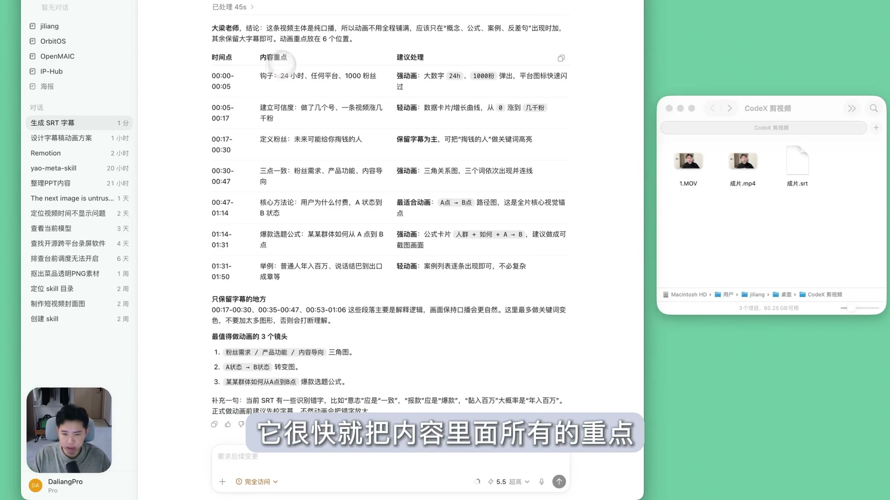

### 2.4 第四步：生成可视化风格预览，确定包装风格
使用HTML格式做预览的优势：HTML是AI最容易生成的可视化格式，生成速度快、消耗Token少，无需渲染即可直观看到静态视觉效果。
操作步骤：
1.  向Codex发送指令：
    ```
    请基于视频画面和内容重点，帮我生成三种可视化的HTML风格预览，不要只给我文字描述，我要能在浏览器里看到效果，每一种风格都要有展示的标题、重点词、卡片、贴片、流程、数据等常见的元素
    ```
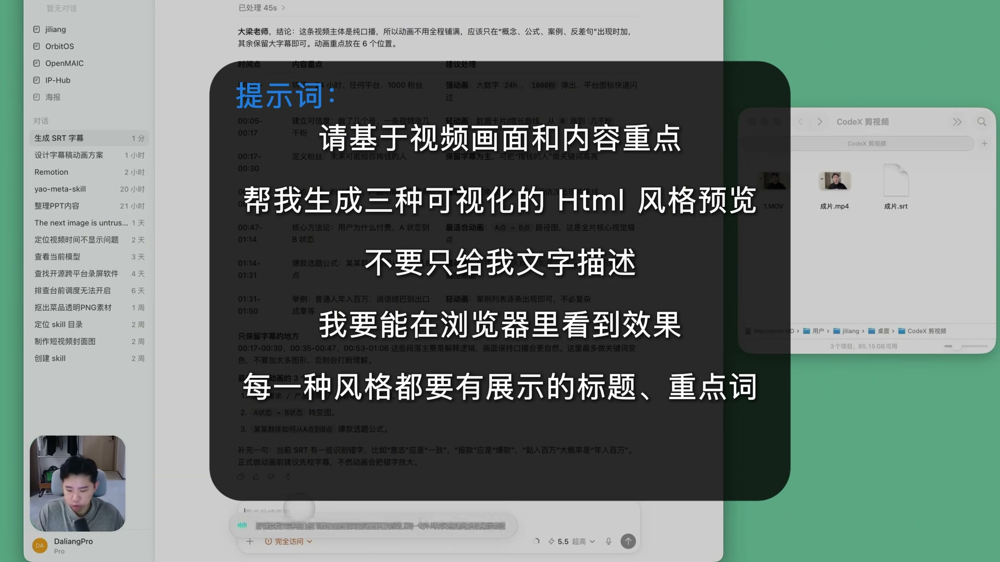
2.  等待生成完成后，打开输出的HTML文件，查看三种预设风格的视觉效果
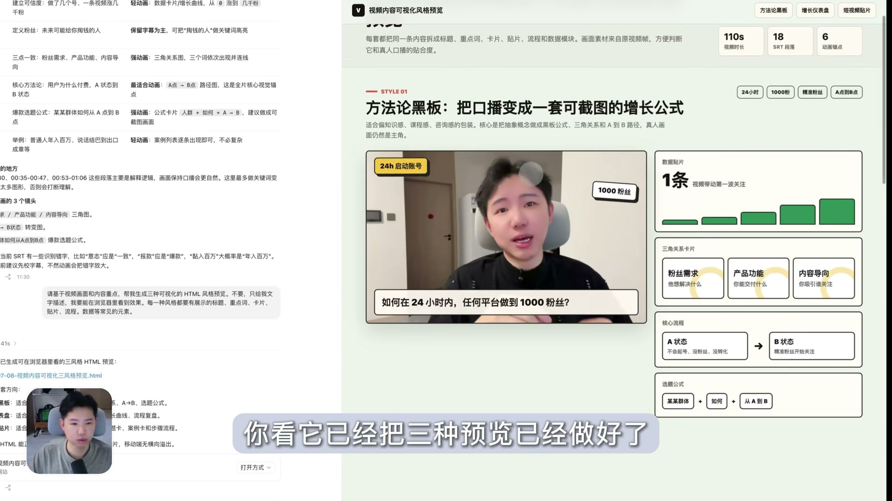
3.  风格调整：如果对预设风格不满意，直接向Codex提出具体修改要求即可，示例指令：
    ```
    这三种风格都不好看，尤其是第三种，我是横屏视频，你做成了竖版不符合要求。请按照横屏样式，给我做一版科技风的预览
    ```
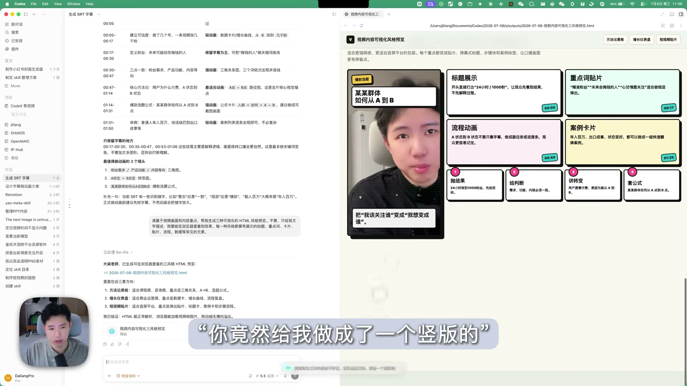
4.  重复调整流程，直到静态风格的配色、布局、元素设计符合你的预期


### 2.5 第五步：生成短Demo，校验动态效果
静态预览满意不代表动态效果符合要求，因此先生成10秒左右的短Demo校验动效，避免全片渲染后修改浪费时间。
操作步骤：
1.  安装HyperFrames插件（未安装时执行）：打开Codex插件市场，搜索`HyperFrames`，点击安装即可
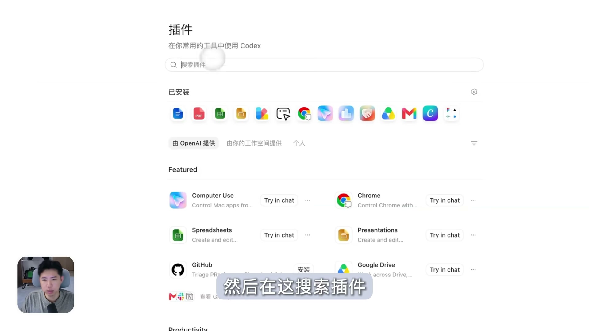
2.  向Codex发送指令：
    ```
    我认为这个版本的风格不错，你用HyperFrames帮我生成一个10秒左右的Demo，不要直接做完整版，我要先看效果，再决定是否要修改
    ```
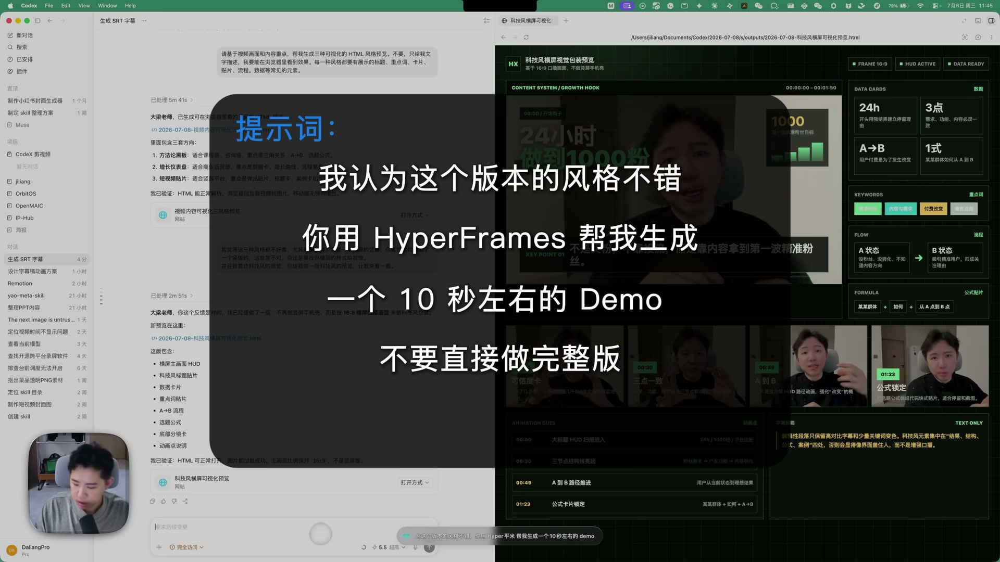
3.  打开生成的Demo视频，校验动态效果：
    - 动画转场是否自然流畅
    - 字幕、信息卡片的出现时间是否和台词完全同步
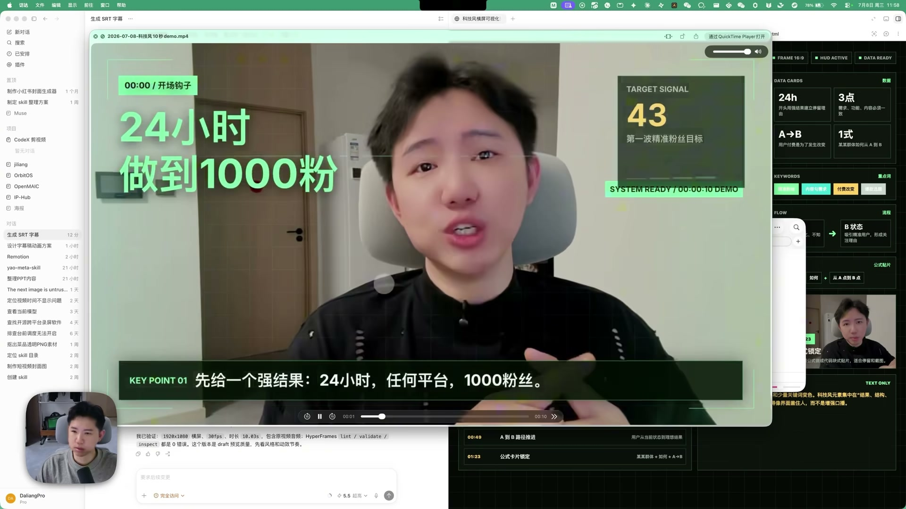
4.  Demo调整：如果发现问题，向Codex提出具体修改要求，示例指令：
    ```
    动画效果没问题，但是有些组件出现的过早，我希望视频效果是跟内容、台词完全同步的
    ```
    等待Codex重新生成Demo，重复校验流程，直到动态效果符合预期。
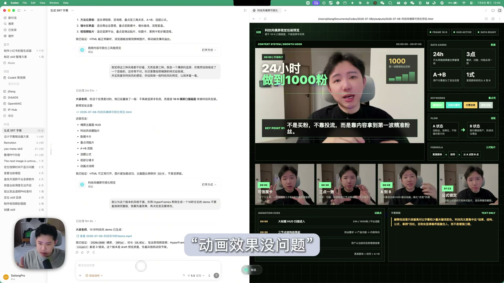

### 2.6 第六步：生成完整预览，做最终全片校验
Demo确认无误后，不要直接导出成片，先生成完整的Studio预览，做全片的最终校验。
操作步骤：
1.  向Codex发送指令：
    ```
    这个Demo可以了，请用HyperFrames按这个风格生成完整的视频Studio预览，先不要导出MP4，我要在预览里去检查时间轴、文字、动画以及画面遮挡有没有问题
    ```
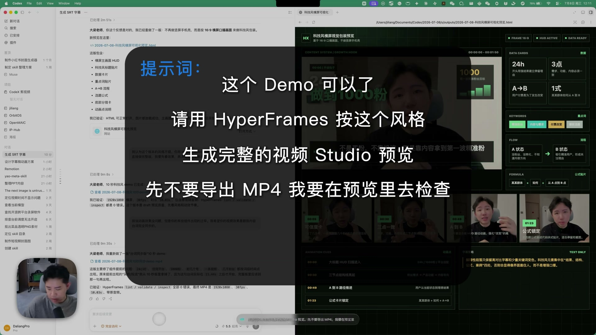
2.  打开生成的Studio预览链接，该预览和专业剪辑软件界面一致，可以查看画面、时间轴、所有素材特效的排布
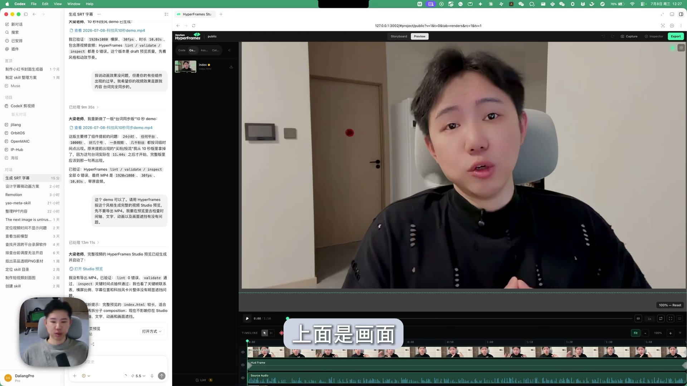
3.  全片播放校验：检查全片的字幕同步、动画效果、画面遮挡、内容匹配度，如果有问题继续向Codex提出修改要求，直到全片效果符合预期。
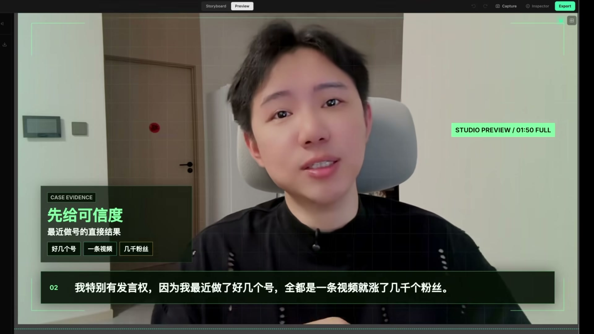

### 2.7 第七步：导出最终成片
预览确认无误后，执行最终导出：
向Codex发送指令：
```
Studio预览我确认没有问题，请帮我导出最终的MP4文件，放到项目的文件夹里
```
等待导出完成，即可得到剪辑、包装全部完成的可发布成品视频。
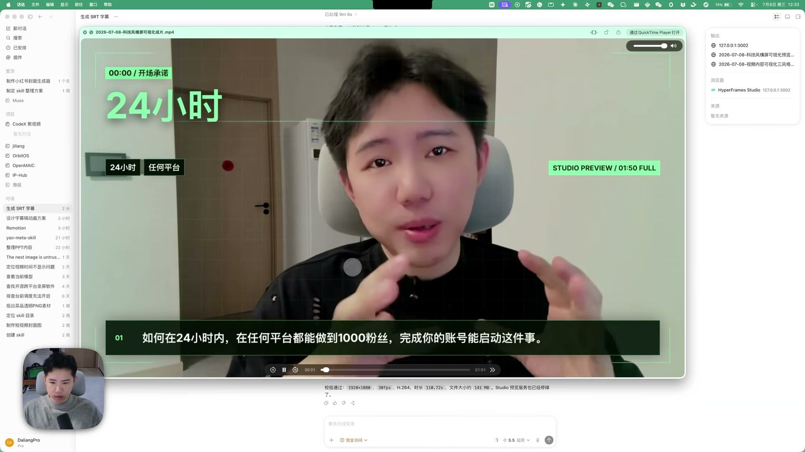

---

## 三、进阶效率方案：一键剪辑Skill
上述分步操作逻辑清晰，但每次剪辑都需要逐步发送指令，效率较低；可以使用预制的一键剪辑Skill，实现全流程自动化。
1.  Skill介绍：`jianji-workflow`（口播视频一键剪辑技能），内置了所有剪辑规则、动画逻辑、风格配置，无需人工逐步调试指令
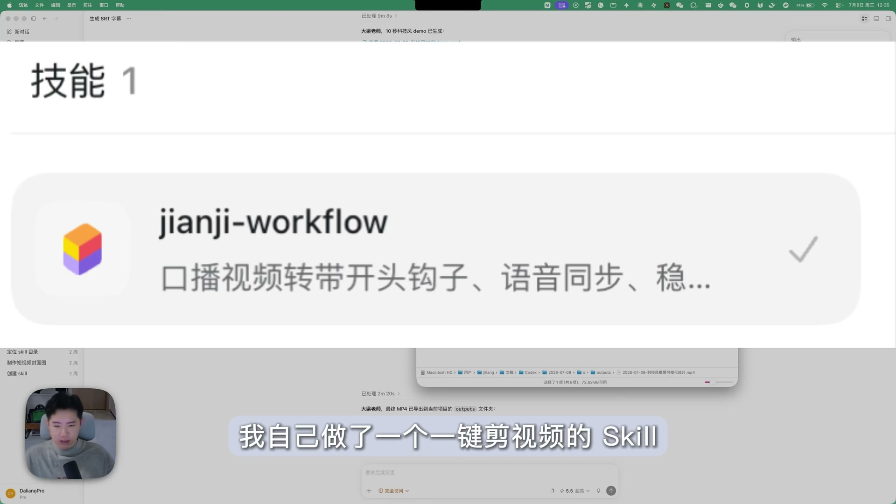
2.  使用方法：
    - 运行该Skill，直接上传待剪辑的视频
    - 到风格确认环节，从预设风格中选择你想要的包装风格（提供知识黑板风、社媒爆点风、科技风等多种预设）
    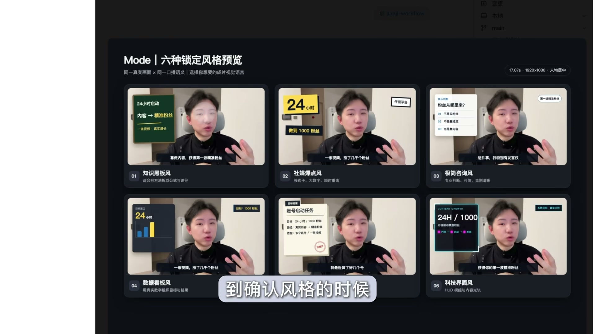
    - AI自动执行全流程，完成粗剪、字幕生成、风格包装、视频渲染，直接输出可发布的成品视频
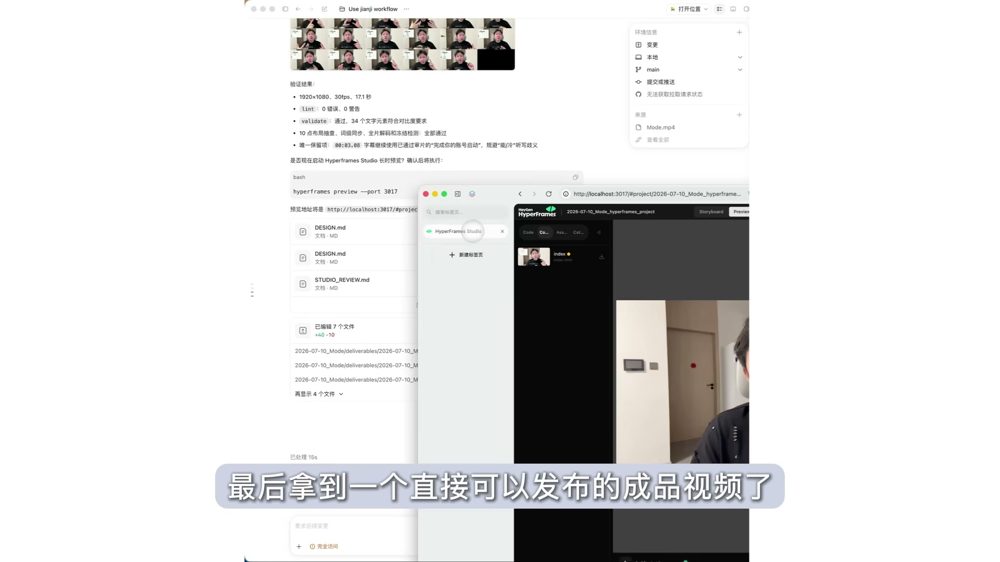
优势：所有动画逻辑、字幕同步规则、元素配置都已经预制完成，仅需上传视频、选择风格两步即可完成剪辑，效率提升显著。

---

## Reference
1.  **工具获取**
    - Codex：OpenAI官方推出的AI智能体平台
    - HyperFrames：Codex插件市场可直接搜索安装
    - WhisperX：Codex可自动完成安装配置，无需手动操作
    - 剪映：官方渠道下载即可
2.  **指令撰写原则**
    - 明确任务目标，避免模糊描述
    - 明确限制条件（例如"不要直接导出完整版，我要先看Demo"）
    - 效果描述尽量具体，例如"科技风"、"16:9横屏比例"
3.  **校验原则**
    按照「静态风格→短Demo动态→全片预览→最终导出」的顺序逐步校验，每一步确认无误再进入下一步，避免全片渲染后再修改浪费时间。