> 来源链接：https://b23.tv/rWAW1QN

## 学习目标
通过本教程的学习，可掌握AI辅助编程的系统化方法，具体包括：
1. 理解AI编程的完整工作流框架，明确各环节的核心价值与作用
2. 了解主流编程Agent的类型与特点，掌握选型逻辑与配置方法
3. 掌握AI编程项目的标准化环境搭建方法，包括Git版本控制与AGENTS.md规范文件的使用
4. 理解MVP（最小可用产品）的产品设计理念，能够与AI协作完成需求梳理、边界定义与产品文档输出
5. 掌握Demo原型的适用场景与实现方式，能够根据项目后端成本判断是否需要前置原型验证
6. 学会与AI协作完成技术方案设计，明确技术栈选型与架构方向
7. 掌握提升AI代码交付质量的方法，包括AI自测能力配置与人工验证的核心要点
8. 理解AI编程流程的裁剪逻辑，能够根据需求的复杂度与重要性灵活调整工作流，在效率与质量间取得平衡

## 1. 问题提出：AI编程的认知误区与核心目标
### 1.1 常见认知误区
当前对AI编程存在普遍的简化认知：认为仅需安装Codex、Claude Code等编程Agent，发送单条指令即可完成完整软件的开发（如笔记软件、剪辑软件、电子书阅读器等）。

### 1.2 实际痛点
直接指令式开发存在两类核心问题：
1. **需求偏差**：AI交付的产品与用户预期存在明显差异，无法匹配真实需求
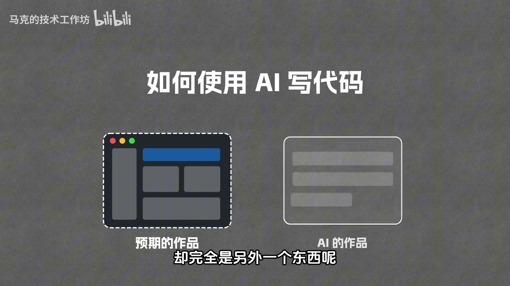
2. **质量缺陷**：AI生成的代码常存在大量bug，可用性与稳定性不足
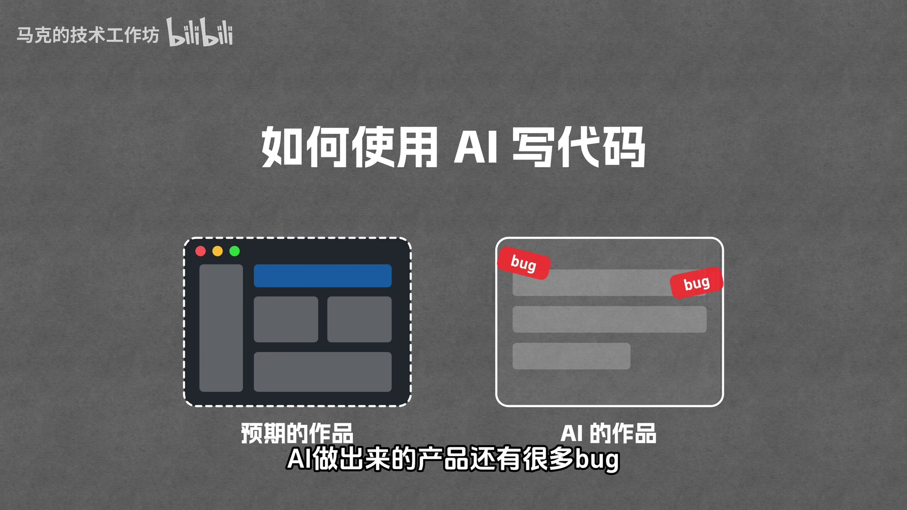

### 1.3 核心目标
本教程以TXT格式电子书阅读器（命名为“马克阅读”）的MVP开发为案例，讲解如何通过标准化流程，让AI稳定交付符合预期的高质量产品。

## 2. 编程Agent选型
### 2.1 主流选项
当前主流的编程Agent包括Codex、Claude Code、OpenCode、Pi、Cursor等，可根据需求选择。
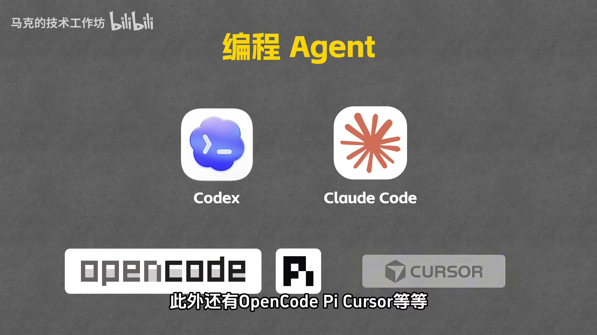

### 2.2 推荐选型：Codex
对于无特殊需求的用户，优先推荐使用Codex，原因如下：
1. 功能完善无明显短板，属于OpenAI旗下产品，可通过订阅ChatGPT调用GPT模型
2. 通用性强：属于通用编程Agent，不与特定模型强绑定，可接入DeepSeek、GLM、Kimi等国产大模型
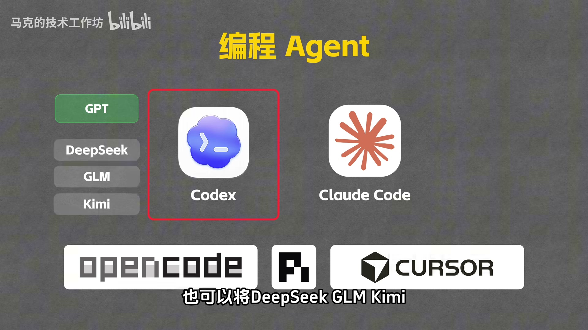

### 2.3 通用性说明
本教程以Codex为演示工具，但核心操作逻辑具有普适性，可迁移至Claude Code、Cursor等其他编程Agent。
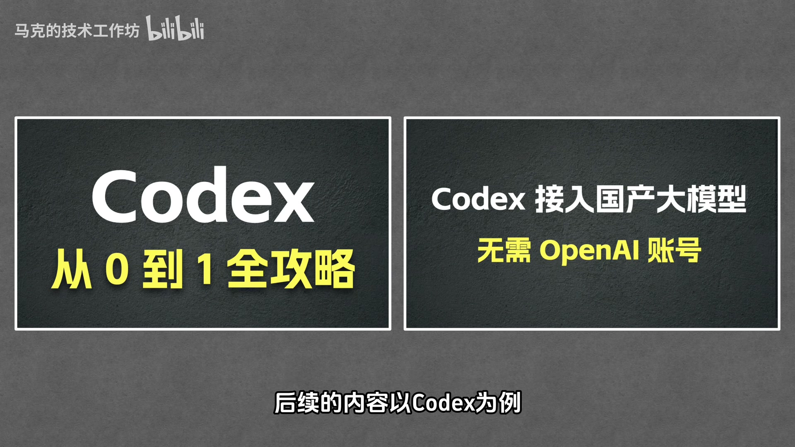

## 3. 项目环境搭建
环境搭建是AI编程的基础，核心包括Git版本控制与AGENTS.md项目规范两部分，为一次性配置工作。

### 3.1 项目初始化
1. 在本地创建项目文件夹，用于存放项目代码（本案例为“马克阅读”文件夹）
2. 打开Codex，创建本地类型的新项目，关联已创建的项目文件夹

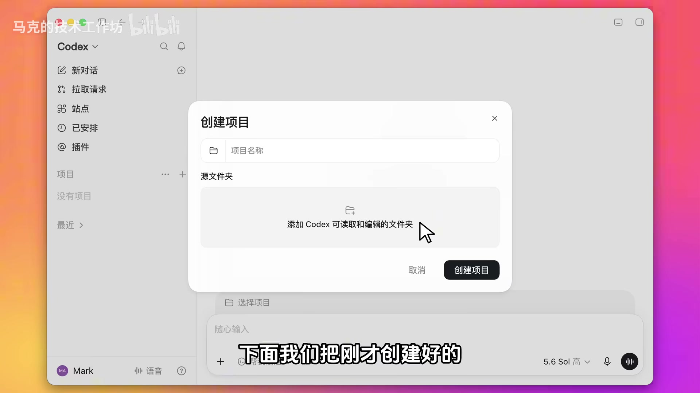

### 3.2 Git版本控制配置
#### 3.2.1 Git的作用
Git是分布式版本管理工具，核心价值包括：
- 每完成一个功能可保存为独立版本，代码混乱时可一键回退至可用状态
- 建议将代码同步至GitHub等远端仓库，防止本地数据丢失

#### 3.2.2 配置方法
向AI发送指令“帮我把当前的目录初始化为一个Git仓库”，等待执行完成后，可通过终端执行`git status`命令验证初始化结果。
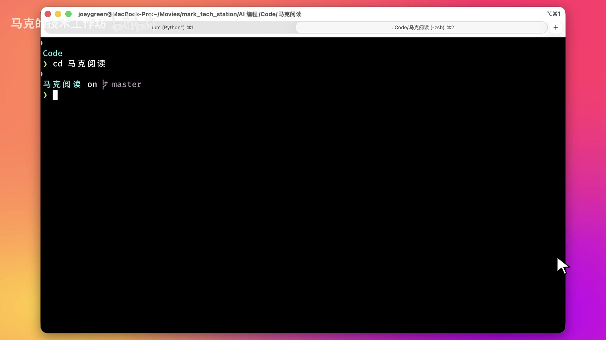

### 3.3 AGENTS.md规范文件配置
#### 3.3.1 文件作用
AGENTS.md是面向编程Agent的项目说明书，Agent开启新会话时会优先读取该文件，快速了解项目背景与开发规范，保证多轮开发的一致性。
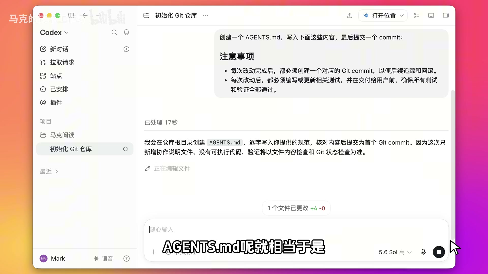

#### 3.3.2 核心规范内容
AGENTS.md中需明确Agent必须遵守的开发规则，本案例中包含两项核心要求：
1. 每次代码改动完成后，必须创建对应的Git commit，便于后续版本追踪与回滚
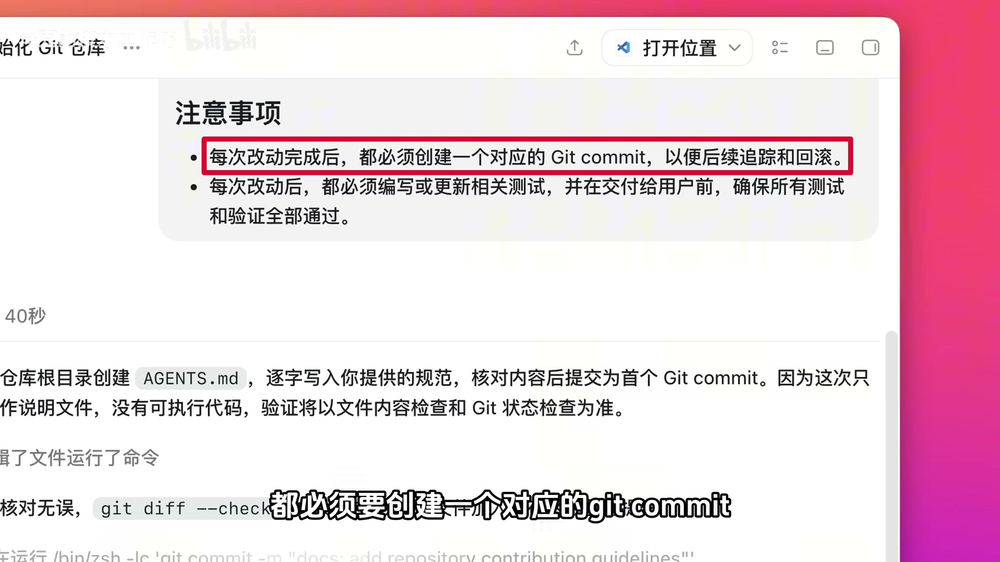
2. 每次代码改动后，必须编写或更新相关测试，在交付前确保所有测试与验证全部通过，提前过滤明显bug

## 4. 产品设计
产品设计环节的核心是明确需求边界，避免AI开发偏离方向，采用MVP（最小可用产品，Minimal Viable Product）的设计思路，优先实现核心功能，验证方向后再逐步迭代。

### 4.1 MVP需求探讨
#### 4.1.1 初始方案
向AI提出“开发电子书阅读器MVP”的需求后，AI初始建议包含EPUB格式支持、目录章节、多主题、书签等功能，但对于最小可用版本而言复杂度较高。
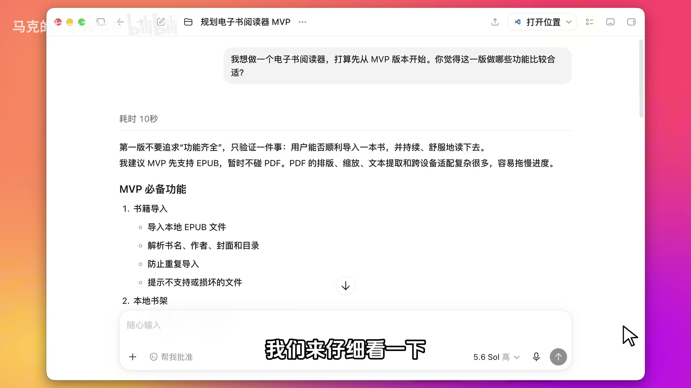

#### 4.1.2 需求裁剪
针对TXT阅读器的MVP定位，对需求进行如下裁剪，仅保留最核心的功能：
- 文件格式：仅支持UTF-8编码的TXT文件，暂不支持EPUB、PDF等复杂格式
- 功能模块：移除目录章节、多主题（仅保留明亮主题）、书签等非必要功能
- 阅读方式：仅支持纵向滚动阅读，暂不实现分页模式
- 大文件处理：限制单文件大小（如10MB），加载时给出对应提示
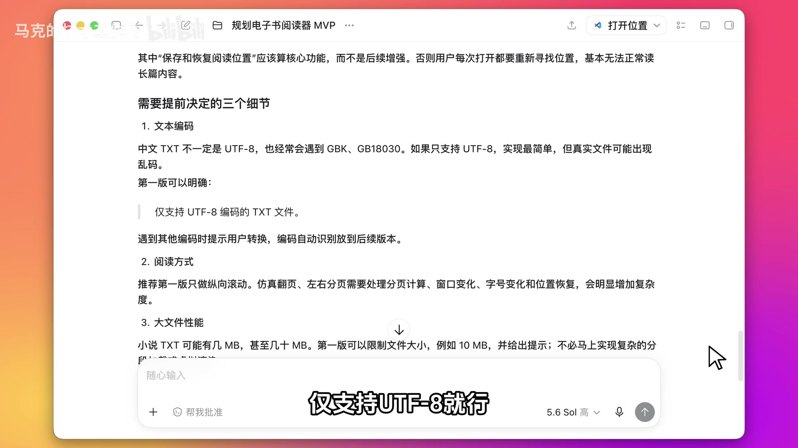

#### 4.1.3 MVP核心路径
最终明确MVP的核心用户路径为：导入UTF-8 TXT文件 → 文件出现在书架 → 打开并滚动阅读 → 关闭应用 → 再次打开时恢复上次阅读位置。

### 4.2 产品设计文档输出
需求确认后，指令AI整理为产品设计文档，存放于项目docs目录中。文档无需过度详细，仅需明确整体方向与主要功能，作为后续技术设计与开发的统一依据。
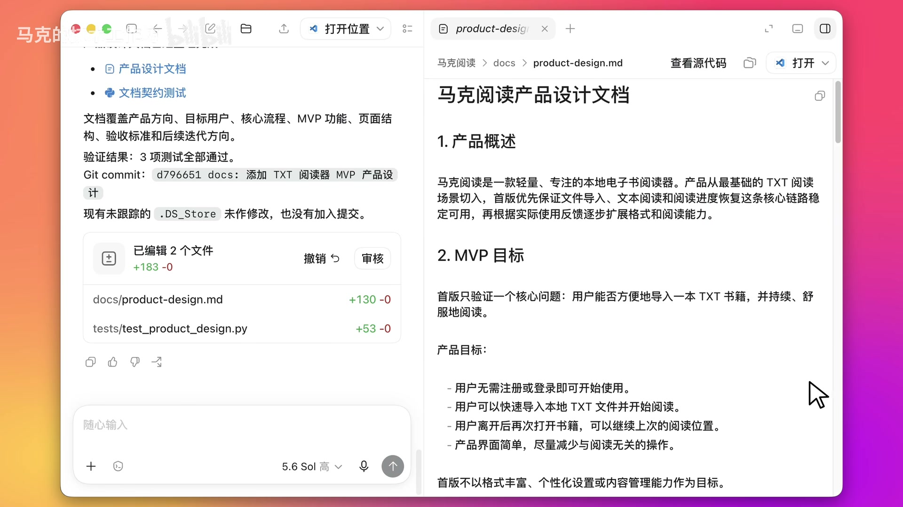

### 4.3 Demo原型环节（可选）
#### 4.3.1 Demo定义
Demo是可交互的前端页面原型，仅实现前端界面与交互逻辑，后端功能与数据通过模拟实现，用于验证界面与交互设计的合理性。
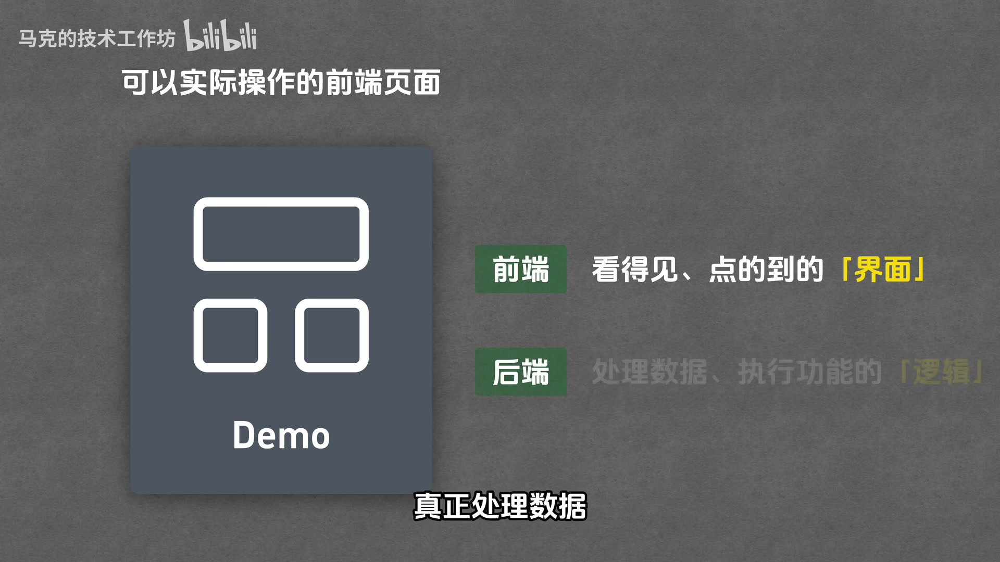

#### 4.3.2 Demo的价值
制作Demo有两项核心价值：
1. **提前验证产品设计**：文字描述难以完整覆盖交互体验，通过实际操作Demo可发现前期未考虑的设计问题，降低后续返工成本
2. **提升开发精准度**：Demo可为AI提供直观的界面与交互参考，相比纯文字描述，能让AI更准确地还原预期效果
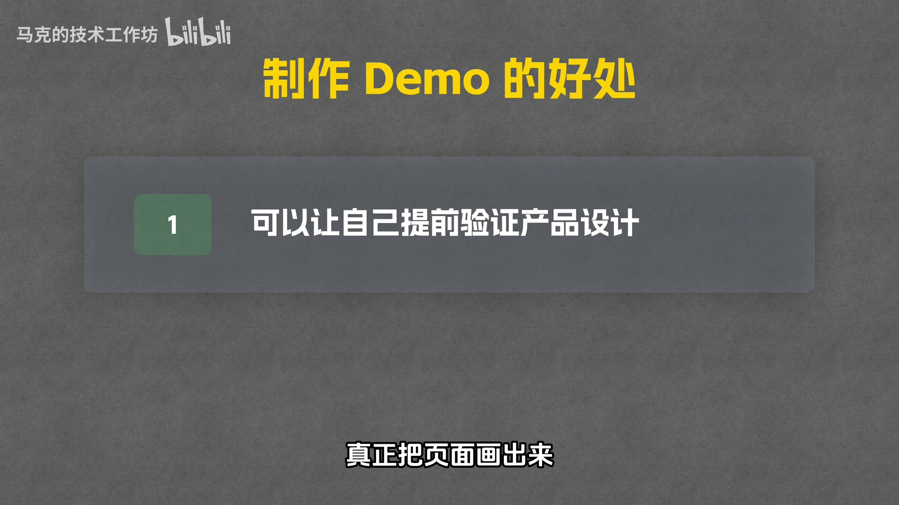
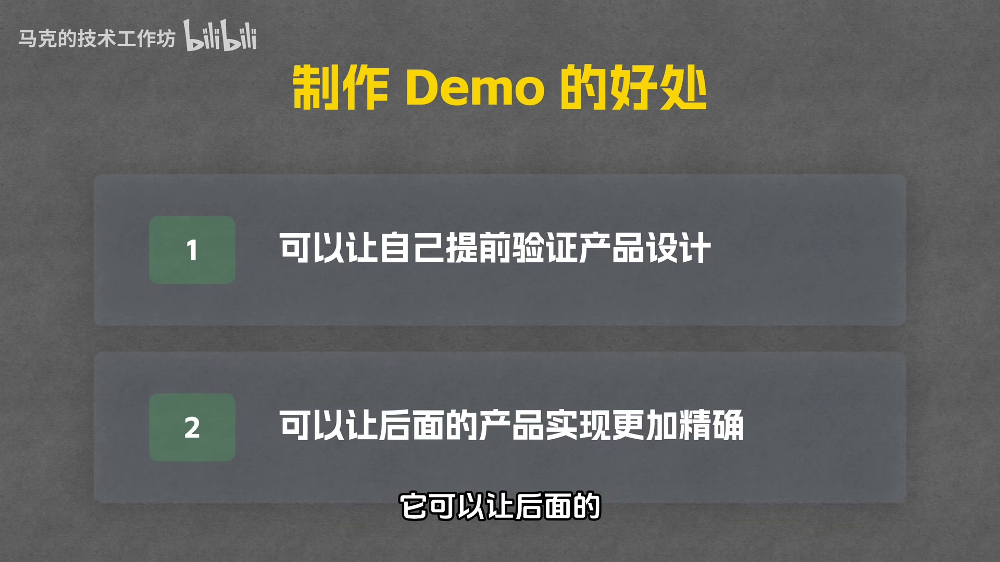

#### 4.3.3 适用场景判断
是否制作Demo可依据产品的**后端实现成本**决定：
- 后端成本高（如个人知识库，涉及文档处理、向量检索、模型调用等复杂逻辑）：建议先制作Demo确认交互，避免后端开发完成后大幅调整
- 后端成本低（如简单电子书阅读器，仅涉及文件读取与展示）：可跳过Demo环节，直接开发完整产品，减少重复劳动

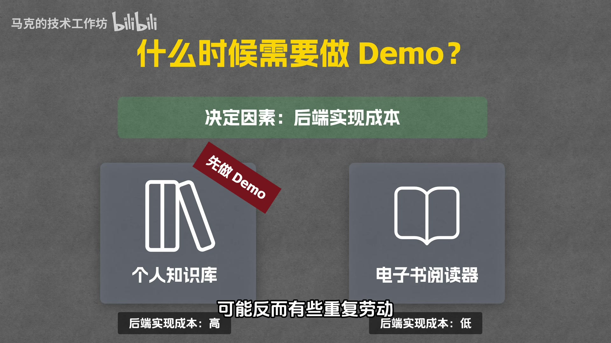

#### 4.3.4 实现指令模板
若需要制作Demo，可使用如下指令：“帮我做一个Demo，不用实现真实的后端功能，数据模拟一下就行。我主要想先看看整体界面和操作流程是否合理。”
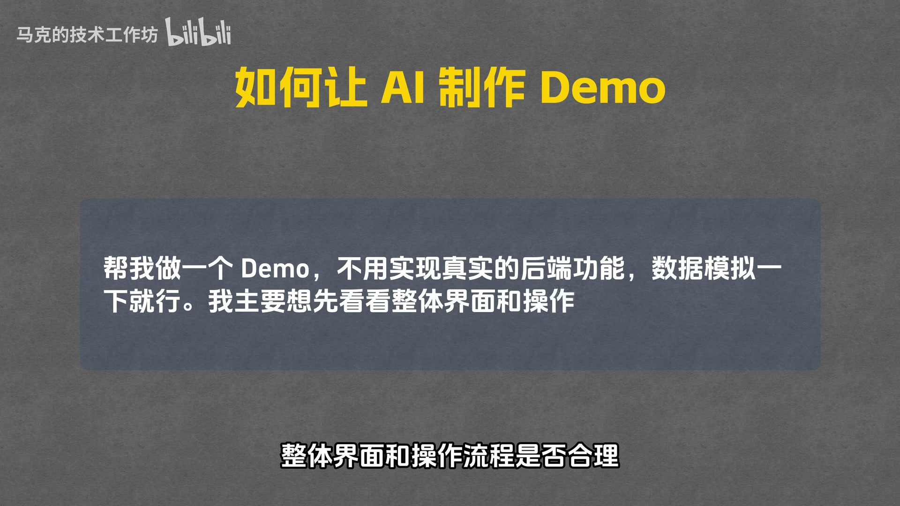

## 5. 技术方案设计
### 5.1 会话选择
技术方案设计可在产品设计的会话中直接延续，也可新开会话进行讨论。当前顶级大模型的长上下文处理能力较强，正常使用无需过度担心上下文丢失问题；新开会话可让技术讨论更聚焦，可根据习惯选择。
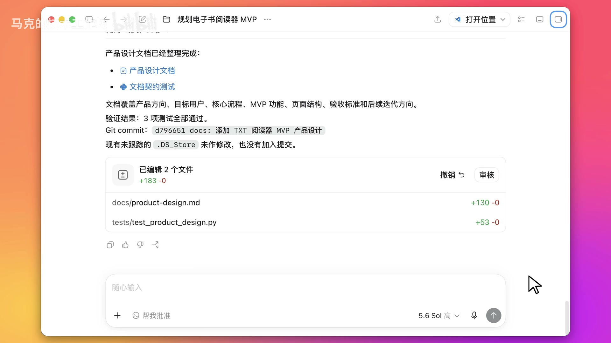

### 5.2 设计流程
1. **技术选型探讨**：指令AI读取产品设计文档，提出技术栈选型建议；若有预选方案（如Electron），可一并告知AI评估合理性

2. **技术方案输出**：选型确认后，指令AI生成正式技术方案文档，存放于docs目录，明确技术架构、实现路径与边界，确保开发方向符合要求。

### 5.3 案例技术选型
本案例最终采用的技术栈为：**Electron + React + TypeScript + Vite + Electron Forge**，选型依据为：
- 适配桌面端应用需求，可实现跨平台（Windows、macOS、Linux）一致的体验
- 基于Web技术栈，开发效率高，适合快速交付MVP
- 替代方案Tauri虽安装包体积更小，但需要Rust技术栈，对于本MVP阶段的收益不明显
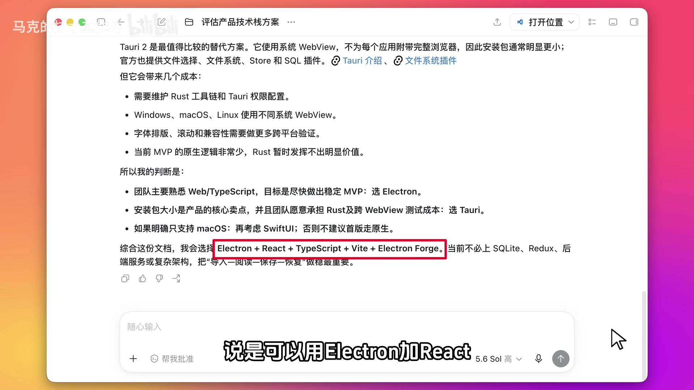
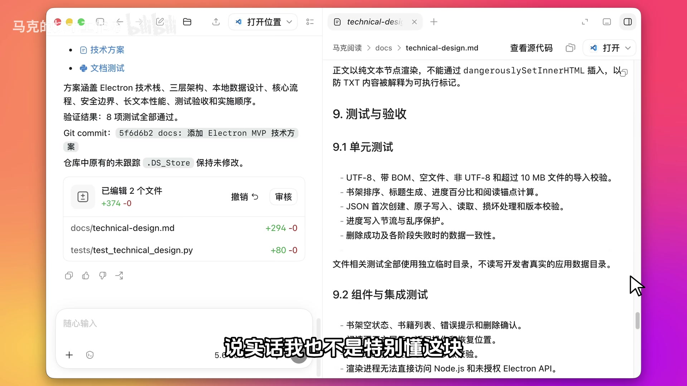

## 6. 产品实现与验证
### 6.1 前置准备：赋予AI自测能力
为提升AI交付代码的质量，需为Agent配置验证工具，使其能够自行测试代码功能，避免人工反复调试低级bug。以Codex为例，需安装两类核心插件：
1. **Computer Use**：可操作系统终端、执行命令，完成环境配置、命令运行等验证工作
2. **Chrome**：可访问浏览器页面，验证前端界面与交互逻辑
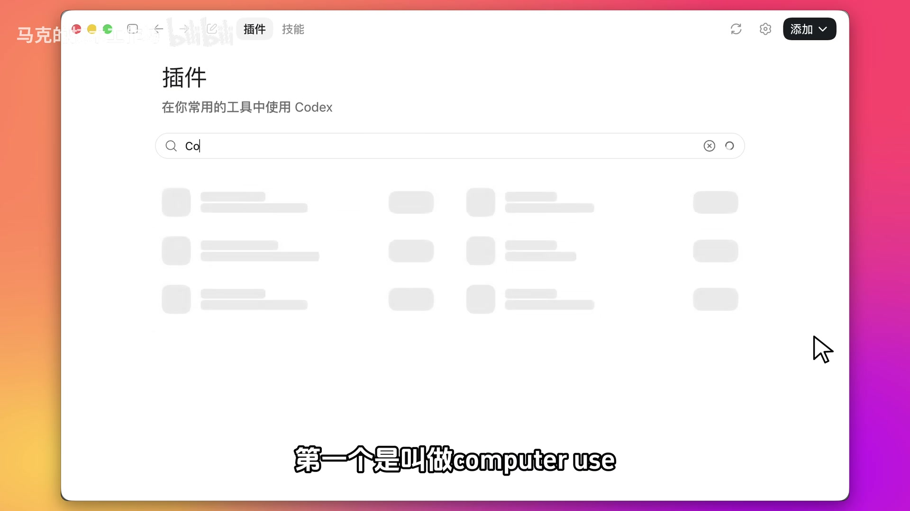

若使用其他编程Agent，可查找对应的插件或技能模块，为AI提供验证环境。配置完成后，AI即可在开发完成后自行运行测试，提前修复明显问题。
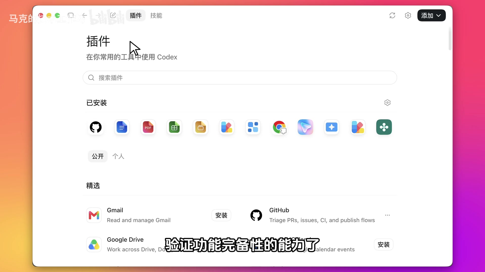

### 6.2 开发执行
向AI发送指令，要求其读取产品设计文档与技术方案文档，按照文档要求实现产品。开发过程中AI会自动遵守AGENTS.md的规范，完成代码编写、测试与版本提交。
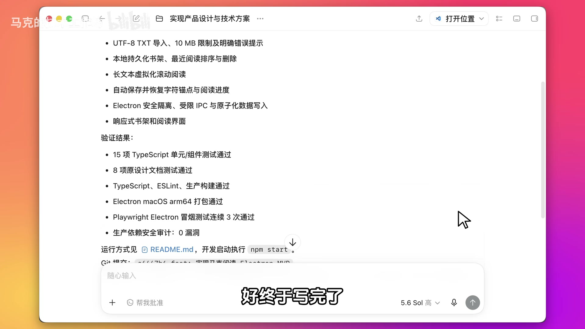

### 6.3 AI自测的局限性
AI自测仅能覆盖可自动化验证的功能问题，无法覆盖交互体验、主观预期匹配度、复杂边界场景等问题，因此不能完全替代人工验证。

### 6.4 人工验证与迭代
人工验证是保障产品符合预期的必要环节，需亲自上手测试核心功能，发现问题后反馈给AI修复，直到产品完全符合要求。
本案例的验证过程如下：
1. 执行`npm start`启动项目，首次启动出现报错，将报错信息反馈给AI修复
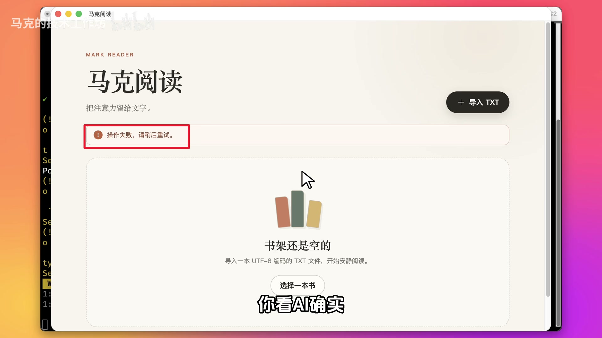
2. 修复完成后重新启动，导入TXT文件，验证阅读、进度保存等核心功能，确认MVP达到可用标准
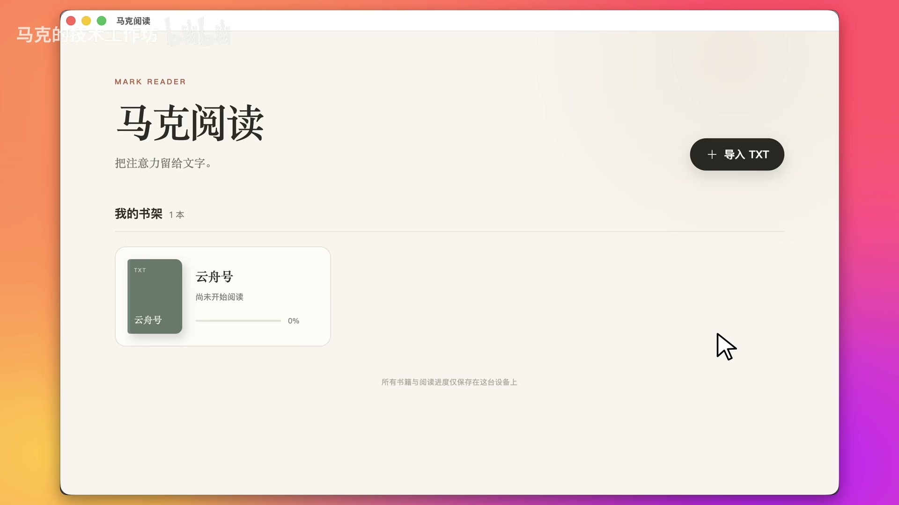
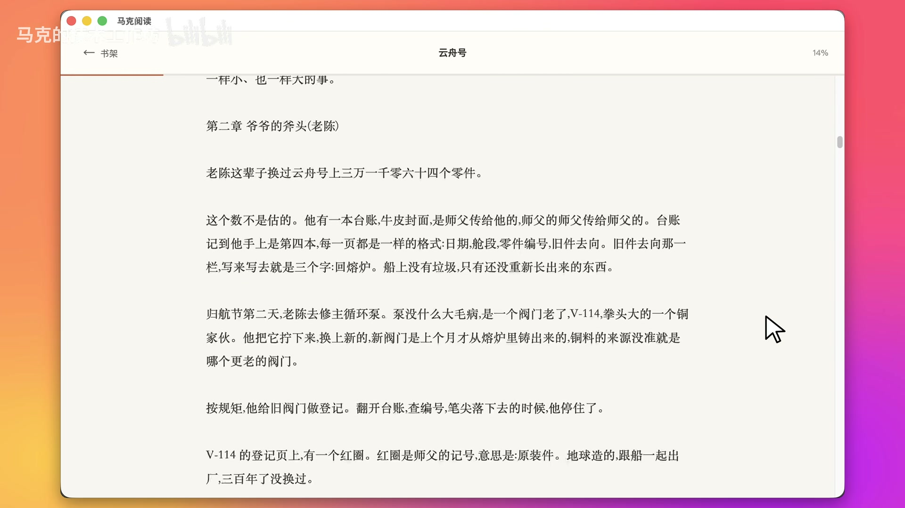

## 7. AI编程全流程总结与裁剪原则
### 7.1 完整五阶段流程
AI编程的完整工作流包含五个阶段：
1. **环境搭建**：配置Git版本控制、编写AGENTS.md规范，为一次性工作
2. **产品设计**：明确需求边界，可选Demo验证交互与界面
3. **技术设计**：确定技术栈与架构，输出技术方案文档
4. **产品实现**：AI完成代码开发与自动化自测
5. **人工验证**：亲自体验产品，迭代修复问题直到符合预期
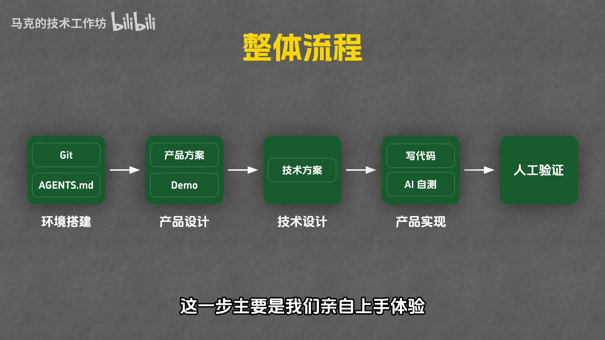

### 7.2 新功能迭代逻辑
每新增一个功能（如为电子书阅读器添加全文搜索功能），都需重复“产品设计→技术设计→实现与自测→人工验证”的流程，保证迭代的可控性。
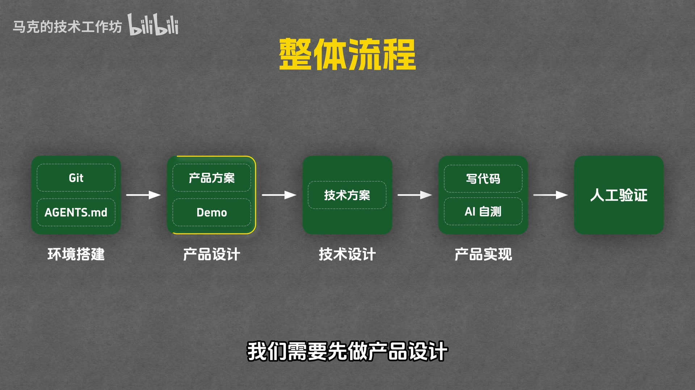

### 7.3 流程裁剪的取舍逻辑
流程并非固定不变，可根据需求灵活调整，核心是在**开发效率**与**结果可控性**之间做取舍：
- 参与环节越多：对最终结果的把控越强，产品贴合度越高，但需要投入的时间与精力越多
- 参与环节越少：开发速度越快，成本越低，但结果与预期出现偏差的概率越高
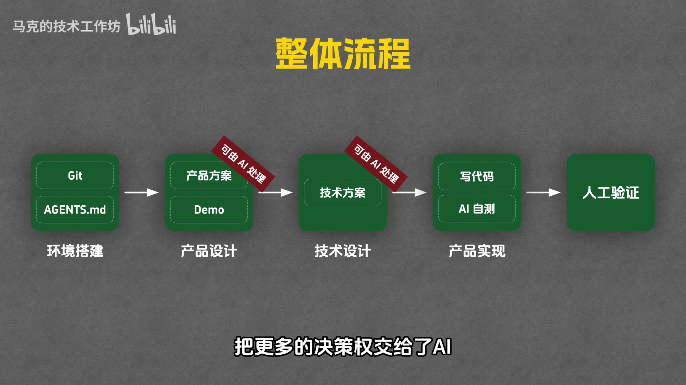

裁剪可参考需求的复杂度与重要性：
- **简单且不重要的需求**：可跳过产品设计、技术设计环节，搭建好环境后直接指令AI开发，完成后人工验证即可，流程效率更高
- **复杂且重要的需求**：建议走完完整五阶段流程，尽可能保障最终产品的质量与预期匹配度
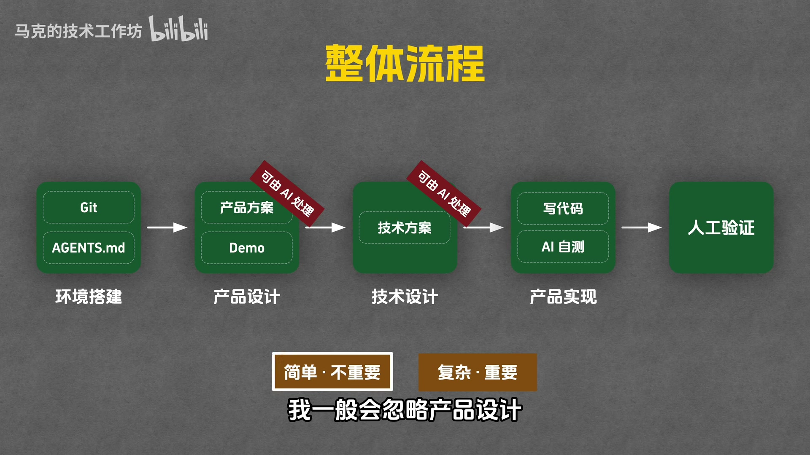
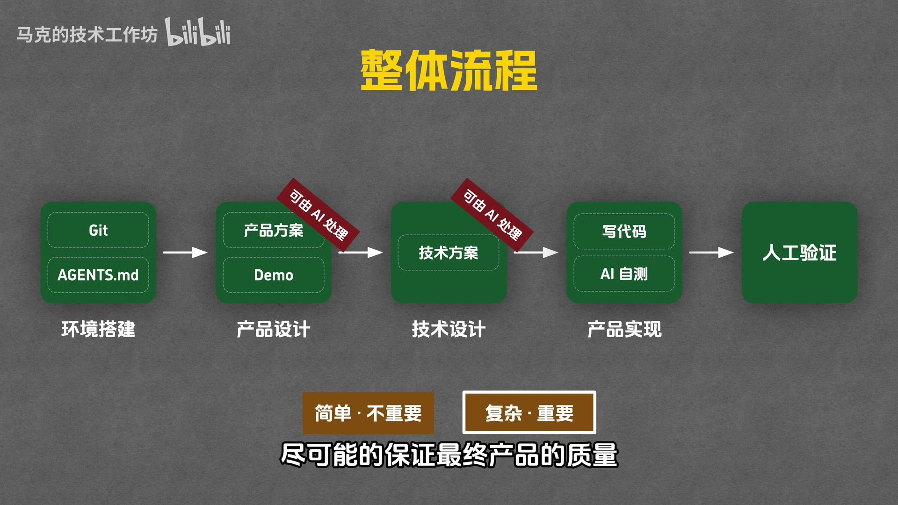

### 7.4 不可省略的核心原则
无论流程如何裁剪，以下三项原则必须遵守，是AI编程质量的基础保障：
1. **版本管理原则**：必须使用Git管理代码，建议同步至GitHub等远端仓库，防止代码损坏或丢失，出现问题可快速回退
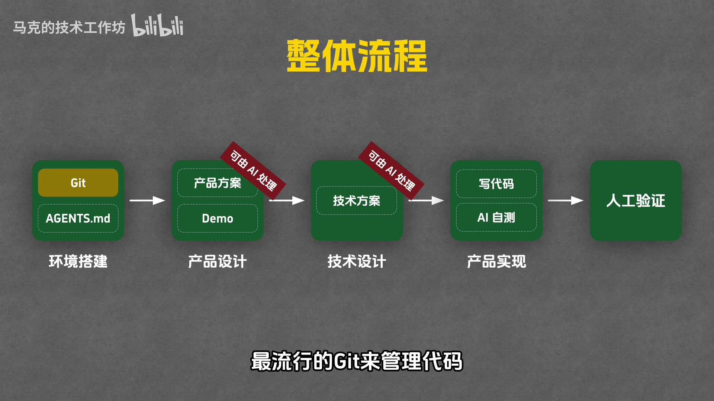
2. **AI自测原则**：必须为AI配置验证工具，使其具备自行测试的能力，避免人工沦为测试员，大幅提升交付效率与基础质量
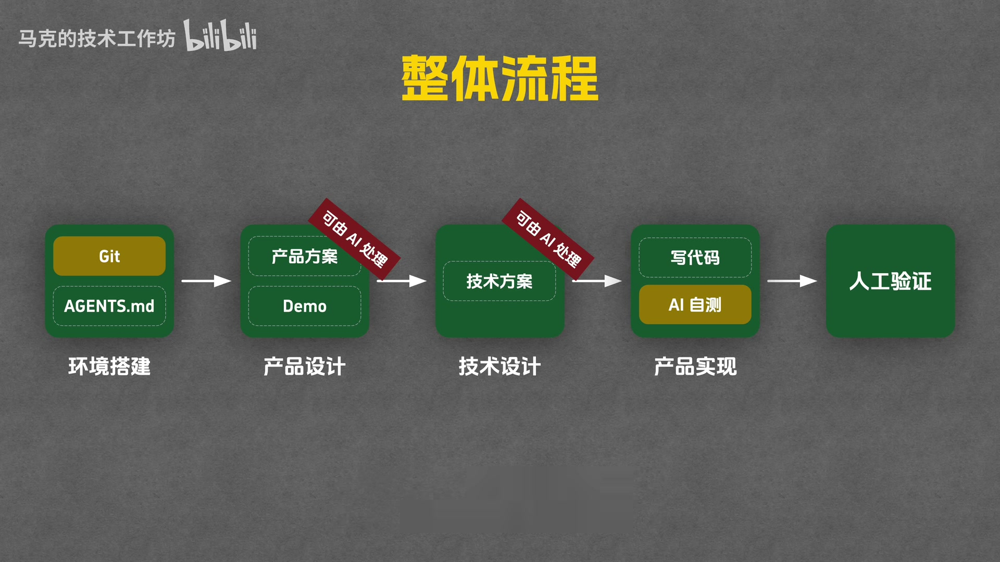
3. **人工验证原则**：必须亲自体验最终产品，确认功能、交互与预期一致，AI自测无法覆盖所有问题，人工验证是质量的最后防线
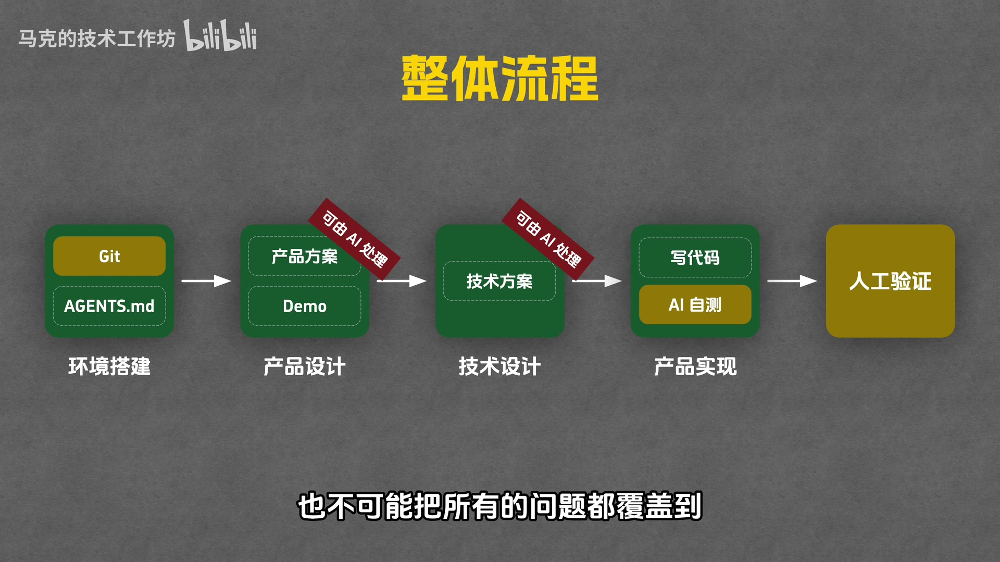
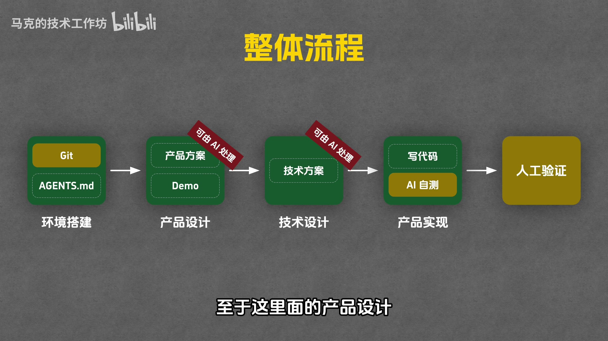

## References
### 工具与技术
- 编程Agent：Codex、Claude Code、Cursor、OpenCode
- 版本管理：Git、GitHub
- 桌面端开发技术栈：Electron、React、TypeScript、Vite、Electron Forge、Tauri
- 核心概念：MVP（最小可用产品）、Demo原型、前端/后端分离

### 延伸学习资源
- Codex基础用法与国产大模型接入教程（视频作者往期内容）
- 《精益创业》（MVP产品设计方法论）
- Git官方文档与入门教程
- Electron官方开发文档