> 来源链接：https://www.bilibili.com/video/BV1KegD6EEgZ

## 学习目标
通过本视频的学习，可掌握以下核心知识点：
1. 理解纯AI写作Skill的核心痛点，明确知识库对提升AI生成内容真人感的价值
2. 掌握阿里云百炼一站式RAG知识库的核心能力与搭建使用流程
3. 掌握RAG检索增强生成在自媒体内容创作场景的落地方法
4. 理解「Skill+知识库」构建个人内容第二大脑的核心方法论

---

## 1. 问题背景：AI写作Skill的痛点
AI编程普及后，坚持原生手动编程的开发者占比持续降低，该趋势同样出现在自媒体创作领域：写作类Skill已经成为创作者的常用工具，可实现写作流程与风格的模仿，大幅提升创作效率。
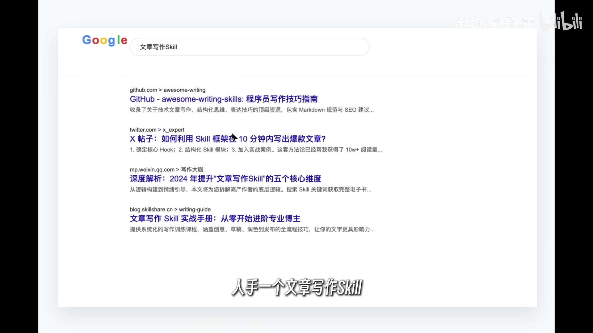

但纯Skill模式存在不可忽视的缺陷：
- 仅能模仿创作者的写作流程与风格，无法获取创作者过往产出的数百篇文章、视频等历史内容资产
- 生成内容仅在风格上相似，内容空洞，缺少创作者的个人经历、观点与表达习惯，缺乏真人感与个人辨识度
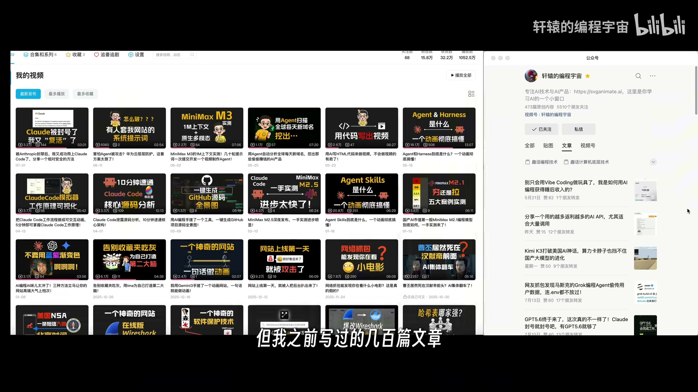

对应的解决方案：搭建个人专属知识库，存储所有历史创作的文章、视频等内容；升级写作Skill，让AI在正式写作前，先检索知识库中的相关历史内容，判断内容的复用价值，最终生成带有个人特色的内容。
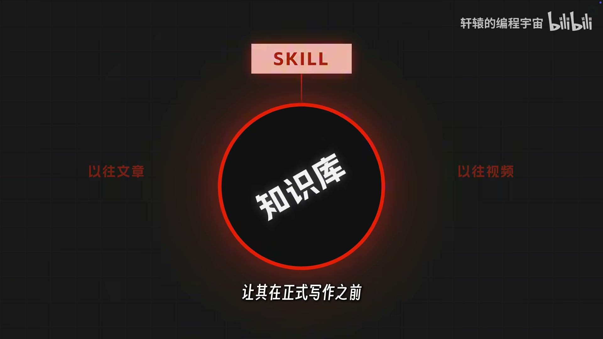

---

## 2. 阿里云百炼知识库介绍
阿里云百炼是一站式RAG（检索增强生成）平台，用户上传内容后，平台会自动完成解析、切分、向量化、索引构建全流程，支持AI从上传的资料中完成检索与问答。
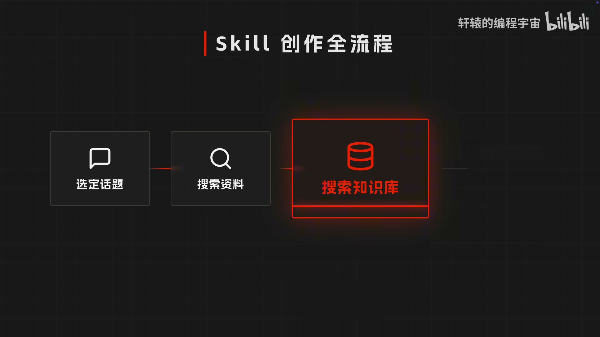

其核心优势适配内容创作者的需求：
1. **全模态内容支持**：支持文档、图片、视频、音频等多媒体格式的处理与检索，覆盖自媒体创作者的所有类型内容资产
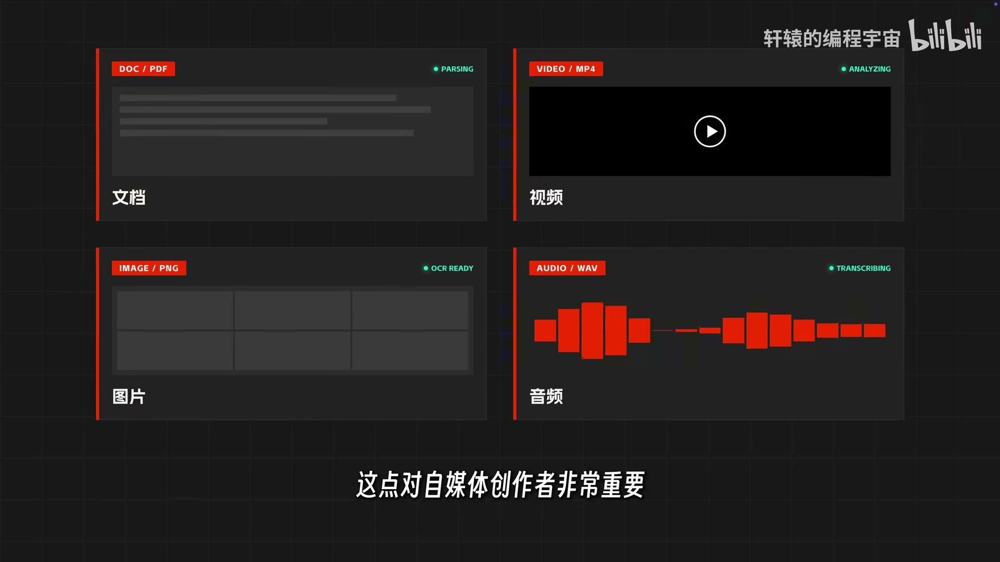
2. **完善的开放能力**：提供功能完整的API接口，支持自定义开发与第三方系统集成
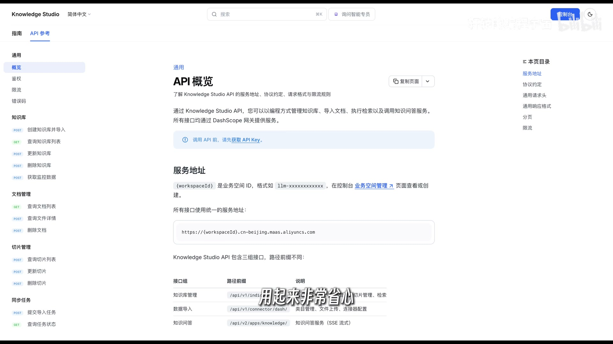

---

## 3. 阿里云百炼知识库使用流程
### 3.1 知识库创建
1. 登录平台后进入「知识管理」页面，目前文档类与视频类内容需要分别创建独立知识库
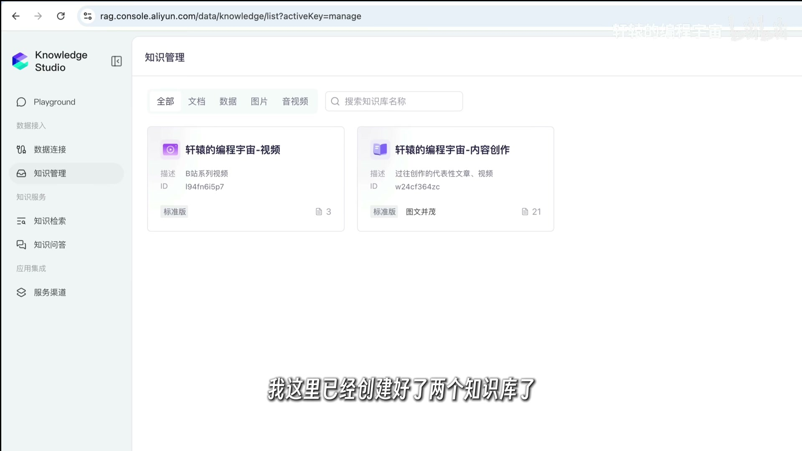
2. 点击创建按钮，个人用户选择基础版即可满足需求；填写知识库名称，根据存储内容选择知识库类型
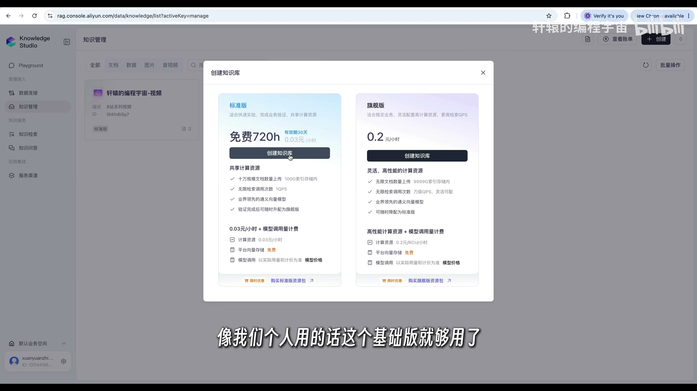
3. 上传需要存入知识库的历史内容（如过往文章、视频文件），支持后续随时追加上传内容
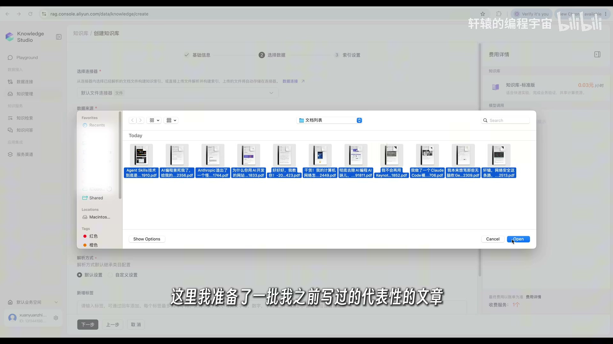
4. 索引相关配置保持默认即可，平台自动完成内容的处理与索引构建
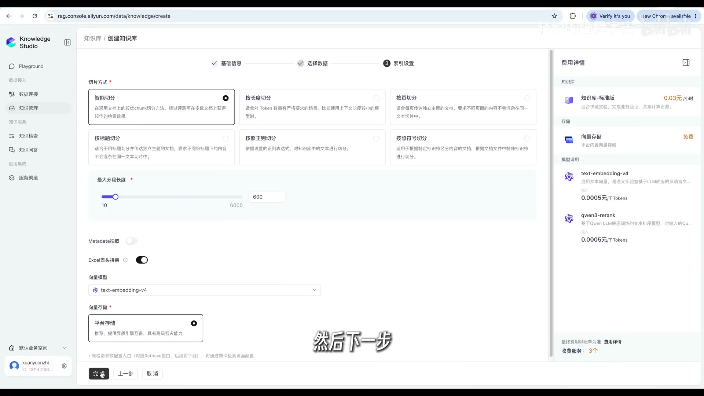

### 3.2 检索能力测试
知识库内容处理完成后，进入左侧菜单栏的`Playground`页面，将检索范围切换为自建的知识库，即可在线测试知识库的检索问答能力。
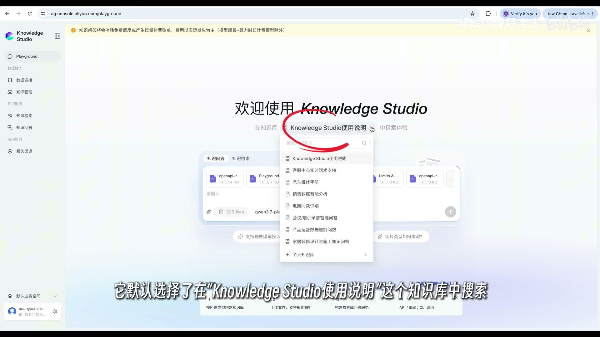

---

## 4. 知识库功能验证测试
通过5个不同难度的测试，验证知识库的实际能力：
### 4.1 单篇文章信息检索测试
- 提问：我之前推荐过一个UI审美很不错的网站，网址是什么？
- 测试结果：准确定位到对应的历史文章，返回目标网站地址`https://aura.build`，同时自动提取并展示文章中的相关配图；该能力适合检索仅有模糊记忆的历史内容。
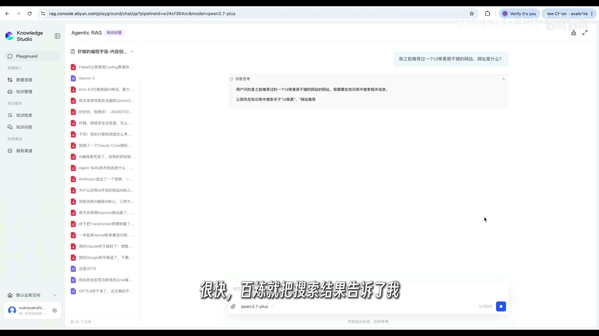

### 4.2 单篇文章概念问答测试
- 提问：什么是Harness工程？
- 测试结果：准确提取对应文章的核心概念解释，同时自动识别、提取文章内的示意图并在回答中展示，可准确理解图片的表达含义，相比纯文字检索体验大幅提升。
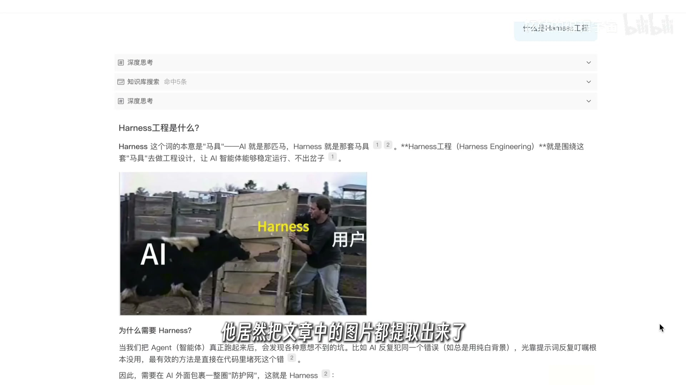

### 4.3 跨多篇文章内容整合测试
- 提问：Claude Code的工作原理是什么？
- 测试结果：自动汇总多篇文章中涉及Claude Code工作原理的内容；甚至可以提取非专门讲解该主题的文章（Agent工作原理相关文章）中的配图，用来辅助阐述Agent Loop概念，内容匹配精准度高。
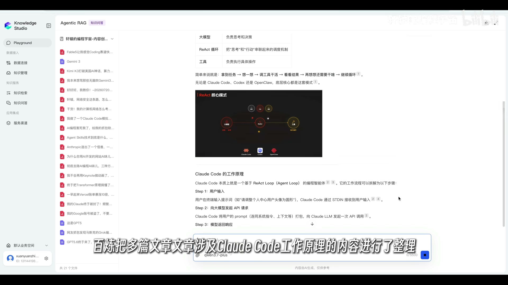

### 4.4 跨文档内容汇总测试
- 提问：汇总我之前做过的AI大模型测评案例
- 测试结果：成功提取分散在不同文档中的所有AI测试相关案例，完成结构化的汇总整理。
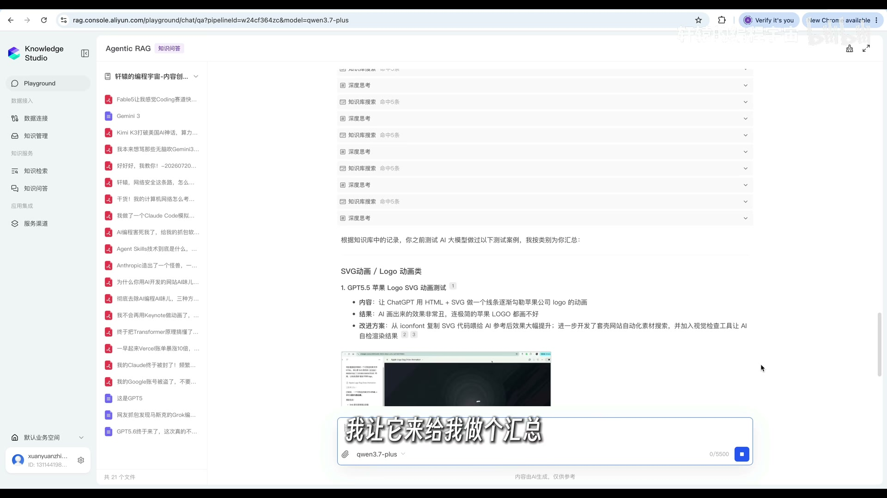

### 4.5 视频内容检索测试
- 提问：MCP的工作原理是什么？
- 测试结果：支持对上传的视频文件内容进行解析与检索，准确返回视频中的相关知识点。
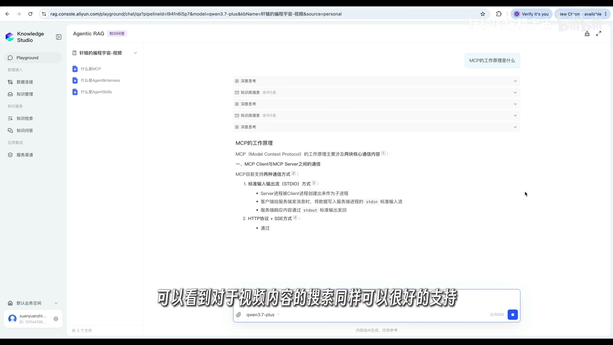

> 产品优化建议：目前平台仅支持上传本地视频文件存入知识库，希望后续支持直接输入B站、Youtube等平台的视频URL，一键完成视频内容的知识库存入，解决收藏视频闲置的问题。
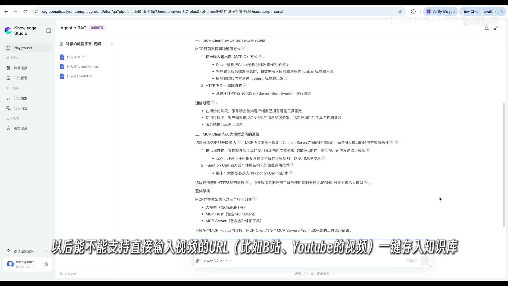

---

## 5. 写作Skill升级与效果验证
### 5.1 Skill升级方案
阿里云百炼提供了完整的API接口，无需手动研读复杂的API文档，可直接将API文档交给编程智能体（如Codex），自动生成用于知识库检索的Python脚本，完成写作Skill的升级。
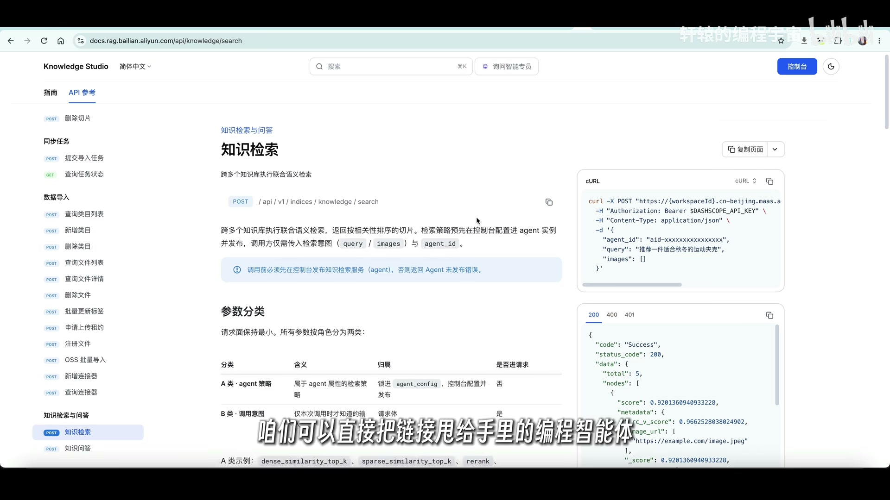

升级后的公众号写作全流程：
1. 获取创作素材（自动执行）
2. 交由用户确认内容方向（人工确认）
3. 收集话题的详细信息（自动执行）
4. **检索过往相关内容并判断复用价值（自动执行，新增环节）**：分析检索到的历史内容，判断适合直接引用、改写复用、仅借鉴结构，或是忽略不用
5. 写作 + 配图（自动执行）
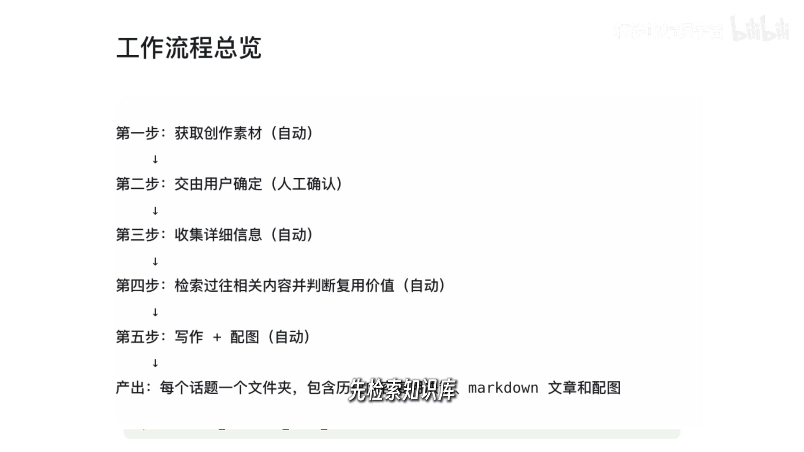

### 5.2 升级效果对比
以热门话题`Loop Engineering`的公众号文章创作为例，对比升级前后的生成效果：
1. **升级前（无知识库）**：生成的文章内容通顺、逻辑完整，但缺少个人特色，内容同质化高，不同创作者生成的同主题内容差异极小，没有真人感。
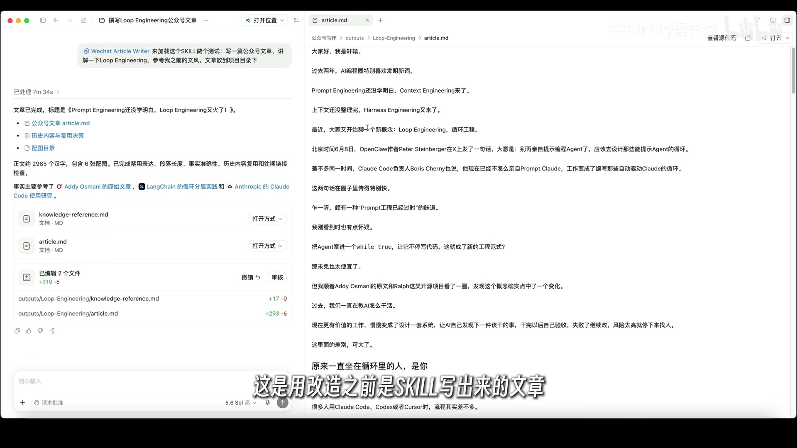
2. **升级后（接入知识库）**：
   - 自动加入创作者的真实项目经历：如创作者自主开发过Claude Code模拟器的相关经历，该内容是无知识库的AI无法生成的
   - 复用创作者过往的表达逻辑：自动复用创作者之前提出的"AI是马、Harness是马具"的类比，将Loop Engineering解释为马车队的调度系统，完全符合创作者的表达习惯
   - 最终生成的内容不再只是模仿写作风格，而是将创作者所有历史内容转化为新创作的资产，大幅提升内容的真人感与个人辨识度。
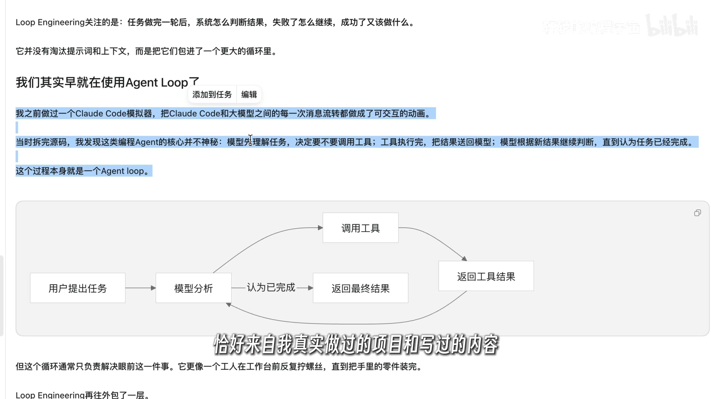
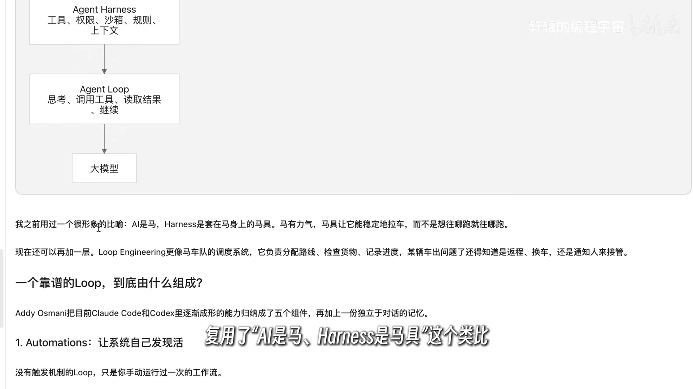

---

## 6. 核心结论
1. 对于内容创作者，核心需求并不是"会写文章的AI"，而是可以让历史内容持续产生价值的系统。
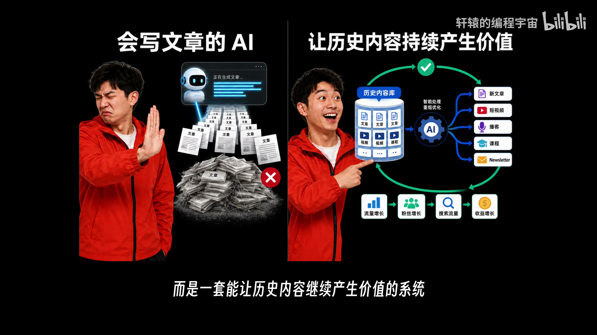

2. **「Skill + 知识库」的组合构成个人内容第二大脑**：
   - Skill的作用：沉淀、复用创作者的创作方法与流程
   - 知识库的作用：存储、检索创作者的所有内容资产
   - 二者结合可将硬盘中沉睡的历史文章、视频，转化为可被AI重新检索、重组、参与新创作的可复用资产，实现内容价值的持续复用。
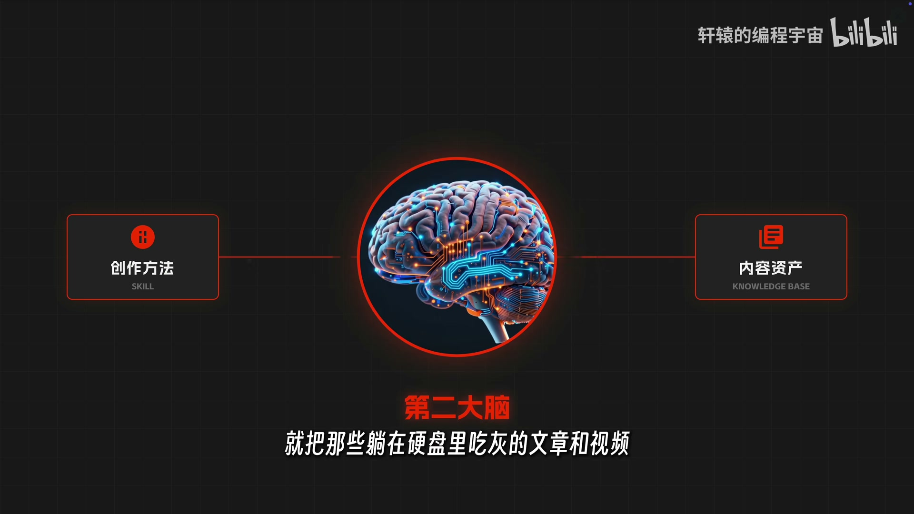

3. 适用人群：积累了大量文章、视频、课程、研究资料的内容创作者与研究者。

---

## 参考资源
1. 阿里云百炼官方平台：https://www.aliyun.com/product/bailian
2. 阿里云百炼知识库检索API文档：https://docs.rag.bailian.aliyun.com/api/knowledge/search